# OpenMetadata Documentation AI Agent

## Master Engineering Guide (Living Document)

Document owner: Engineering
Primary audience: Developers, reviewers, interviewers, maintainers
Status: Active and continuously expanded
Last updated: 2026-04-02

---

## Quick Content Index

This index is intentionally practical. It helps readers jump quickly between architecture, implementation, workflows, operations, and interview-defense content.

### Foundation And Scope

1. [0. Purpose Of This Guide](#0-purpose-of-this-guide)
2. [0.1 Reader Paths And Recommended Reading Order](#01-reader-paths-and-recommended-reading-order)
3. [0.2 Guidebook Governance And Update Policy](#02-guidebook-governance-and-update-policy)
4. [0.3 Definition Of Complete Guidebook Coverage](#03-definition-of-complete-guidebook-coverage)
5. [1. Problem Framing And Origin Story](#1-problem-framing-and-origin-story)
6. [2. Product Scope, Non-Goals, And Boundaries](#2-product-scope-non-goals-and-boundaries)
7. [3. Why This Architecture](#3-why-this-architecture)

### Core System And Implementation

1. [4. End-To-End Architecture Overview](#4-end-to-end-architecture-overview)
2. [5. Repository Tour With Intent](#5-repository-tour-with-intent)
3. [6. Configuration System Deep Dive](#6-configuration-system-deep-dive)
4. [7. Ingestion Architecture: Why It Is The Core Reliability Layer](#7-ingestion-architecture-why-it-is-the-core-reliability-layer)
5. [8. Sitemap Parsing And URL Selection](#8-sitemap-parsing-and-url-selection)
6. [9. Scraping Pipeline Internals](#9-scraping-pipeline-internals)
7. [10. Chunking Strategy And Metadata Design](#10-chunking-strategy-and-metadata-design)
8. [11. Embedding Service Design](#11-embedding-service-design)
9. [12. Database Architecture And Schema As Code](#12-database-architecture-and-schema-as-code)
10. [13. Retrieval RPCs And Their Semantics](#13-retrieval-rpcs-and-their-semantics)
11. [14. Data Access Layer In Python](#14-data-access-layer-in-python)
12. [15. LangGraph Agent Architecture](#15-langgraph-agent-architecture)
13. [16. Prompt System Design](#16-prompt-system-design)
14. [17. Tooling Layer And Its Current Role](#17-tooling-layer-and-its-current-role)
15. [18. Interface Layer: CLI](#18-interface-layer-cli)
16. [19. Interface Layer: FastAPI](#19-interface-layer-fastapi)

### Workflows And Operations

1. [4.4 Workflow Atlas (Graph, DB, Ingestion, API, Eval, Incident)](#44-workflow-atlas-graph-db-ingestion-api-eval-incident)
2. [4.5 Workflow Playbooks (Mermaid + Plain Text Fallback)](#45-workflow-playbooks-mermaid-plain-text-fallback)
3. [4.6 Workflow Navigation Matrix (What To Read First)](#46-workflow-navigation-matrix-what-to-read-first)
4. [4.7 Static Diagram Gallery (SVG)](#47-static-diagram-gallery-svg)
5. [12.6 Database ER Diagram And Relationship Workflows](#126-database-er-diagram-and-relationship-workflows)
6. [19.5 FastAPI Sequence Diagrams And Workflow Playbooks](#195-fastapi-sequence-diagrams-and-workflow-playbooks)
7. [20. Observability And Logging](#20-observability-and-logging)
8. [21. Setup, Bootstrapping, And Operational Runbook](#21-setup-bootstrapping-and-operational-runbook)
9. [22. Evaluation Methodology](#22-evaluation-methodology)
10. [23. Security Posture And Secret Hygiene](#23-security-posture-and-secret-hygiene)
11. [24. Performance Characteristics](#24-performance-characteristics)
12. [25. Failure Modes And Debugging Playbook](#25-failure-modes-and-debugging-playbook)

### Decisioning, Extensions, And Deep-Dive Volumes

1. [26. Design Trade-Off Ledger](#26-design-trade-off-ledger)
2. [27. Extensibility Guide](#27-extensibility-guide)
3. [28. Testing Strategy (Current And Recommended)](#28-testing-strategy-current-and-recommended)
4. [29. Operational Maturity Roadmap](#29-operational-maturity-roadmap)
5. [39. Volume 2: Implementation Walkthrough (Function-Level)](#39-volume-2-implementation-walkthrough-function-level)
6. [48. Volume 3: Productionization And Operations Playbook](#48-volume-3-productionization-and-operations-playbook)
7. [56. Interview Defense Bank Part 4 (Q321-Q500)](#56-interview-defense-bank-part-4-q321-q500)
8. [60. Interview Lightning Round (Q501-Q620)](#60-interview-lightning-round-q501-q620)

### Appendices And Revision Logs

1. [34. Appendix A: Concrete File-To-Responsibility Map](#34-appendix-a-concrete-file-to-responsibility-map)
2. [35. Appendix B: Data Contracts](#35-appendix-b-data-contracts)
3. [36. Appendix C: Suggested Future Documentation Expansions](#36-appendix-c-suggested-future-documentation-expansions)
4. [38. Revision Log](#38-revision-log)
5. [61. Revision Log (Volume 5 Additions)](#61-revision-log-volume-5-additions)
6. [62. Guidebook QA Checklist (Definition Of Complete)](#62-guidebook-qa-checklist-definition-of-complete)

### Diagram Rendering Note

If Mermaid diagrams are not visible in your current markdown viewer, use these fallback paths:

1. Open the file in VS Code Markdown Preview (Ctrl+Shift+V).
2. Use the plain-text workflow diagrams in sections 4.5, 12.6, and 19.5.
3. Use the static SVG images in section 4.7 and `docs/diagrams/`.
4. Treat plain-text flow blocks as canonical when Mermaid rendering is unavailable.

---

## 0. Purpose Of This Guide

This document is the canonical engineering handbook for the project. It is intentionally long-form and implementation-grounded. It explains not only what the system does, but why each major choice was made, what trade-offs were accepted, and how to reason about the design under technical scrutiny.

The target outcome is practical mastery. After reading this guide, an engineer should be able to:

1. Explain the full architecture end-to-end.
2. Defend design decisions in an interview or technical review.
3. Operate, debug, and extend the system without guessing.
4. Distinguish current implemented behavior from future planned behavior.
5. Map every major behavior to concrete files and functions in the repository.

This guide is written against the current codebase implementation, not a hypothetical architecture.

### 0.1 Reader Paths And Recommended Reading Order

Use the path below based on your role so the guide stays practical instead of overwhelming.

1. New engineer onboarding path:
   - Read sections 0 to 6, then 4.5, 4.7, 21, 34, 57.
2. Architecture review or interview prep path:
   - Read sections 3, 4, 12, 15, 19, 26, 30, 31, 41.
3. On-call / operations path:
   - Read sections 4.5.6, 19.5.4, 20, 21, 25, 42, 49.
4. Feature extension path:
   - Read sections 6, 12 to 17, 27, 28, 54, 58.

### 0.2 Guidebook Governance And Update Policy

To prevent documentation drift, use this precedence and update policy.

1. Source-of-truth precedence:
   - Runtime behavior in code (`src/`, `scripts/`) has final authority.
   - This guide is canonical explanatory documentation.
   - Other docs in `docs/` should align with this guide.
2. Required updates when behavior changes:
   - Update affected workflow section(s).
   - Update related diagrams (Mermaid, plain-text, and SVG assets).
   - Update revision log entry.
3. Review cadence:
   - Lightweight monthly pass.
   - Full pass before major demo/interview/release checkpoints.

### 0.3 Definition Of Complete Guidebook Coverage

A guidebook update is considered complete only when all of the following are true.

1. Architecture is explainable end-to-end from ingestion to response.
2. Data model and retrieval behavior are documented with diagrams and fallbacks.
3. API runtime and failure workflows are explicitly documented.
4. Setup, operations, testing, and migration paths are executable from docs.
5. Known limitations, trade-offs, and extension roadmap are explicit.

---

## 1. Problem Framing And Origin Story

### 1.1 Original Assignment Context

The project started from an assessment prompt requiring an AI agent that can answer questions about OpenMetadata documentation via natural language. The prompt explicitly prioritized:

1. Software design quality.
2. Modularity and maintainability.
3. Explainability of technical decisions.
4. A usable backend experience, not necessarily a full product UI.

This matters because many design decisions in this repository were made to optimize for robust engineering explanation rather than just a one-off demo.

### 1.2 Why Documentation QA Is Non-Trivial

Question-answering over documentation sounds straightforward, but in practice there are hard constraints:

1. OpenMetadata docs are broad, deep, and versioned.
2. User queries are often semantic, not keyword exact.
3. Documentation pages may be rendered by JavaScript-heavy frameworks.
4. Raw scraped content often includes heavy navigation noise.
5. Retrieval failures can silently degrade answer quality.

A minimal chatbot that just calls an LLM over a small static file would fail quickly on realistic questions.

### 1.3 Defining Success In Engineering Terms

Success was interpreted as achieving all of the following simultaneously:

1. Reliable retrieval from a meaningful doc subset.
2. Answer grounding with source traceability.
3. Clear architecture decomposition by concern.
4. Reproducible setup and deterministic schema creation.
5. Measurable retrieval quality through offline evaluation.

---

## 2. Product Scope, Non-Goals, And Boundaries

### 2.1 In Scope

1. Ingest OpenMetadata docs pages from sitemap.
2. Clean and chunk docs content for embedding.
3. Store chunks and embeddings in Supabase Postgres with pgvector.
4. Run retrieval-augmented answer generation.
5. Use an agentic control loop (route, retrieve, grade, rewrite, generate).
6. Expose interaction via CLI and FastAPI API.
7. Evaluate retrieval with golden queries and ranking metrics.

### 2.2 Out Of Scope (Current Version)

1. Full frontend product UI.
2. Multi-tenant production auth and RBAC.
3. Guaranteed persistent session history in the running app.
4. Online learning or feedback-driven auto-retraining.
5. Cross-source federation beyond docs.open-metadata.org.

### 2.3 System Boundary Definition

The system boundary starts at user query input and ends at generated response with citations. Web crawling and ingestion is an offline boundary process feeding the online retrieval boundary.

---

## 3. Why This Architecture

### 3.1 Options Considered

During design, there are four typical solution families:

1. Pure LLM without retrieval.
2. Classic keyword search only.
3. Naive linear RAG chain.
4. Agentic RAG with a control loop.

### 3.2 Why Not Pure LLM

Pure LLM would fail grounding requirements and cannot be trusted for doc-specific accuracy across versions. Hallucination risk is high.

### 3.3 Why Not Keyword Search Only

Keyword search underperforms on semantic phrasing. Users ask "how to track data flow" while docs may say "data lineage".

### 3.4 Why Not Only Linear RAG

Linear RAG is brittle:

1. If first retrieval misses, generation quality collapses.
2. No built-in self-correction behavior.
3. No control path for greeting/non-doc queries.

### 3.5 Why Agentic RAG Was Chosen

The final architecture uses LangGraph to express explicit stateful control:

1. Route query by intent type.
2. Retrieve chunks.
3. Grade relevance.
4. Rewrite query and retry when needed.
5. Generate only after retrieval quality gate.

This improves robustness while keeping logic inspectable and testable.

---

## 4. End-To-End Architecture Overview

### 4.1 Logical Layers

The system is split into three core layers:

1. Ingestion Layer (offline): Fetch, clean, chunk, embed, store.
2. Storage Layer (persistent): Supabase Postgres + pgvector + FTS.
3. Agent/Application Layer (online): LangGraph + CLI/API interfaces.

### 4.2 High-Level Data Flow

```text
Offline Flow:
Sitemap -> URL Filtering -> Crawl4AI Scrape -> Markdown Cleaning -> Chunking
-> Embedding -> Supabase Tables (sources, documents)

Online Flow:
User Query -> LangGraph Route -> (Direct Response OR Retrieval Path)
Retrieval Path -> Embed Query -> match_documents RPC -> LLM Relevance Grading
-> (Rewrite Loop if needed) -> Answer Generation -> Response with citations
```

### 4.3 Component Mapping

1. `src/ingestion/`: all crawling, parsing, and chunking logic.
2. `src/embeddings/`: embedding model service.
3. `src/database/`: vector and keyword retrieval APIs.
4. `src/agent/`: state, prompts, nodes, and graph.
5. `src/main.py`: rich CLI entrypoint.
6. `src/api/server.py`: FastAPI server.
7. `scripts/setup_db.py`: schema and RPC creation.
8. `eval/run_eval.py`: retrieval quality evaluation.

### 4.4 Workflow Atlas (Graph, DB, Ingestion, API, Eval, Incident)

This section provides concrete, implementation-aligned workflows so engineers can execute, debug, and explain the system behavior under real conditions.

#### Workflow 1: End-To-End System Execution

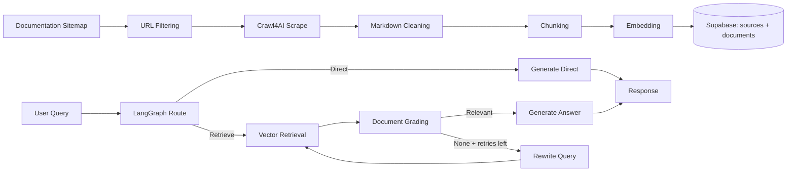

Ideal usage:

1. Use this workflow for executive architecture explanation.
2. Use it as a reference when debugging cross-layer failures.

#### Workflow 2: LangGraph Query Control Flow

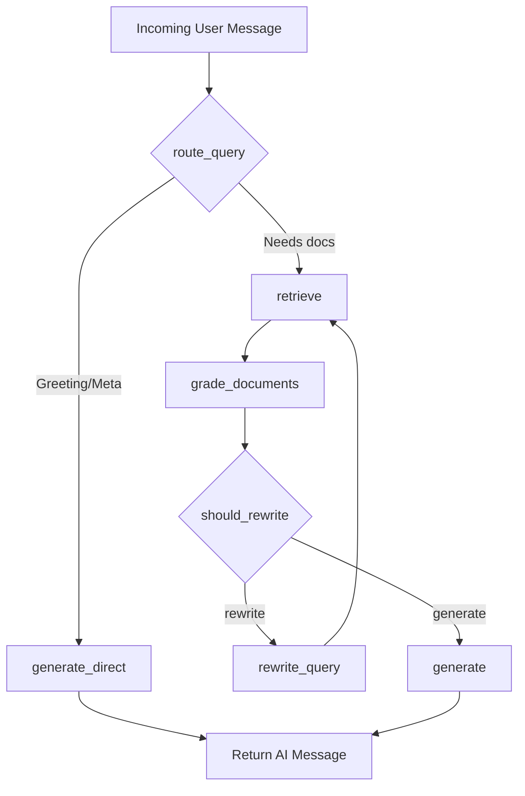

Implementation anchors:

1. Router and nodes: `src/agent/nodes.py`
2. Graph wiring: `src/agent/graph.py`
3. Shared state contract: `src/agent/state.py`

#### Workflow 3: Ingestion Pipeline Workflow

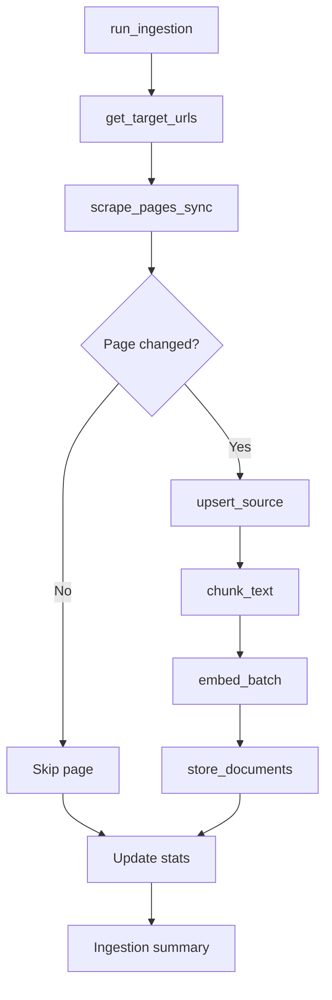

Operational checkpoints:

1. `urls_found` should be non-trivial.
2. `pages_scraped` and `chunks_stored` should move together.
3. Large `pages_skipped` is expected on stable reruns.

#### Workflow 4: Database Setup And Retrieval Workflow

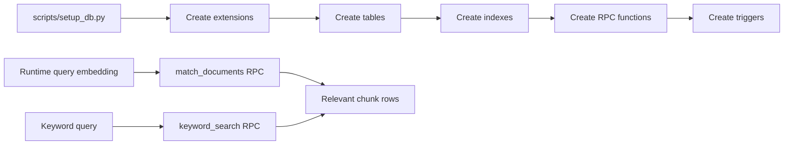

Execution order rules:

1. Run schema setup before ingestion.
2. Run ingestion before chat/eval workflows.
3. Re-run setup with `--drop` only for destructive reset.

#### Workflow 5: API Session And Response Workflow

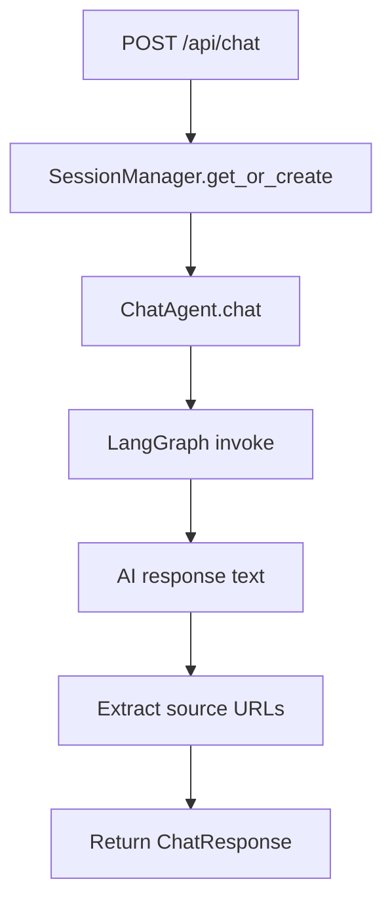

Session notes:

1. Session continuity depends on `session_id` reuse.
2. Session state is currently in-memory and process-local.

#### Workflow 6: Retrieval Quality Evaluation Workflow

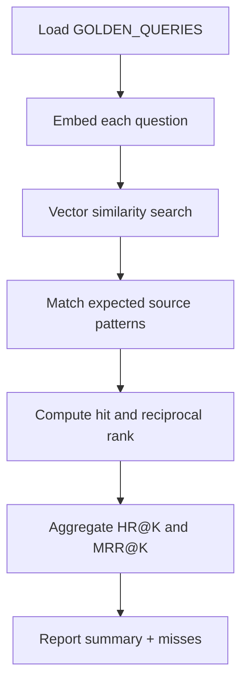

Usage pattern:

1. Run after ingestion changes.
2. Run after retrieval or threshold tuning.
3. Keep historical score snapshots for trend analysis.

#### Workflow 7: Incident Triage Workflow (Fast Path)

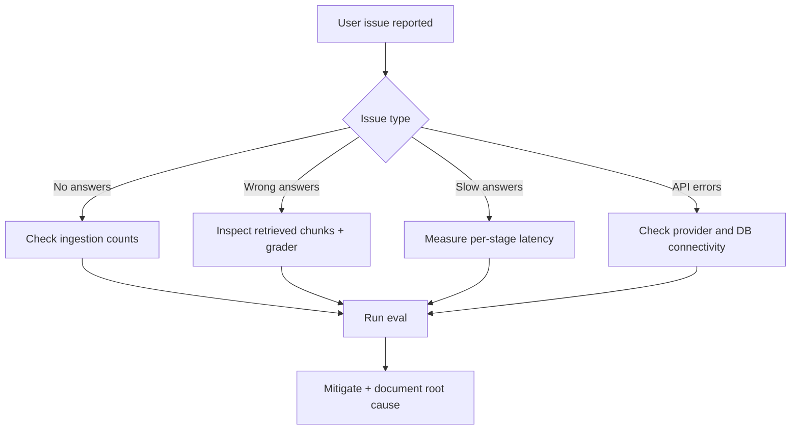

Escalation policy:

1. Mitigate first (degraded mode if needed).
2. Diagnose with traces/logs.
3. Close with preventive action in revision logs.

### 4.5 Workflow Playbooks (Mermaid + Plain Text Fallback)

If your Markdown viewer does not render Mermaid diagrams, use this section as the canonical fallback. Each workflow below includes:

1. Goal
2. Trigger
3. Inputs
4. Step-by-step execution
5. Outputs
6. Failure signals
7. Plain-text flow diagram

#### 4.5.1 Agent Graph Runtime Workflow (Primary Online Path)

Goal:

1. Produce grounded answers with bounded retry behavior.

Trigger:

1. User query received via CLI or API.

Inputs:

1. `state.messages`
2. `state.query`
3. retrieval config values (`TOP_K`, `SIMILARITY_THRESHOLD`, rewrite limit)

Execution steps:

1. `route_query` classifies the query as direct-response or retrieval-needed.
2. If direct-response, the flow executes `generate_direct` and returns.
3. If retrieval-needed, the flow executes `retrieve`.
4. `retrieve` embeds the query and calls vector RPC.
5. `grade_documents` checks each retrieved chunk for relevance.
6. `should_rewrite` checks whether any relevant docs remain.
7. If none remain and retries are available, `rewrite_query` runs and loops back.
8. If relevant docs exist, `generate` composes context and creates final answer.
9. Output message is appended to conversation history.

Outputs:

1. AI answer text
2. Updated conversation history
3. Updated rewrite counter

Failure signals:

1. Frequent empty `retrieved_docs`
2. High rewrite frequency
3. Responses missing citations despite retrieval hits

Plain-text flow:

```text
[User Query]
   |
   v
[route_query]
   |-------------------------------|
   | greeting/meta                | docs needed
   v                               v
[generate_direct]            [retrieve]
                                   |
                                   v
                           [grade_documents]
                                   |
                                   v
                             [should_rewrite]
                             |             |
                     rewrite (yes)      generate
                             |             |
                             v             v
                        [rewrite_query] [generate]
                             |
                             v
                          [retrieve]  (loop)
```

#### 4.5.2 Ingestion Workflow Playbook (Primary Offline Path)

Goal:

1. Build and refresh a high-quality retrieval corpus.

Trigger:

1. Manual `run_ingestion.py` execution or scheduled ingestion run.

Inputs:

1. Sitemap URLs
2. Ingestion filters (version, categories, max pages)
3. Existing source hashes in DB

Execution steps:

1. Fetch sitemap and extract URLs.
2. Filter URLs by version, category, and leaf-page heuristics.
3. Scrape each URL via Crawl4AI in async batches.
4. Clean markdown boundaries and artifacts.
5. For each page, compare `content_hash` with existing source record.
6. Skip unchanged pages unless force mode is enabled.
7. Upsert source metadata and raw content.
8. Chunk page content and embed batch.
9. Replace source chunks in documents table.
10. Emit summary stats.

Outputs:

1. Updated `sources` rows
2. Updated `documents` rows
3. Ingestion summary counters

Failure signals:

1. `pages_scraped` high but `chunks_stored` low
2. large number of pages rejected as too short
3. source count not changing after docs updates

Plain-text flow:

```text
[get_target_urls] -> [scrape_pages_sync] -> [clean_markdown]
        -> [hash compare]
             | unchanged -> [skip]
             | changed   -> [upsert_source]
                            -> [chunk_text]
                            -> [embed_batch]
                            -> [store_documents]
        -> [stats + summary]
```

#### 4.5.3 Database Setup And Retrieval Workflow Playbook

Goal:

1. Provide deterministic schema setup and high-performance retrieval primitives.

Trigger:

1. Initial project setup, schema reset, or retrieval execution.

Inputs:

1. `SUPABASE_DB_URL` for DDL setup
2. retrieval query embedding or keyword string

Execution steps (setup):

1. Enable required extensions.
2. Create core tables (`sources`, `documents`, `conversations`, `messages`).
3. Create indexes (HNSW, GIN, relational indexes).
4. Create RPC functions (`match_documents`, `keyword_search`, `get_surrounding_chunks`).
5. Create timestamp triggers.

Execution steps (runtime retrieval):

1. For semantic path, call `match_documents` with embedding + threshold.
2. For lexical path, call `keyword_search` with query text.
3. Optionally fetch context neighbors with `get_surrounding_chunks`.

Outputs:

1. Deterministic schema state
2. Retrieval rows with source metadata

Failure signals:

1. setup errors on extensions/functions
2. RPC returns empty results for known-good queries
3. index creation failures affecting latency

Plain-text flow:

```text
SETUP:
  extensions -> tables -> indexes -> RPCs -> triggers

RUNTIME:
  query embedding -> match_documents -> rows
  keyword query  -> keyword_search  -> rows
  optional       -> surrounding_chunks -> expanded context
```

#### 4.5.4 API Session Workflow Playbook

Goal:

1. Maintain per-session conversational continuity and return structured API output.

Trigger:

1. `POST /api/chat` request.

Inputs:

1. `message`
2. `session_id` (provided or generated)

Execution steps:

1. Validate request payload.
2. `SessionManager.get_or_create` returns ChatAgent for session.
3. ChatAgent runs graph and returns answer text.
4. Source URLs are extracted from answer text.
5. Latency is measured.
6. Response model is returned.

Outputs:

1. `response`
2. `session_id`
3. `sources`
4. `latency_ms`

Failure signals:

1. frequent 500 responses
2. session context not preserved across turns
3. sources list empty despite citation-heavy answers

Plain-text flow:

```text
[POST /api/chat]
   -> [validate request]
   -> [get_or_create session agent]
   -> [agent.chat -> graph invoke]
   -> [extract source URLs]
   -> [return ChatResponse]
```

#### 4.5.5 Evaluation Workflow Playbook

Goal:

1. Quantify retrieval quality independently of generation style.

Trigger:

1. Manual evaluation run after corpus/retrieval changes.

Inputs:

1. `GOLDEN_QUERIES`
2. top-k parameter
3. current corpus and retrieval config

Execution steps:

1. Embed each golden query.
2. Run similarity search with threshold 0.0 for ranking visibility.
3. Check whether expected source patterns are present.
4. Compute per-query hit and reciprocal rank.
5. Aggregate HR@K and MRR@K.
6. Print misses and top results for diagnosis.

Outputs:

1. Aggregate quality metrics
2. Per-query diagnostics

Failure signals:

1. sudden HR@K or MRR@K drop
2. repeated misses in one category
3. top-ranked results unrelated to query intent

Plain-text flow:

```text
[load golden queries]
   -> [embed query]
   -> [search top-k]
   -> [pattern match expected sources]
   -> [hit + reciprocal rank]
   -> [aggregate HR/MRR]
```

#### 4.5.6 Incident Triage Workflow Playbook

Goal:

1. Restore service quality quickly while preserving a clear root-cause trail.

Trigger:

1. User-reported failures or alert triggers.

Inputs:

1. logs
2. traces
3. API health/stats
4. latest ingestion/eval results

Execution steps:

1. Classify issue as quality, latency, or availability.
2. Apply immediate mitigation (for example degraded mode if required).
3. Diagnose stage-by-stage (ingestion, retrieval, grading, generation, API).
4. Validate fix against sample queries and stats.
5. Document root cause and prevention action.

Outputs:

1. Service restored
2. incident record with follow-up tasks

Failure signals:

1. recurring same incident type
2. unresolved action items from previous incidents
3. repeated regressions after prompt/config changes

Plain-text flow:

```text
[alert/user report]
   -> [classify issue]
   -> [mitigate now]
   -> [diagnose by stage]
   -> [verify fix]
   -> [postmortem + prevention]
```

### 4.6 Workflow Navigation Matrix (What To Read First)

Use this matrix to choose the right workflow section quickly:

1. "Answers are wrong" -> read 4.5.1 and 4.5.5 first.
2. "Ingestion seems broken" -> read 4.5.2 first.
3. "DB setup or search is failing" -> read 4.5.3 first.
4. "API session behavior is inconsistent" -> read 4.5.4 first.
5. "Production incident in progress" -> read 4.5.6 first.

### 4.7 Static Diagram Gallery (SVG)

These diagrams are pre-rendered SVG assets and should be visible in standard Markdown previews even when Mermaid execution is disabled.

#### 4.7.1 System Overview (Rendered SVG)


Explanation:

1. Shows offline ingestion path and online answer path together.
2. Highlights rewrite loop as bounded recovery mechanism.

#### 4.7.2 LangGraph Runtime Flow (Rendered SVG)


Explanation:

1. Shows direct-response and retrieval branches.
2. Makes rewrite loop entry/exit conditions explicit.

#### 4.7.3 Ingestion Pipeline (Rendered SVG)


Explanation:

1. Shows skip-vs-process decision via content hash.
2. Shows chunk/embed/store stages in order.

#### 4.7.4 Database ER Model (Rendered SVG)


Explanation:

1. Shows `sources -> documents` retrieval data model.
2. Shows `conversations -> messages` persistence model.

#### 4.7.5 API Chat Sequence (Rendered SVG)

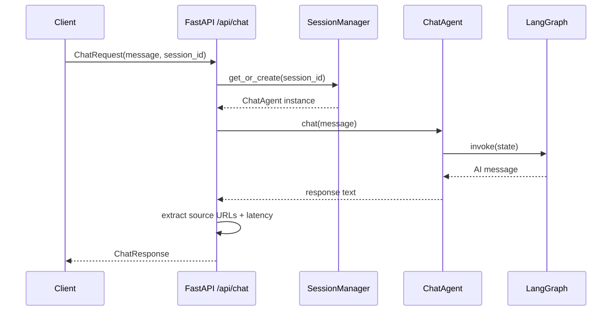

Explanation:

1. Shows request flow through SessionManager and ChatAgent.
2. Shows final response packaging with sources and latency.

#### 4.7.6 Evaluation Sequence (Rendered SVG)


Explanation:

1. Shows query embedding, retrieval, matching, and metric aggregation.
2. Maps directly to HR@K and MRR@K reporting flow.

---

## 5. Repository Tour With Intent

### 5.1 Source Tree Mental Model

The repository is organized by responsibility, not by framework defaults:

1. Core runtime behavior in `src/`.
2. Environment setup and operational scripts in `scripts/`.
3. Quality and retrieval benchmarking in `eval/`.
4. Long-form design documentation in `docs/`.

This improves discoverability. A new engineer can quickly locate implementation by concern.

### 5.2 Important Runtime Entry Points

1. CLI chat: `python -m src.main`
2. API server: `python scripts/run_server.py`
3. Ingestion: `python scripts/run_ingestion.py`
4. DB setup: `python scripts/setup_db.py`
5. Evaluation: `python eval/run_eval.py --verbose`

---

## 6. Configuration System Deep Dive

Configuration is centralized in `src/config.py` as typed classes plus environment-backed secrets.

### 6.1 Config Philosophy

The code uses Python class constants for non-secret operational defaults and environment variables for secrets. This creates:

1. Explicit defaults in code review.
2. Easy overrides by editing one module.
3. Secret hygiene by avoiding hardcoded credentials.

### 6.2 LLMConfig

Current defaults:

1. Provider: `openrouter`
2. Model: `nvidia/nemotron-3-super-120b-a12b:free`
3. Temperature: `0.3`
4. Max tokens: `2048`
5. Base URL: `https://openrouter.ai/api/v1`

Rationale:

1. Lower temperature for factual doc QA.
2. Moderate max tokens to balance cost and answer completeness.

### 6.3 EmbeddingConfig

Current defaults:

1. Model: `all-MiniLM-L6-v2`
2. Dimensions: `384`
3. Device: `cpu`

Rationale:

1. Local embeddings reduce recurring API cost.
2. CPU default makes setup broadly portable.
3. 384 dimensions are lightweight and fast for moderate corpora.

### 6.4 RetrievalConfig

Current defaults:

1. Top K: `5`
2. Similarity threshold: `0.5`
3. Rewrite max attempts: `2`
4. Expand context: `True`
5. Context window: `1`

Important nuance:

1. Context expansion is implemented in `src/agent/tools.py` tool functions.
2. The graph path in `src/agent/nodes.py` currently calls `VectorStore.similarity_search` directly without expansion.
3. This means tool-based paths and graph-based paths can differ in context behavior.

This is an intentional point to discuss in reviews because it reveals where future consolidation can improve consistency.

### 6.5 ChunkingConfig

Current defaults:

1. Chunk size: `2000` characters.
2. Overlap: `400` characters.

Rationale:

1. Large enough to preserve semantic completeness.
2. Overlap reduces boundary fragmentation.

### 6.6 IngestionConfig

Current defaults:

1. Docs version: `v1.12.x`
2. Max pages: `1000`
3. Concurrency: `10`
4. Categories: quickstart, deployment, how-to, connectors, developers, releases, concepts

Rationale:

1. Version targeting controls corpus drift.
2. High max pages favors fuller recall.
3. Category list aligns with user-relevant product usage questions.

### 6.7 LangSmithConfig

Current defaults:

1. Enabled: `True`
2. Project: `openmetadata-agent`
3. Endpoint: EU region endpoint

Behavior:

1. `configure_langsmith()` sets tracing env vars only if API key exists.
2. If absent, tracing is disabled by removing tracing env var.

### 6.8 Secrets Wrapper

The `Secrets` class wraps env reads for:

1. Supabase URL
2. Supabase service key
3. Supabase direct DB URL
4. OpenRouter API key
5. LangSmith API key

This wrapper creates a single path for secret consumption and clearer error messages.

---

## 7. Ingestion Architecture: Why It Is The Core Reliability Layer

### 7.1 Engineering Principle

For doc QA, ingestion quality dominates answer quality. Bad corpus in means bad retrieval out.

### 7.2 Pipeline Ownership

The orchestrator is `src/ingestion/ingest.py` and runs four major stages:

1. Fetch/filter sitemap URLs.
2. Scrape pages.
3. Chunk and embed text.
4. Store chunks and summary stats.

### 7.3 Idempotency Strategy

Idempotency is achieved by `content_hash` on sources:

1. If URL exists and hash unchanged, page is skipped.
2. If changed or forced, source is upserted and chunks are replaced.

This keeps ingestion efficient for repeated runs.

---

## 8. Sitemap Parsing And URL Selection

Implemented in `src/ingestion/sitemap_parser.py`.

### 8.1 Fetch

1. Source URL: `https://docs.open-metadata.org/sitemap.xml`
2. Parser: `xml.etree.ElementTree`
3. Transport: `httpx`

### 8.2 Version Filter

URLs are filtered to target version by matching `/v1.12.x/` or trailing `/v1.12.x`.

### 8.3 Category Classifier

A pattern mapping classifies URL paths into categories. Example:

1. `quick-start` -> quickstart
2. `how-to-guides` -> how-to
3. `developers` or `sdk` -> developers

### 8.4 Noise Pruning

The `_is_leaf_page` heuristic drops known CRUD/variant suffixes, reducing low-value generated pages.

### 8.5 Max Page Balancing

If filtered URLs exceed max pages:

1. Group by category.
2. Allocate even per-category quota.
3. Fill remaining slots from overflow.

This prevents one category from crowding out others.

### 8.6 Design Trade-Off

Heuristic URL filtering is fast and transparent but may drop occasional useful pages. This is accepted for initial reliability and simplicity.

---

## 9. Scraping Pipeline Internals

Implemented in `src/ingestion/scraper.py`.

### 9.1 Why Crawl4AI

Docs sites often use client-side rendering. Crawl4AI handles dynamic rendering and produces markdown output suitable for downstream NLP.

### 9.2 Concurrency Model

1. URLs are batched by configured concurrency.
2. Each batch executes asynchronously via `asyncio.gather`.
3. A single crawler context is reused across batches.

### 9.3 Markdown Boundary Detection

Cleaning avoids brittle CSS selectors by using deterministic text boundaries:

1. Start: after "On this page" TOC block.
2. End: before "Was this page helpful?" footer marker.

This approach is robust against front-end class changes.

### 9.4 Artifact Removal

Mintlify inserts empty link anchors like `[](url#heading)`.

`strip_empty_links()` in `src/ingestion/text_cleaner.py` removes these with a character-level scanner rather than regex.

Advantages:

1. Deterministic O(N) scan.
2. Handles nested parentheses in URLs.
3. Avoids regex edge-case backtracking or escaping bugs.

### 9.5 Additional Cleaning

Post-boundary cleanup includes:

1. Removing empty headings.
2. Removing lone numeric step lines.
3. Collapsing excessive blank lines.
4. Trimming whitespace.

### 9.6 Title Extraction Strategy

Title extraction attempts in order:

1. H1 heading.
2. H2 heading.
3. Pipe pattern title (`Title | Subtitle`).
4. First plausible non-noise text line.
5. URL slug fallback.

This layered strategy is practical for inconsistent page structures.

### 9.7 ScrapedPage Contract

`ScrapedPage` dataclass includes:

1. `url`
2. `title`
3. `content`
4. `content_hash`
5. `category`

This object is the clean boundary between scraping and storage.

---

## 10. Chunking Strategy And Metadata Design

Implemented in `src/ingestion/chunker.py`.

### 10.1 Splitter Choice

`RecursiveCharacterTextSplitter` is used with markdown-aware separator priority:

1. H2 headers
2. H3 headers
3. H4 headers
4. Paragraph breaks
5. Line breaks
6. Sentence boundaries
7. Words
8. Characters fallback

### 10.2 Why This Hierarchy

The goal is to preserve semantic units while respecting chunk limits. Splitting at headings and paragraphs keeps retrieval context coherent.

### 10.3 Overlap And Continuity

Overlap helps preserve continuity across chunk boundaries, especially for procedural instructions where key steps may straddle boundaries.

### 10.4 Chunk Metadata

Each chunk stores:

1. Source URL
2. Source title
3. Section heading (best effort)
4. Chunk index
5. Total chunks in source

This metadata supports retrieval explainability and future filtering.

---

## 11. Embedding Service Design

Implemented in `src/embeddings/embedding_service.py`.

### 11.1 Singleton Pattern

`EmbeddingService` is singleton-backed to avoid repeated model loads and reduce memory churn.

### 11.2 Initialization Checks

On initialization:

1. Model is loaded once.
2. A test embedding validates dimension alignment with config.
3. Mismatch raises explicit error.

This prevents silent schema incompatibility with VECTOR dimension constraints.

### 11.3 API Surface

1. `embed_text(text)` for single query embedding.
2. `embed_batch(texts, batch_size=64)` for ingestion throughput.
3. `dimensions` property for introspection.

### 11.4 Practical Trade-Off

CPU embeddings are slower than GPU but maximize portability and reduce setup complexity in review environments.

---

## 12. Database Architecture And Schema As Code

Implemented in `scripts/setup_db.py` and runtime adapters in `src/database/`.

### 12.1 Why Supabase Postgres + pgvector

Reasons:

1. Unified relational + vector capabilities.
2. Familiar SQL ecosystem.
3. First-class managed hosting for rapid setup.
4. Ability to combine semantic and keyword retrieval.

### 12.2 Extension Requirements

Schema setup enables:

1. `vector`
2. `pg_trgm`

### 12.3 Core Tables

#### 12.3.1 `sources`

Purpose: page-level metadata and raw content.

Key columns:

1. `id` UUID PK
2. `url` unique URL
3. `title`
4. `section_category` with check constraint
5. `content_hash`
6. `raw_content`
7. `crawl_metadata` JSONB
8. `is_active` boolean
9. `created_at`, `updated_at`

#### 12.3.2 `documents`

Purpose: chunk-level retrieval units.

Key columns:

1. `id` UUID PK
2. `source_id` FK to sources with cascade delete
3. `content`
4. `embedding VECTOR(384)`
5. `chunk_index`
6. `metadata` JSONB
7. `created_at`

#### 12.3.3 `conversations`

Purpose: future persistent chat container.

Current runtime note:

1. Online chat sessions are currently in-memory in API layer.
2. Table exists for future persistence integration.

#### 12.3.4 `messages`

Purpose: future persistent turn-level message records.

Key columns include role checks and sequence ordering indexes.

### 12.4 Index Strategy

1. HNSW index on embeddings for vector retrieval performance.
2. GIN full-text index on chunk content.
3. Source and source+chunk indexes for joins and context lookup.
4. Partial index on active sources.
5. Conversation sequence index for future message pagination.

### 12.5 Trigger Strategy

A generic `update_updated_at` trigger updates timestamps on sources and conversations.

### 12.6 Database ER Diagram And Relationship Workflows

This section makes database relationships explicit and maps them to operational workflows.

#### 12.6.1 ER Diagram (Mermaid)

Rendered SVG (fallback-safe):


Note:

1. This Mermaid ER block intentionally uses renderer-compatible attribute syntax.
2. Canonical constraints and exact SQL types remain defined in `scripts/setup_db.py`.

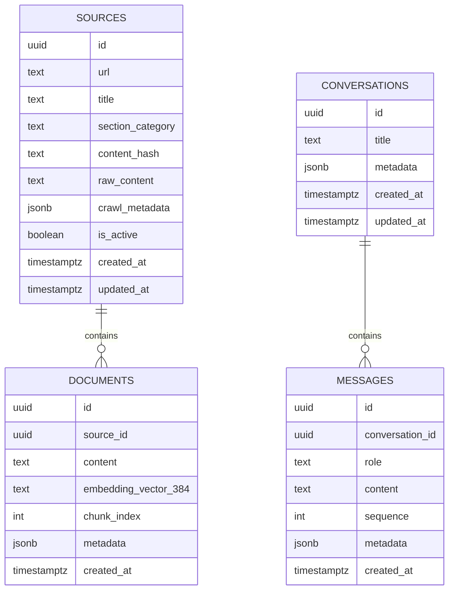

#### 12.6.2 ER Diagram (Plain Text Fallback)

```text
SOURCES (1) -> (N) DOCUMENTS
   - sources.id (PK) -> documents.source_id (FK)
   - sources.url (UNIQUE)
   - sources attributes: title, section_category, content_hash, raw_content, is_active
   - documents attributes: content, embedding (VECTOR 384), chunk_index, metadata

CONVERSATIONS (1) -> (N) MESSAGES
   - conversations.id (PK) -> messages.conversation_id (FK)
   - conversations attributes: title, metadata
   - messages attributes: role, content, sequence, metadata
```

#### 12.6.3 Workflow A: Ingestion Write Path Across Tables

Purpose:

1. Persist doc pages and chunk embeddings consistently.

Execution:

1. Upsert page into `sources` by URL.
2. Delete old `documents` rows for the source.
3. Insert new chunk rows with embeddings and metadata.

Plain-text flow:

```text
[scraped page]
   -> [upsert sources by url]
   -> [delete documents where source_id = current]
   -> [insert documents chunk batch]
```

#### 12.6.4 Workflow B: Retrieval Read Path Across Tables And RPCs

Purpose:

1. Return ranked chunks with source provenance in one query path.

Execution:

1. Query embedding is passed to `match_documents`.
2. RPC joins `documents` with active `sources`.
3. Returns chunk content plus `source_url` and `source_title`.

Plain-text flow:

```text
[query embedding]
   -> [match_documents RPC]
   -> [documents join sources]
   -> [ranked rows with source metadata]
```

#### 12.6.5 Workflow C: Future Conversation Persistence Path

Purpose:

1. Support durable chat storage when moving beyond in-memory sessions.

Execution:

1. Create or resolve conversation row.
2. Append user and assistant turns into `messages` with sequence ordering.
3. Rehydrate turns for session recovery.

Plain-text flow:

```text
[session/message]
   -> [create/resolve conversation]
   -> [insert user message]
   -> [insert assistant message]
   -> [read ordered sequence on resume]
```

---

## 13. Retrieval RPCs And Their Semantics

### 13.1 `match_documents`

Inputs:

1. Query embedding
2. Match threshold
3. Match count
4. Optional category filter

Behavior:

1. Joins `documents` with active `sources`.
2. Computes similarity as `1 - cosine_distance`.
3. Applies threshold and optional category filter.
4. Orders by vector distance ascending.
5. Returns chunk plus source URL/title for citations.

### 13.2 `keyword_search`

Inputs:

1. Search query text
2. Match count

Behavior:

1. Uses `to_tsvector` and `websearch_to_tsquery`.
2. Filters to active sources.
3. Ranks by `ts_rank` descending.
4. Returns chunk plus source metadata.

### 13.3 `get_surrounding_chunks`

Inputs:

1. Source ID
2. Target chunk index
3. Context window

Behavior:

1. Returns chunk neighborhood around target index.
2. Preserves chunk order.
3. Supports context stitching beyond single chunk retrieval.

### 13.4 Why Put This Logic In RPCs

Benefits:

1. Less application-side data movement.
2. Cleaner API in Python code.
3. Easier to optimize centrally in SQL.

Trade-off:

1. Deeper DB logic requires SQL literacy for maintainers.

---

## 14. Data Access Layer In Python

### 14.1 Supabase Client Factory

`src/database/supabase_client.py` provides a cached singleton client via `lru_cache(maxsize=1)`.

Benefits:

1. Avoid repeated client setup.
2. Centralized env validation.

### 14.2 VectorStore Responsibilities

`src/database/vector_store.py` encapsulates:

1. Source upsert operations.
2. Chunk storage (delete-and-reinsert by source).
3. Similarity RPC calls.
4. Surrounding chunk RPC calls.
5. Utility counts and source lookup.

Notable implementation detail:

1. Insert batches of 50 reduce payload-limit issues during ingestion.

### 14.3 TextSearch Responsibilities

`src/database/text_search.py` wraps keyword RPC and logs result counts.

---

## 15. LangGraph Agent Architecture

Implemented in `src/agent/graph.py`, `src/agent/state.py`, `src/agent/nodes.py`, and `src/agent/prompts.py`.

### 15.1 Why LangGraph Instead Of A Simple Chain

LangGraph allows explicit state transitions and loops, which are critical for rewrite-retry behavior and deterministic routing.

### 15.2 Agent State Contract

`AgentState` includes:

1. `messages`: list of langchain messages with `add_messages` reducer.
2. `retrieved_docs`: list of retrieved chunks.
3. `query`: current working query string.
4. `rewrite_count`: loop guard counter.

### 15.3 Graph Topology

Nodes:

1. `retrieve`
2. `grade_documents`
3. `rewrite_query`
4. `generate`
5. `generate_direct`

Conditional entry:

1. `route_query` chooses between retrieval path and direct generation path.

Conditional transition:

1. `should_rewrite` chooses rewrite vs generate after grading.

Terminal nodes:

1. `generate`
2. `generate_direct`

### 15.4 Route Node Behavior

`route_query` uses deterministic string pattern checks for greetings/meta prompts.

Benefits:

1. Saves vector DB and LLM grading calls for trivial messages.
2. Reduces latency and cost for greetings.

### 15.5 Retrieve Node Behavior

`retrieve` performs hybrid search with **Reciprocal Rank Fusion (RRF)**:

1. Query embedding using `EmbeddingService`.
2. Parallel retrieval calls: `VectorStore.similarity_search` (semantic) and `TextSearch.keyword_search` (exact phrases).
3. Merges chunks natively in Python using the RRF algorithm `score = 1 / (60 + rank)` for both sets.
4. Deduplicates chunks prioritizing higher RRF scores.

Returns `retrieved_docs` payload.

### 15.6 Grade Node Behavior

For each retrieved chunk, the LLM receives `GRADER_PROMPT` with truncated content (`[:1000]`) and returns yes/no.

Behavioral notes:

1. If verdict contains `yes`, chunk is retained.
2. On grader exception, chunk is retained as safety fallback.

Trade-off:

1. Fallback retaining chunk avoids empty context due transient grader failure.
2. It can allow occasional noisy chunks through.

### 15.7 Rewrite Loop

If no docs survive grading and rewrite attempts are below limit, `rewrite_query` runs and increments counter.

This creates bounded self-correction instead of immediate failure.

### 15.8 Generate Node

If docs exist:

1. Build context as markdown blocks with source links.
2. Send system prompt plus generate prompt plus recent messages.

If docs absent:

1. Send fallback system instructions acknowledging no results.

Output:

1. Returns a new AI message into state.

### 15.9 Generate Direct Node

Used for greetings and meta interactions without retrieval.

### 15.10 ChatAgent Wrapper

`ChatAgent` in `src/agent/graph.py` manages user-level conversation history outside graph calls.

Flow:

1. Append `HumanMessage` to `_history`.
2. Build input state with history and fresh retrieval state.
3. Invoke compiled graph.
4. Extract latest AI response.
5. Append response to `_history`.

`reset()` clears history for new conversation.

---

## 16. Prompt System Design

Prompt templates are centralized in `src/agent/prompts.py`.

### 16.1 SYSTEM_PROMPT Objectives

1. Constrain assistant to OpenMetadata scope.
2. Force context-grounded answers.
3. Force citations.
4. Define fallback behavior for unknowns.

### 16.2 GRADER_PROMPT Design

Binary relevance framing reduces ambiguity and supports deterministic branching.

### 16.3 REWRITE_PROMPT Design

Focuses on reformulating search semantics into doc-like terminology.

### 16.4 GENERATE_PROMPT Design

Frames context-included answer generation with explicit source citation behavior.

### 16.5 Prompt Engineering Trade-Off

Prompt rigidity improves grounding but can reduce conversational expressiveness. This is intentional for a documentation assistant.

---

## 17. Tooling Layer And Its Current Role

`src/agent/tools.py` defines tool functions:

1. `retrieve_docs` semantic retrieval with optional context expansion.
2. `keyword_search_tool` full-text search.

Current runtime note:

1. Graph node implementation in `nodes.py` performs retrieval directly.
2. Tool functions exist and are useful for future function-calling or alternative agent patterns.

This duality should be kept in mind when extending architecture.

---

## 18. Interface Layer: CLI

Implemented in `src/main.py` using Rich.

### 18.1 Command Surface

1. `/new` reset conversation
2. `/quit` exit
3. `/help` command help
4. `/stats` DB statistics

### 18.2 Runtime Behavior

1. Displays selected model and embeddings on startup.
2. Instantiates one ChatAgent for session.
3. Sends non-command input through agent graph.
4. Renders markdown response in a styled panel.

### 18.3 Why CLI Exists

CLI gives minimal-friction developer testing and demoability without frontend overhead.

---

## 19. Interface Layer: FastAPI

Implemented in `src/api/server.py` and run via `scripts/run_server.py`.

### 19.1 Endpoints

1. `GET /api/health`
2. `GET /api/stats`
3. `POST /api/chat`
4. `POST /api/chat/reset`

### 19.2 Session Model

`SessionManager` stores `session_id -> ChatAgent` in memory.

Benefits:

1. Quick conversational continuity.
2. No DB write path needed for MVP.

Limitations:

1. Sessions vanish on server restart.
2. No horizontal scale coherence without shared state.

### 19.3 Response Composition

`/api/chat` also extracts source URLs from response text via regex and returns top unique sources.

### 19.4 CORS Policy

Current CORS is permissive (`*`) for rapid integration. Production hardening should restrict origins.

### 19.5 FastAPI Sequence Diagrams And Workflow Playbooks

This section describes endpoint behavior as request-response sequences. Each diagram is provided in Mermaid and plain-text form.

#### 19.5.1 `POST /api/chat` Sequence

Rendered SVG (fallback-safe):


Mermaid:

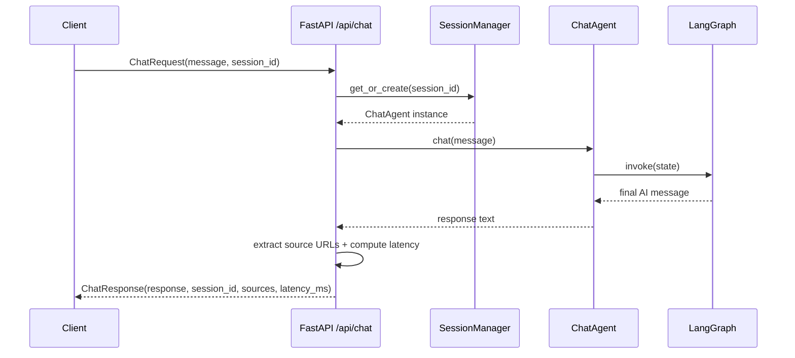

Plain-text fallback:

```text
Client -> /api/chat -> SessionManager.get_or_create
      -> ChatAgent.chat -> LangGraph.invoke
      -> response text -> source extraction + latency
      -> ChatResponse to client
```

Workflow explanation:

1. Session continuity is keyed by `session_id`.
2. Business logic is delegated to graph runtime through ChatAgent.
3. API layer adds response metadata (sources, latency).

#### 19.5.2 `GET /api/stats` Sequence

Rendered SVG (fallback-safe):

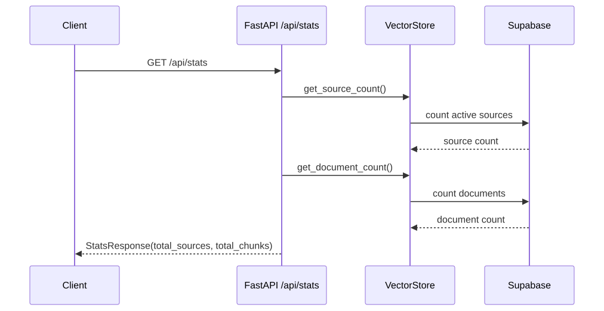

Mermaid:

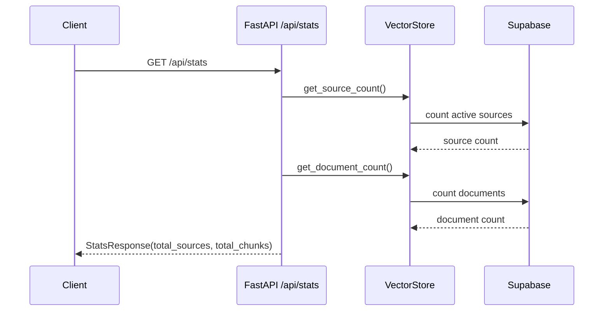

Plain-text fallback:

```text
Client -> /api/stats
      -> VectorStore.get_source_count
      -> VectorStore.get_document_count
      -> StatsResponse
```

Workflow explanation:

1. Endpoint provides corpus health signals.
2. Counts are pulled live from current DB state.

#### 19.5.3 `POST /api/chat/reset` Sequence

Rendered SVG (fallback-safe):

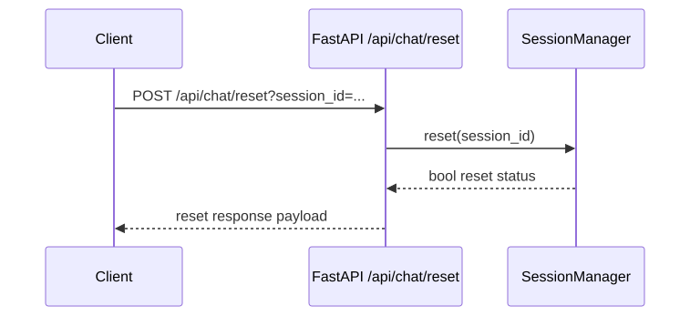

Mermaid:

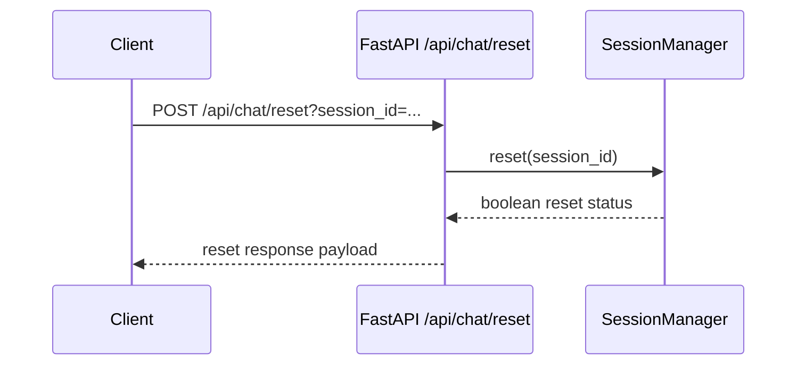

Plain-text fallback:

```text
Client -> /api/chat/reset -> SessionManager.reset
      -> reset status -> response payload
```

Workflow explanation:

1. Reset clears in-memory conversation state for that session.
2. If session is unknown, response is non-destructive and explicit.

#### 19.5.4 API Error-Handling Workflow

Purpose:

1. Ensure consistent failure surfaces and diagnosable error logging.

Execution:

1. Endpoint catches exceptions around core logic.
2. Logs include error details and traceback.
3. API returns HTTP 500 with detail payload.

Plain-text flow:

```text
[endpoint execution]
   -> [exception?]
     | no  -> normal response
     | yes -> log error + raise HTTPException(500)
```

---

## 20. Observability And Logging

### 20.1 Logging

Logger utility is centralized in `src/utils/logger.py` and used across modules.

Observed patterns:

1. Ingestion stage logs and summary counters.
2. Per-query retrieval and grading logs.
3. Error logs with traceback for runtime exceptions.

### 20.2 LangSmith Tracing

If key is set and enabled, LangSmith traces graph/LLM interactions for deeper debugging and analysis.

---

## 21. Setup, Bootstrapping, And Operational Runbook

### 21.1 Environment Setup Sequence

1. Create and activate Python virtual environment.
2. Install dependencies from `requirements.txt`.
3. Run `crawl4ai-setup` to install browser dependencies.
4. Copy `.env.example` to `.env` and fill required keys.

### 21.2 Database Bootstrap

Run:

```bash
python scripts/setup_db.py
```

Optional destructive reset:

```bash
python scripts/setup_db.py --drop
```

### 21.3 Ingestion Run

Normal:

```bash
python scripts/run_ingestion.py
```

Force re-ingest all pages:

```bash
python scripts/run_ingestion.py --force
```

Wipe and fresh ingest:

```bash
python scripts/run_ingestion.py --clean
```

### 21.4 Online Runtime Modes

CLI mode:

```bash
python -m src.main
```

API mode:

```bash
python scripts/run_server.py --port 8000
```

### 21.5 Quick Health Checklist

1. DB setup succeeded without SQL errors.
2. `sources` and `documents` populated after ingestion.
3. `/api/health` returns healthy status.
4. Sample question returns citations.

---

## 22. Evaluation Methodology

Implemented in `eval/run_eval.py` (retrieval metrics) and `eval/run_ragas.py` (end-to-end RAG metrics).

### 22.1 Goal

Measure component-level retrieval quality and end-to-end conversational answer quality objectively.

### 22.2 Retrieval Quality Metrics (Offline)

Evaluated via `run_eval.py` using `eval/golden_queries.py`.
1. **Hit Rate at K (HR@K)**: Fraction of queries with at least one target chunk in top K.
2. **Mean Reciprocal Rank at K (MRR@K)**: Average of reciprocal rank of the first relevant hit.

If retrieval is poor, generation cannot recover facts.

### 22.3 End-to-End Generation Quality (Online)

Evaluated via `run_ragas.py` using the **RAGAS** framework evaluated by `GPT-4o`.
1. **Faithfulness**: Measures whether the generated answer contains hallucinated facts not present in the retrieved chunks.
2. **Answer Relevancy**: Measures how directly the generated answer addresses the posed user query without wandering off topic.

### 22.4 Why Both Methods?

Combining offline offline ranking metrics and AI-as-a-judge provides full visibility. We found that deploying OpenAI GPT-4o vastly improved faithfulness compared to smaller open-source models, while hybrid retrieval directly boosted downstream answer relevancy for edge cases like specific connector names.

---

## 23. Security Posture And Secret Hygiene

### 23.1 Secret Handling

Secrets are sourced from environment variables and never committed.

### 23.2 Key Risk Areas

1. Exposed service role keys in logs or client contexts.
2. Overly permissive CORS in production.
3. Missing API rate limits and abuse controls.

### 23.3 Current Mitigations

1. Secret wrapper methods in config.
2. No hardcoded credentials in source.
3. Clear `.env.example` guidance.

### 23.4 Recommended Hardening Next

1. Restrict CORS origins.
2. Add API auth and request quotas.
3. Add structured secret scanning in CI.

---

## 24. Performance Characteristics

### 24.1 Ingestion Performance Drivers

1. Crawl concurrency.
2. Page size and dynamic render overhead.
3. Embedding throughput and batch size.
4. DB insert batch size.

### 24.2 Query-Time Latency Drivers

1. Embedding query time.
2. Vector RPC performance.
3. Grader LLM calls per candidate chunk.
4. Final generation LLM latency.

### 24.3 Optimization Opportunities

1. Parallelize grading calls where safe.
2. Tune top_k and threshold by category.
3. Cache query embeddings for repeated prompts.
4. Introduce reranking model for top candidates.

---

## 25. Failure Modes And Debugging Playbook

### 25.1 Ingestion Failure Modes

1. Sitemap fetch failures.
2. Crawl rendering failures.
3. Empty markdown or over-cleaned pages.
4. Embedding dimension mismatch.
5. Supabase connectivity or payload limits.

Debug sequence:

1. Validate `.env` keys.
2. Run scraper test scripts for isolated page checks.
3. Check logs for per-page clean length warnings.
4. Inspect `sources` and `documents` counts.

### 25.2 Retrieval Failure Modes

1. No hits above threshold.
2. Hits are semantically off-target.
3. Grader removes all docs due strictness.

Debug sequence:

1. Temporarily lower threshold.
2. Run keyword fallback checks.
3. Inspect retrieved chunk contents directly.
4. Review grader verdict patterns in traces.

### 25.3 Generation Failure Modes

1. Empty or generic answers despite relevant docs.
2. Missing citations.
3. LLM API errors/timeouts.

Debug sequence:

1. Validate prompt construction.
2. Inspect context payload format.
3. Verify OpenRouter key/model availability.

### 25.4 API Runtime Failure Modes

1. Session memory growth under long-lived process.
2. Session loss after restarts.
3. Broad CORS in unsafe environments.

Mitigations:

1. Add session TTL and LRU eviction.
2. Persist conversations/messages to DB.
3. Add auth and CORS allowlist.

---

## 26. Design Trade-Off Ledger

This section explicitly records accepted trade-offs so future maintainers understand intent.

### 26.1 CPU Embeddings

Decision: keep CPU default.

Why:

1. Easier setup on standard machines.
2. Avoids GPU dependency friction.

Cost:

1. Slower ingestion on large corpora.

### 26.2 In-Memory Sessions

Decision: keep in-memory session manager for API MVP.

Why:

1. Simplicity and low implementation overhead.

Cost:

1. No persistence across restarts.
2. Not horizontally scalable without shared state.

### 26.3 LLM-Based Grading

Decision: use LLM relevance grading after retrieval.

Why:

1. Improved filtering quality versus raw threshold alone.

Cost:

1. Extra latency and token cost per query.

### 26.4 Rewrite Loop Limit

Decision: max rewrite attempts = 2.

Why:

1. Prevent infinite loops.
2. Keep latency bounded.

Cost:

1. Some hard queries may still fail after 2 rewrites.

---

## 27. Extensibility Guide

### 27.1 Add New Documentation Version

Steps:

1. Change `IngestionConfig.DOCS_VERSION`.
2. Re-run ingestion.
3. Re-run evaluation.

### 27.2 Add New Categories

Steps:

1. Extend `CATEGORY_PATTERNS` in sitemap parser.
2. Update `IngestionConfig.CATEGORIES`.
3. Ingest and validate category distribution logs.

### 27.4 Add Persistent Chat Storage

Steps:

1. Use existing `conversations` and `messages` schema.
2. Store turns on each API chat request.
3. Rehydrate ChatAgent history from DB by session.
4. Add retention policy.

### 27.5 Add Citation Structure At API Level

Current behavior extracts citation URLs via regex from generated text.

More robust approach:

1. Carry source URLs directly from retrieved_docs.
2. Return structured citation metadata independent of generation format.

---

## 28. Testing Strategy (Current And Recommended)

### 28.1 Current Coverage Style

The repository currently emphasizes script-driven validation:

1. Scrape behavior tests via utility scripts.
2. Ingestion run summaries.
3. Retrieval evaluation with golden queries.

### 28.2 Recommended Next Test Layers

1. Unit tests for text cleaning edge cases.
2. Unit tests for URL filtering/category mapping.
3. Unit tests for graph routing and rewrite branch behavior.
4. Integration tests with mocked Supabase client.
5. Contract tests for API response models.

### 28.3 High-Value Unit Test Targets

1. `strip_empty_links` nested-parenthesis scenarios.
2. `_find_content_start/_find_content_end` boundary extraction.
3. `should_rewrite` edge conditions at rewrite limits.
4. `extract_title` fallback ordering.

---

## 29. Operational Maturity Roadmap

### 29.1 Stage 1 (Current)

1. Functional MVP with CLI + API.
2. Offline ingestion and retrieval metrics.
3. Strong modular architecture.

### 29.2 Stage 2 (Near-Term)

1. Persistent conversations.
2. Hybrid retrieval in graph path.
3. Auth and CORS tightening.
4. Added unit test suite.

### 29.3 Stage 3 (Production-Hardening)

1. Background ingestion scheduler.
2. Query analytics dashboards.
3. Rate limiting and abuse detection.
4. SLOs for latency and citation quality.

---

## 30. Interview-Ready Explanation Script

This section is intentionally written as speaking points for design interviews.

### 30.1 One-Minute System Summary

"This is an agentic RAG system for OpenMetadata documentation. I ingest pages from the sitemap, clean markdown artifacts deterministically, chunk and embed the content, and store chunks in Supabase Postgres with pgvector. At query time, a LangGraph state machine routes between direct response and retrieval path, grades document relevance, rewrites the query if needed, then generates a citation-grounded answer. I evaluate retrieval with HR@K and MRR@K to ensure objective quality."

### 30.2 Why Not A Simpler Chain

"A simple chain fails when first retrieval misses. I added an explicit grading and rewrite loop to recover from weak initial queries while keeping attempts bounded for latency control."

### 30.3 Why Supabase Postgres

"I needed one operational system that supports vector search, full-text fallback, relational metadata, and SQL-level optimization. Supabase Postgres with pgvector gave that balance."

### 30.4 Most Critical Engineering Decision

"The biggest quality decision was deterministic text cleaning. If ingestion is noisy, everything downstream degrades. Solving markdown artifact cleanup with a character scanner rather than fragile regex made retrieval quality much more stable."

### 30.5 First Production Upgrade

"I would persist sessions and add authenticated API access with CORS restriction, then merge keyword fallback into the graph retrieval path for stronger exact-term handling."

---

## 31. Question Bank With Strong Answers

### Q1. Why use LLM grading after retrieval when cosine similarity already ranks documents?

A1. Similarity scores are useful but not sufficient. Cosine can rank semantically nearby yet irrelevant chunks. LLM grading adds a semantic relevance gate before generation, which improves grounding quality. It is a deliberate latency-cost trade for answer precision.
This is ideal because it explicitly balances retrieval quality, ranking quality, and practical trade-offs.

### Q2. Why rewrite only when zero relevant docs remain?

A2. Rewriting is a recovery mechanism. If at least some docs are relevant, generation can usually proceed. Triggering rewrite too aggressively would increase latency and churn unnecessarily.
This is ideal because it connects answer quality with measurable performance and cost control.

### Q3. Why keep max rewrite attempts low?

A3. To enforce bounded latency and avoid hidden loops. Two attempts give meaningful recovery while keeping user experience predictable.
This is ideal because it connects answer quality with measurable performance and cost control.

### Q4. Why include conversations/messages tables if sessions are in-memory?

A4. It is forward-compatible schema planning. The online MVP uses in-memory sessions for simplicity, while the schema is ready for durable persistence without disruptive migrations.
This is ideal because it anchors the answer in data-layer correctness, the foundation of reliable RAG.

### Q5. Why use direct DB setup script instead of static SQL migration files?

A5. For this project scope, Python-driven setup gives one executable bootstrap path tied to runtime config and clear logging. For larger teams, this can evolve into formal migration tooling.
This is ideal because it ties the decision to reliability, clarity, and defensible engineering trade-offs.

### Q6. Why local embeddings instead of embedding APIs?

A6. Local embeddings reduce recurring cost and external dependency risk, which is ideal for assessment and reproducibility. It also avoids rate-limit coupling during ingestion.
This is ideal because it connects answer quality with measurable performance and cost control.

### Q7. Why is there both graph retrieval logic and tool retrieval logic?

A7. The graph path is the primary runtime flow. Tool functions are present for future tool-calling variants and experimentation. This is a current architectural seam and a candidate for consolidation.
This is ideal because it ties the decision to reliability, clarity, and defensible engineering trade-offs.

---

## 32. Known Gaps And Honest Limitations

1. API sessions are not durable across process restarts.
2. CORS is currently permissive for development convenience.
3. Graph retrieval path does not yet integrate keyword fallback.
4. Automated test coverage can be expanded significantly.
5. Some docs in `docs/` may contain stale references and should be synchronized with this guide.

Capturing limitations explicitly is part of responsible engineering communication.

---

## 33. Practical Maintenance Checklist

When changing this system, verify these in order:

1. Config and env variables remain consistent.
2. DB schema still matches embedding dimensions and runtime expectations.
3. Ingestion run produces non-trivial source and chunk counts.
4. Sample queries produce citations.
5. Evaluation metrics do not regress unexpectedly.

---

## 34. Appendix A: Concrete File-To-Responsibility Map

1. `src/config.py`: configuration classes, secrets, LangSmith env setup.
2. `src/main.py`: CLI runtime.
3. `src/api/server.py`: FastAPI app, session manager, endpoint handlers.
4. `src/agent/state.py`: LangGraph state shape.
5. `src/agent/prompts.py`: prompt templates.
6. `src/agent/nodes.py`: routing/retrieval/grading/rewrite/generation functions.
7. `src/agent/graph.py`: graph wiring and chat wrapper.
8. `src/agent/tools.py`: tool interfaces for retrieval and keyword search.
9. `src/ingestion/sitemap_parser.py`: sitemap fetch/filter/classify.
10. `src/ingestion/scraper.py`: Crawl4AI async scraping and markdown cleaning.
11. `src/ingestion/text_cleaner.py`: empty-link artifact stripping.
12. `src/ingestion/chunker.py`: chunk generation and metadata.
13. `src/ingestion/ingest.py`: end-to-end ingestion orchestrator.
14. `src/embeddings/embedding_service.py`: singleton embedding model wrapper.
15. `src/database/supabase_client.py`: cached Supabase client factory.
16. `src/database/vector_store.py`: source/chunk storage and vector retrieval.
17. `src/database/text_search.py`: keyword retrieval wrapper.
18. `scripts/setup_db.py`: schema, indexes, RPCs, triggers.
19. `scripts/run_ingestion.py`: ingestion CLI wrapper with clean/force modes.
20. `scripts/run_server.py`: API server launcher.
21. `eval/golden_queries.py`: evaluation query fixtures.
22. `eval/run_eval.py`: metric runner and summary output.

---

## 35. Appendix B: Data Contracts

### 35.1 Retrieved Doc Shape (runtime expectation)

A retrieved doc dict is expected to include fields like:

1. `id`
2. `content`
3. `metadata`
4. `source_url`
5. `source_title`
6. `chunk_index`
7. `similarity` (vector path) or `rank` (keyword path)

### 35.2 API Chat Request Contract

Fields:

1. `message` string (1..4000)
2. `session_id` string (optional, auto-generated if omitted)

### 35.3 API Chat Response Contract

Fields:

1. `response` string
2. `session_id` string
3. `sources` list of URL strings
4. `latency_ms` float

---

## 36. Appendix C: Suggested Future Documentation Expansions

This guide is a living document and can be expanded further in future passes with:

1. Full sequence diagrams per endpoint.
2. Raw SQL explain plans for retrieval RPC performance tuning.
3. Prompt ablation study logs.
4. Evaluation trend history across config changes.
5. Incident response templates for ingestion/runtime failures.

---

## 37. Closing Summary

This project is intentionally engineered as a clear, inspectable, and extensible documentation intelligence system. The architecture balances deterministic data processing with agentic retrieval control. The ingestion stack protects corpus quality, the storage layer unifies semantic and keyword capabilities, and the LangGraph runtime provides bounded self-correction before answer generation.

The system is already practical, and its seams for future enhancement are explicit and low-risk. That combination, reliability now and clear extensibility path, is the core engineering achievement.

---

## 38. Revision Log

2026-04-02:

1. Rewrote guide as canonical implementation-aligned handbook.
2. Added architecture rationale, trade-off ledger, and extensibility playbooks.
3. Added interview-focused explanation scripts and question bank.
4. Added known gaps, operational checklists, and data contracts.

---

## 39. Volume 2: Implementation Walkthrough (Function-Level)

This section explains the implementation as if we are tracing a debugger through each major file. The goal is to remove hidden assumptions and make maintenance predictable.

### 39.1 `src/config.py` Walkthrough

#### 39.1.1 Import And `.env` Loading

1. The module computes `_PROJECT_ROOT` by walking up from the file path.
2. It calls `load_dotenv(_PROJECT_ROOT / ".env")`.
3. This ensures all downstream modules can rely on environment resolution at import time.

Practical implication:

1. If `.env` is missing or malformed, failures appear when secrets are first consumed.
2. The config module itself does not aggressively validate all required secrets upfront.

#### 39.1.2 Class-Based Static Configuration

Configuration classes are plain class constants, not pydantic settings models.

Why this is acceptable here:

1. Simple to read and diff.
2. No extra framework complexity.
3. Good fit for project scale.

Where this may evolve:

1. For production, pydantic settings with typed validation may improve strictness.

#### 39.1.3 `configure_langsmith()` Execution Timing

The function is called on module import.

Behavior:

1. If tracing enabled and key exists, environment is configured.
2. Else tracing env var is removed.

Important note:

1. Import order can matter in some environments if other components read LangSmith env vars before `config.py` import.
2. In this codebase, config is imported early by runtime entry points, so behavior is stable.

### 39.2 `scripts/setup_db.py` Walkthrough

This script is one of the most important operational files. It defines schema, indexes, RPC functions, triggers, and optional destructive reset behavior.

#### 39.2.1 Why This File Is Structured As SQL Blocks

Each SQL block is a named constant with explicit semantic intent:

1. Extensions
2. Table definitions
3. Indexes
4. RPC function definitions
5. Trigger definitions

This makes review simple and keeps DDL transparent.

#### 39.2.2 Extension Setup

The script enables:

1. `vector`
2. `pg_trgm`

Why both:

1. `vector` powers embedding similarity.
2. `pg_trgm` can support fuzzy text workflows and related indexing patterns.

#### 39.2.3 Source Table Constraints

`section_category` uses a CHECK constraint over known categories.

Benefits:

1. Prevents accidental category drift.
2. Maintains predictable filtering semantics.

Trade-off:

1. New categories require schema updates.

#### 39.2.4 Documents Table Design

`embedding VECTOR(384)` hard-codes the embedding dimension.

Operational consequence:

1. Embedding model changes that alter dimension require schema migration.
2. This is intentionally guarded by runtime dimension check in embedding service.

#### 39.2.5 HNSW Index Parameters

Current HNSW parameters:

1. `m = 16`
2. `ef_construction = 64`

These are reasonable defaults balancing build cost and query quality for medium-size corpora.

#### 39.2.6 RPC `match_documents`

Core logic:

1. Join chunks with sources.
2. Filter active sources.
3. Apply similarity threshold.
4. Apply optional category filter.
5. Order by vector distance.
6. Return top results.

Design note:

1. Similarity is returned as `1 - distance` for interpretability.

#### 39.2.7 RPC `keyword_search`

Core logic:

1. Use `websearch_to_tsquery` for human-like query parsing.
2. Score matches with `ts_rank`.
3. Return ranked chunk list.

Strength:

1. Exact-term and operator-friendly fallback path.

#### 39.2.8 RPC `get_surrounding_chunks`

Purpose:

1. Recover nearby chunk context around a hit.

Typical use:

1. Expand brief snippets into full procedural context.

#### 39.2.9 Trigger Setup

A generic trigger function updates `updated_at` fields on sources and conversations.

Why this is useful:

1. Auditability for content freshness.
2. No app-layer timestamp management burden.

#### 39.2.10 Drop-First Flow

`--drop` executes ordered teardown:

1. Triggers
2. Functions
3. Tables

This avoids dependency errors and keeps reset deterministic.

### 39.3 `src/ingestion/sitemap_parser.py` Walkthrough

#### 39.3.1 URL Discovery

`fetch_sitemap_urls()`:

1. Downloads sitemap XML.
2. Parses `<loc>` tags.
3. Returns flat URL list.

#### 39.3.2 Classification And Filtering

`filter_urls()` does four passes:

1. Version filter.
2. Category mapping filter.
3. CRUD/variant suffix pruning.
4. Max-page balancing.

Why multi-pass:

1. Debuggability at each stage.
2. Better logging and observability.

#### 39.3.3 Category Balance Algorithm

The algorithm enforces broad topical representation when capping page count.

Potential edge case:

1. If one category is very sparse, equal quota may underfill.
2. Overflow fill mechanism addresses this by topping up from remaining pages.

### 39.4 `src/ingestion/scraper.py` Walkthrough

#### 39.4.1 Crawler Configuration

Run config includes:

1. Cache bypass.
2. Excluded layout tags.
3. Overlay removal.

This reduces stale content effects and strips obvious chrome noise.

#### 39.4.2 Single-URL Pipeline `_scrape_single`

Flow:

1. Crawl URL.
2. Validate success.
3. Resolve raw markdown.
4. Clean markdown.
5. Validate minimum length.
6. Extract title.
7. Compute content hash.
8. Return `ScrapedPage`.

Important resilience behavior:

1. Any exception is isolated per page and does not abort full run.

#### 39.4.3 Batch Pipeline `_scrape_batch`

Uses `asyncio.gather(return_exceptions=True)`.

Advantages:

1. Fast concurrent I/O.
2. Partial success under per-page failures.

#### 39.4.4 Synchronous Wrapper

`scrape_pages_sync()` wraps async flow for script ergonomics.

This keeps ingestion scripts straightforward while preserving async internals.

### 39.5 `src/ingestion/text_cleaner.py` Walkthrough

#### 39.5.1 Character Scanner Rationale

The scanner tracks bracket/parenthesis sequence and nested depth.

Pseudo-flow:

```text
for each char i:
	if text[i:i+3] == "[](":
		skip forward until matching closing parenthesis
		skip trailing spaces/tabs
	else:
		append char
```

Why it works:

1. Deterministic control over edge cases.
2. Independent from regex engine quirks.

### 39.6 `src/ingestion/chunker.py` Walkthrough

#### 39.6.1 Split + Post-Clean

For each splitter output:

1. Strip residual empty links.
2. Remove lone-number lines.
3. Collapse excess blank lines.
4. Extract first heading.

This second-pass cleanup improves chunk readability and embedding quality.

#### 39.6.2 Metadata Richness

Chunk metadata includes enough provenance to support:

1. Citation reconstruction.
2. UI grouping by source and section.
3. Future reranking features.

### 39.7 `src/ingestion/ingest.py` Walkthrough

#### 39.7.1 Stats Contract

The orchestrator accumulates stats for:

1. URLs found
2. Pages scraped
3. Pages skipped
4. Chunks created
5. Chunks stored

These counters are operationally useful for regression detection.

#### 39.7.2 Per-Page Processing Loop

For each page:

1. Skip unchanged pages unless forced.
2. Upsert source row.
3. Chunk page content.
4. Batch-embed chunk texts.
5. Store chunk rows.

Failure handling:

1. Errors are logged and loop continues.

#### 39.7.3 Why Delete-And-Reinsert Chunks

Chunk boundaries can change when content changes.

Delete-and-reinsert ensures:

1. No stale chunk residue.
2. Clean one-source one-version chunk set.

### 39.8 `src/database/vector_store.py` Walkthrough

#### 39.8.1 Upsert Source

Uses `on_conflict="url"` for idempotent source maintenance.

#### 39.8.2 Store Documents

Behavior:

1. Delete existing source chunks.
2. Build chunk rows.
3. Insert in batches of 50.

Why 50:

1. Safe payload size compromise for Supabase API calls.

#### 39.8.3 Similarity Search

Thin wrapper around RPC call with defaulted top_k and threshold.

#### 39.8.4 Utility Methods

Includes source lookup and count methods used by CLI/API stats endpoints.

### 39.9 `src/agent/nodes.py` Walkthrough

#### 39.9.1 `_get_llm()`

Builds a `ChatOpenAI` client configured for OpenRouter endpoint and key.

#### 39.9.2 `route_query()`

Simple pattern-based routing for greetings/meta prompts.

Strength:

1. Deterministic and cheap.

Limit:

1. Pattern list maintenance is manual.

#### 39.9.3 `retrieve()`

Embeds query and fetches vector matches from DB.

#### 39.9.4 `grade_documents()`

Per-doc LLM grading with yes/no verdict.

Implementation nuance:

1. Verdict check uses substring containment of `"yes"`.
2. Usually fine, but stricter normalization could be added.

#### 39.9.5 `should_rewrite()`

If no docs and rewrites remain -> rewrite. Else generate.

#### 39.9.6 `rewrite_query()`

Asks LLM to reformulate query for improved retrieval terms.

#### 39.9.7 `generate()`

Two modes:

1. Context mode with retrieved docs.
2. No-context fallback message.

Conversation handling:

1. Uses last six messages for recency control.

#### 39.9.8 `generate_direct()`

Handles non-retrieval conversational prompts.

### 39.10 `src/agent/graph.py` Walkthrough

#### 39.10.1 Graph Wiring

The graph explicitly encodes control edges. This is one of the clearest files for architecture demonstration.

#### 39.10.2 ChatAgent Wrapper

Maintains local history and invokes graph per user turn.

Design advantage:

1. Keeps caller interface simple (`agent.chat(text)`).

### 39.11 `src/api/server.py` Walkthrough

#### 39.11.1 Pydantic Contracts

Request/response models ensure predictable API shape.

#### 39.11.2 SessionManager

Maps session IDs to ChatAgent objects.

#### 39.11.3 `/api/chat` Endpoint

Flow:

1. Resolve agent by session.
2. Generate response.
3. Regex-extract source URLs.
4. Return payload with latency.

#### 39.11.4 `/api/stats` Endpoint

Uses `VectorStore` utility counts to expose corpus health indicators.

### 39.12 `src/main.py` Walkthrough

#### 39.12.1 Rich UX

Startup shows model/embedding/tracing status, then interactive loop with command handling.

#### 39.12.2 Command Parsing

Slash commands are routed before model call, reducing unnecessary token usage.

### 39.13 `eval/run_eval.py` Walkthrough

#### 39.13.1 Single Query Evaluation

For each query:

1. Embed question.
2. Retrieve top-k with zero threshold.
3. Match expected URL patterns.
4. Compute hit and reciprocal rank.

#### 39.13.2 Aggregate Summary

Computes HR@K and MRR@K and prints target attainment checks.

---

## 40. Query Lifecycle Deep Trace (Concrete Example)

This section narrates a realistic runtime query step-by-step.

Example query:

"How do I deploy OpenMetadata using Docker?"

### 40.1 API Entry

1. Request arrives at `/api/chat`.
2. Session manager returns existing or new ChatAgent.

### 40.2 Graph Entry Routing

1. `route_query` evaluates input.
2. Query is not greeting -> route to `retrieve`.

### 40.3 Retrieval

1. Query text embedded to 384-d vector.
2. `match_documents` RPC returns top-K chunks with similarity and source metadata.

### 40.4 Relevance Grading

1. Each chunk truncated to first 1000 chars for grader prompt.
2. LLM returns yes/no per chunk.
3. Irrelevant chunks are removed.

### 40.5 Rewrite Decision

1. If any relevant docs remain -> `generate`.
2. If none and rewrite attempts available -> `rewrite_query` then loop back.

### 40.6 Generation

1. Build context block from relevant chunks.
2. Build prompt stack with system+context+recent messages.
3. Invoke LLM for final answer.
4. Return AI message to graph state.

### 40.7 Response Packaging

1. API endpoint measures latency.
2. Regex extracts source URLs from markdown response.
3. Returns JSON with response text, source list, latency.

### 40.8 Failure Branch Example

If retrieval and rewrite both fail:

1. `generate` enters no-doc fallback instruction path.
2. Assistant returns explicit inability to find relevant info in current docs context.

This prevents confident hallucinations.

---

## 41. Architecture Decision Records (ADR-Style)

These ADR summaries capture key decisions in concise engineering format.

### ADR-001: Use Agentic RAG (LangGraph) Instead Of Linear Chain

Status: Accepted

Context:

1. Need resilience against bad first retrieval.

Decision:

1. Implement route-retrieve-grade-rewrite-generate graph.

Consequences:

1. Better retrieval recovery.
2. Higher complexity than linear chain.

### ADR-002: Use Supabase Postgres With pgvector

Status: Accepted

Context:

1. Need vector and keyword retrieval in one data plane.

Decision:

1. Store chunks in Postgres with vector and FTS indexes.

Consequences:

1. Unified stack and simple operations.
2. Requires SQL and RPC maintenance.

### ADR-003: Character-Level Cleaner For `[](url)`

Status: Accepted

Context:

1. Regex approach showed edge-case brittleness.

Decision:

1. Implement deterministic scanner.

Consequences:

1. Higher reliability in cleaned corpus.
2. Slightly more custom code to maintain.

### ADR-004: In-Memory Session Management For API MVP

Status: Accepted (interim)

Context:

1. Need quick conversational continuity.

Decision:

1. Map session ID to ChatAgent in memory.

Consequences:

1. Fast and simple.
2. No durability/horizontal scalability.

### ADR-005: Keep Prompt Templates Centralized

Status: Accepted

Context:

1. Prompt drift is common in RAG systems.

Decision:

1. Centralize prompts in one module.

Consequences:

1. Easier review and tuning.
2. Requires careful version tracking when edited.

### ADR-006: Evaluate Retrieval Separately From Generation

Status: Accepted

Context:

1. Need objective metric signal independent of model phrasing.

Decision:

1. Use golden queries and HR/MRR in `eval/`.

Consequences:

1. Better retrieval optimization clarity.
2. Still need additional answer-level quality evaluation in future.

### ADR-007: Chunk Overlap Set To 400

Status: Accepted

Context:

1. Avoid losing context at chunk boundaries.

Decision:

1. Use 2000 char chunks with 400 overlap.

Consequences:

1. Better continuity.
2. Slightly larger storage and indexing footprint.

### ADR-008: Use OpenRouter-Compatible ChatOpenAI Client

Status: Accepted

Context:

1. Need flexible model endpoint with OpenAI-compatible interface.

Decision:

1. Configure ChatOpenAI with OpenRouter base URL.

Consequences:

1. Easy model swap potential.
2. Dependency on external gateway availability.

### ADR-009: Use `content_hash` For Idempotent Ingestion

Status: Accepted

Context:

1. Re-ingestion should skip unchanged pages.

Decision:

1. Compare hash before processing page.

Consequences:

1. Faster reruns.
2. Requires reliable hash from cleaned content.

### ADR-010: Keep Category Filters In URL Space

Status: Accepted

Context:

1. Need fast, deterministic scope control.

Decision:

1. Categorize by URL path patterns.

Consequences:

1. Transparent filtering.
2. Potential misses when docs URL patterns change.

---

## 42. Troubleshooting Runbook (Expanded)

### 42.1 Symptom: `setup_db.py` fails with extension errors

Likely cause:

1. DB role lacks extension permissions.

Actions:

1. Verify Supabase project and DB URL correctness.
2. Confirm extension availability in plan/region.
3. Re-run setup after permission checks.

### 42.2 Symptom: Ingestion runs but stores zero chunks

Likely causes:

1. Over-aggressive URL filtering.
2. Scraper cleaning removing too much content.
3. Embedding/storage failures in loop.

Actions:

1. Log and inspect `urls_found`, `pages_scraped`, `chunks_created`.
2. Use scraper test script against known page.
3. Print sample cleaned markdown lengths.

### 42.3 Symptom: Query returns generic fallback too often

Likely causes:

1. High similarity threshold.
2. Retrieval corpus coverage gaps.
3. Grader prompt too strict for returned chunks.

Actions:

1. Lower threshold temporarily for diagnosis.
2. Run evaluation script and inspect misses.
3. Inspect top retrieved chunks for representative failed query.

### 42.4 Symptom: API latency spikes

Likely causes:

1. LLM response latency.
2. Multiple grader calls per query.
3. Network issues to DB or OpenRouter.

Actions:

1. Measure per-stage latency (embed/retrieve/grade/generate).
2. Reduce top_k during diagnostics.
3. Add timeout and retry strategy where safe.

### 42.5 Symptom: Source citations missing in API response

Likely causes:

1. Model did not emit URLs in text.
2. Regex extraction missed format variant.

Actions:

1. Verify prompt still instructs source citation.
2. Prefer structured citations from retrieved_docs in future refactor.

### 42.6 Symptom: Memory growth in long-running API process

Likely causes:

1. Session map unbounded growth.
2. Conversation history accumulation.

Actions:

1. Add session TTL eviction.
2. Add max history length policy.
3. Persist and prune old sessions.

### 42.7 Symptom: Evaluation unexpectedly regresses

Likely causes:

1. Ingestion corpus changed significantly.
2. Threshold/model/config changes.
3. Docs URL structure changes affecting expected patterns.

Actions:

1. Compare config values and ingestion stats between runs.
2. Inspect per-query miss details.
3. Refresh golden patterns if docs structure evolved.

---

## 43. Performance Tuning Cookbook

### 43.1 Retrieval Top-K Tuning

Guideline:

1. Increase top_k if misses are common but latency allows.
2. Decrease top_k if latency/cost is high and relevance is already good.

### 43.2 Similarity Threshold Tuning

Guideline:

1. Lower threshold to boost recall.
2. Raise threshold to reduce noise.

Best practice:

1. Tune with evaluation metrics, not intuition alone.

### 43.3 Rewrite Policy Tuning

Guideline:

1. If frequent no-hit cases persist, consider increasing rewrite attempts to 3.
2. If latency budget is tight, keep at 1-2.

### 43.4 Chunking Tuning

Guideline:

1. Larger chunks improve context completeness.
2. Smaller chunks improve precision and reduce irrelevant baggage.

Approach:

1. Benchmark multiple chunk sizes using same query set.

### 43.5 Ingestion Throughput Tuning

Levers:

1. Increase crawl concurrency carefully.
2. Increase embedding batch size if memory allows.
3. Tune DB batch insert size.

### 43.6 DB Index And RPC Tuning

Levers:

1. Inspect query plans for RPC SQL.
2. Tune HNSW construction/search parameters.
3. Add selective source/category filters for domain-specific endpoints.

---

## 44. Security And Reliability Hardening Blueprint

### 44.1 API Security

Immediate:

1. Add API key or JWT auth.
2. Restrict CORS origins.
3. Add per-IP/session rate limiting.

Near-term:

1. Add request body and content moderation gates as policy requires.
2. Add structured audit logs for access and errors.

### 44.2 Secret Management

1. Move from `.env` local secrets to managed secret store in deployment.
2. Rotate service keys periodically.
3. Add CI secret scanning.

### 44.3 Reliability Controls

1. Timeouts for external API calls.
2. Retry policies for transient network failures.
3. Circuit-breaker style fallback for repeated provider failures.

### 44.4 Data Safety

1. Snapshot/backup strategy for sources/documents tables.
2. Migration discipline for schema changes.
3. Safe rollback plans for ingestion errors.

---

## 45. Massive Interview Drill Bank

This section intentionally contains many short Q/A items for high-speed oral preparation.

### 45.1 Architecture Fundamentals (Q1-Q20)

Q1. What core problem does this system solve?
A1. It answers natural-language questions grounded in OpenMetadata docs with citations.
This is ideal because it reinforces grounded generation and user trust through explicit evidence handling.

Q2. Why use RAG at all?
A2. To ground answers in source documentation and reduce hallucinations.
This is ideal because it anchors the answer in data-layer correctness, the foundation of reliable RAG.

Q3. Why agentic RAG?
A3. To recover from weak retrieval via grading and rewrite loops.
This is ideal because it explicitly balances retrieval quality, ranking quality, and practical trade-offs.

Q4. What are the three major layers?
A4. Ingestion, Storage, and Agent/Application layers.
This is ideal because it anchors the answer in data-layer correctness, the foundation of reliable RAG.

Q5. What is the role of LangGraph?
A5. It encodes explicit state transitions and loop logic for query handling.
This is ideal because it clarifies continuity behavior and its direct scalability implications.

Q6. What is the role of Supabase?
A6. It stores sources/chunks and runs vector/keyword retrieval.
This is ideal because it explicitly balances retrieval quality, ranking quality, and practical trade-offs.

Q7. Why include both vector and keyword retrieval capabilities?
A7. Vector handles semantic intent; keyword handles exact names/phrases.
This is ideal because it explicitly balances retrieval quality, ranking quality, and practical trade-offs.

Q8. Where is routing logic implemented?
A8. In `route_query` inside `src/agent/nodes.py`.
This is ideal because it ties the decision to reliability, clarity, and defensible engineering trade-offs.

Q9. What avoids infinite rewrite loops?
A9. `rewrite_count` bounded by `REWRITE_MAX_ATTEMPTS`.
This is ideal because it ties the decision to reliability, clarity, and defensible engineering trade-offs.

Q10. What happens if no relevant docs are found?
A10. The system rewrites query up to limit, then returns a grounded fallback response.
This is ideal because it reinforces grounded generation and user trust through explicit evidence handling.

Q11. Why not use a single monolithic script?
A11. Modularity improves maintainability, testing, and review clarity.
This is ideal because it captures design intent and long-term maintainability, not just short-term functionality.

Q12. Why does this architecture fit the assignment well?
A12. It demonstrates design quality, explainability, and extensibility.
This is ideal because it captures design intent and long-term maintainability, not just short-term functionality.

Q13. How do you ensure docs version control?
A13. `IngestionConfig.DOCS_VERSION` filters sitemap URLs to version path.
This is ideal because it anchors the answer in data-layer correctness, the foundation of reliable RAG.

Q14. How do you avoid stale chunks after updates?
A14. Delete old source chunks then insert new chunk set.
This is ideal because it anchors the answer in data-layer correctness, the foundation of reliable RAG.

Q15. Where is API session state kept?
A15. In-memory map from session ID to ChatAgent instance.
This is ideal because it clarifies continuity behavior and its direct scalability implications.

Q16. What is the biggest reliability lever?
A16. Ingestion quality and clean corpus preparation.
This is ideal because it anchors the answer in data-layer correctness, the foundation of reliable RAG.

Q17. Why include source URLs in responses?
A17. To provide verification and user trust.
This is ideal because it ties the decision to reliability, clarity, and defensible engineering trade-offs.

Q18. What makes this system explainable?
A18. Explicit graph edges, centralized prompts, and schema-as-code.
This is ideal because it anchors the answer in data-layer correctness, the foundation of reliable RAG.

Q19. Why is there an evaluation harness?
A19. To measure retrieval quality objectively with HR and MRR.
This is ideal because it explicitly balances retrieval quality, ranking quality, and practical trade-offs.

Q20. What is one immediate improvement?
A20. Integrate keyword fallback directly into graph retrieval path.
This is ideal because it explicitly balances retrieval quality, ranking quality, and practical trade-offs.

### 45.2 Ingestion Deep Questions (Q21-Q40)

Q21. Why scrape markdown instead of HTML?
A21. Markdown is cleaner for chunking and embedding pipelines.
This is ideal because it anchors the answer in data-layer correctness, the foundation of reliable RAG.

Q22. Why use async scraping?
A22. To parallelize I/O-bound page retrieval efficiently.
This is ideal because it explicitly balances retrieval quality, ranking quality, and practical trade-offs.

Q23. What is the boundary detection strategy?
A23. Start after TOC marker and end before feedback footer marker.
This is ideal because it ties the decision to reliability, clarity, and defensible engineering trade-offs.

Q24. Why avoid brittle CSS selectors?
A24. Frontend class structure can change and break extraction logic.
This is ideal because it ties the decision to reliability, clarity, and defensible engineering trade-offs.

Q25. What artifact was most problematic?
A25. Mintlify-injected empty link anchors `[](url)` before headings.
This is ideal because it ties the decision to reliability, clarity, and defensible engineering trade-offs.

Q26. Why not regex-only for artifact removal?
A26. Regex edge cases were brittle; scanner gave deterministic behavior.
This is ideal because it ties the decision to reliability, clarity, and defensible engineering trade-offs.

Q27. What does `content_hash` represent?
A27. SHA-256 of cleaned page content to detect changes.
This is ideal because it ties the decision to reliability, clarity, and defensible engineering trade-offs.

Q28. Why classify URLs into categories?
A28. It supports targeted ingestion scope and future filter control.
This is ideal because it anchors the answer in data-layer correctness, the foundation of reliable RAG.

Q29. What is max page balancing for?
A29. To avoid category imbalance when capping ingestion size.
This is ideal because it anchors the answer in data-layer correctness, the foundation of reliable RAG.

Q30. Why keep raw content in `sources`?
A30. For traceability, debugging, and potential reprocessing.
This is ideal because it ties the decision to reliability, clarity, and defensible engineering trade-offs.

Q31. Why use chunk overlap?
A31. To preserve continuity near split boundaries.
This is ideal because it ties the decision to reliability, clarity, and defensible engineering trade-offs.

Q32. What metadata is attached to chunks?
A32. Source URL, title, heading, index, total chunk count.
This is ideal because it anchors the answer in data-layer correctness, the foundation of reliable RAG.

Q33. Why re-clean chunks after splitting?
A33. Overlap and split boundaries may reintroduce minor artifacts.
This is ideal because it ties the decision to reliability, clarity, and defensible engineering trade-offs.

Q34. How do you handle page-level scrape failures?
A34. Log and continue; batch run is resilient to partial failures.
This is ideal because it ties the decision to reliability, clarity, and defensible engineering trade-offs.

Q35. What is a practical sign of over-cleaning?
A35. Many pages failing minimum length after cleaning.
This is ideal because it ties the decision to reliability, clarity, and defensible engineering trade-offs.

Q36. How do you verify ingestion success quickly?
A36. Check stats counters and DB source/chunk counts.
This is ideal because it anchors the answer in data-layer correctness, the foundation of reliable RAG.

Q37. Why store section heading metadata?
A37. It helps retrieval explainability and richer citations.
This is ideal because it explicitly balances retrieval quality, ranking quality, and practical trade-offs.

Q38. What is the ingestion script clean mode?
A38. `--clean` wipes documents/sources then ingests from scratch.
This is ideal because it anchors the answer in data-layer correctness, the foundation of reliable RAG.

Q39. Why is clean mode useful?
A39. It ensures deterministic rebuild after major pipeline changes.
This is ideal because it ties the decision to reliability, clarity, and defensible engineering trade-offs.

Q40. What is one ingestion improvement idea?
A40. Incremental scheduling with per-URL freshness timestamps.
This is ideal because it ties the decision to reliability, clarity, and defensible engineering trade-offs.

### 45.3 Retrieval And Database Questions (Q41-Q60)

Q41. What does `VECTOR(384)` imply operationally?
A41. Embedding model dimension must remain 384 unless schema is migrated.
This is ideal because it anchors the answer in data-layer correctness, the foundation of reliable RAG.

Q42. Why use HNSW index?
A42. Fast approximate nearest-neighbor search for vector retrieval.
This is ideal because it explicitly balances retrieval quality, ranking quality, and practical trade-offs.

Q43. What is cosine similarity representation in RPC output?
A43. `1 - distance` where distance is `embedding <=> query_embedding`.
This is ideal because it anchors the answer in data-layer correctness, the foundation of reliable RAG.

Q44. Why include `is_active` in source filtering?
A44. To soft-disable pages without deleting records.
This is ideal because it ties the decision to reliability, clarity, and defensible engineering trade-offs.

Q45. What does keyword RPC add over vector search?
A45. Precise lexical matching for exact terms and operators.
This is ideal because it ties the decision to reliability, clarity, and defensible engineering trade-offs.

Q46. Why use `websearch_to_tsquery`?
A46. It parses user-like query syntax effectively.
This is ideal because it ties the decision to reliability, clarity, and defensible engineering trade-offs.

Q47. Why create source+chunk composite index?
A47. Efficient neighboring chunk lookup by source and index.
This is ideal because it anchors the answer in data-layer correctness, the foundation of reliable RAG.

Q48. Why are RPCs beneficial?
A48. Centralized DB-side computation and reduced app-layer complexity.
This is ideal because it ties the decision to reliability, clarity, and defensible engineering trade-offs.

Q49. What is one RPC risk?
A49. SQL logic complexity can be harder for non-SQL maintainers.
This is ideal because it captures design intent and long-term maintainability, not just short-term functionality.

Q50. Why batch inserts in `store_documents`?
A50. To avoid payload limits and improve insertion reliability.
This is ideal because it ties the decision to reliability, clarity, and defensible engineering trade-offs.

Q51. How do you handle source updates?
A51. Upsert source by URL, then replace chunks.
This is ideal because it anchors the answer in data-layer correctness, the foundation of reliable RAG.

Q52. Why keep conversations/messages tables now?
A52. To support future persistence with minimal schema redesign.
This is ideal because it anchors the answer in data-layer correctness, the foundation of reliable RAG.

Q53. What might cause low similarity despite relevant content?
A53. Query wording mismatch or embedding model semantic blind spots.
This is ideal because it anchors the answer in data-layer correctness, the foundation of reliable RAG.

Q54. How can you improve exact connector retrieval?
A54. Combine keyword search with vector results in graph path.
This is ideal because it explicitly balances retrieval quality, ranking quality, and practical trade-offs.

Q55. Why threshold defaults to 0.5?
A55. A balanced starting point between precision and recall.
This is ideal because it explicitly balances retrieval quality, ranking quality, and practical trade-offs.

Q56. How do you tune threshold safely?
A56. Adjust incrementally and validate with HR/MRR trends.
This is ideal because it explicitly balances retrieval quality, ranking quality, and practical trade-offs.

Q57. What is context expansion window?
A57. Number of neighboring chunks fetched around top hits.
This is ideal because it anchors the answer in data-layer correctness, the foundation of reliable RAG.

Q58. Is expansion always active in graph flow?
A58. No, current expansion logic is in tool path, not graph retrieve node.
This is ideal because it ties the decision to reliability, clarity, and defensible engineering trade-offs.

Q59. Why is that important to know?
A59. It explains behavior differences between potential retrieval paths.
This is ideal because it explicitly balances retrieval quality, ranking quality, and practical trade-offs.

Q60. What is a robust citation strategy improvement?
A60. Return citations from retrieved_docs directly, not regex extraction.
This is ideal because it reinforces grounded generation and user trust through explicit evidence handling.

### 45.4 Agent And Prompting Questions (Q61-Q80)

Q61. What determines direct response vs retrieval?
A61. `route_query` greeting/meta pattern checks.
This is ideal because it ties the decision to reliability, clarity, and defensible engineering trade-offs.

Q62. Why not always retrieve?
A62. Greetings do not need retrieval; skipping saves latency and cost.
This is ideal because it explicitly balances retrieval quality, ranking quality, and practical trade-offs.

Q63. What does grader prompt enforce?
A63. Binary yes/no relevance decision per chunk.
This is ideal because it anchors the answer in data-layer correctness, the foundation of reliable RAG.

Q64. Why truncate doc to 1000 chars for grading?
A64. Reduce token usage and latency while preserving main signal.
This is ideal because it connects answer quality with measurable performance and cost control.

Q65. What happens if grader call fails?
A65. Chunk is retained to avoid false-empty context due transient failure.
This is ideal because it anchors the answer in data-layer correctness, the foundation of reliable RAG.

Q66. Why is rewrite prompt useful?
A66. It maps user phrasing to likely documentation terminology.
This is ideal because it ties the decision to reliability, clarity, and defensible engineering trade-offs.

Q67. What guards against endless rewrite?
A67. `rewrite_count` max attempts.
This is ideal because it ties the decision to reliability, clarity, and defensible engineering trade-offs.

Q68. What message history is sent to generate node?
A68. Up to six recent messages in context path.
This is ideal because it reinforces grounded generation and user trust through explicit evidence handling.

Q69. Why limit history length?
A69. Control token growth and keep focus on recent context.
This is ideal because it connects answer quality with measurable performance and cost control.

Q70. What if docs are absent after retries?
A70. Generate node uses no-results fallback instruction.
This is ideal because it reinforces grounded generation and user trust through explicit evidence handling.

Q71. Where are prompts centralized?
A71. `src/agent/prompts.py`.
This is ideal because it reinforces grounded generation and user trust through explicit evidence handling.

Q72. Why centralize prompts?
A72. Easier tuning, review, and consistency.
This is ideal because it ties the decision to reliability, clarity, and defensible engineering trade-offs.

Q73. How do you keep model constrained to docs?
A73. System prompt rule: answer only from provided context.
This is ideal because it reinforces grounded generation and user trust through explicit evidence handling.

Q74. Why require citations in prompt rules?
A74. To improve trust and verifiability.
This is ideal because it ties the decision to reliability, clarity, and defensible engineering trade-offs.

Q75. What is one prompt risk?
A75. Overly strict prompts can reduce helpfulness on partially covered topics.
This is ideal because it reinforces grounded generation and user trust through explicit evidence handling.

Q76. How can you monitor prompt behavior drift?
A76. Use LangSmith traces and periodic regression queries.
This is ideal because it ties the decision to reliability, clarity, and defensible engineering trade-offs.

Q77. Why use ChatOpenAI client with OpenRouter base URL?
A77. It provides OpenAI-compatible interface with model flexibility.
This is ideal because it ties the decision to reliability, clarity, and defensible engineering trade-offs.

Q78. What is one possible grader enhancement?
A78. Structured output parsing for strict boolean verdict.
This is ideal because it ties the decision to reliability, clarity, and defensible engineering trade-offs.

Q79. What is one generation enhancement?
A79. Add answer schema with explicit citations list and confidence.
This is ideal because it anchors the answer in data-layer correctness, the foundation of reliable RAG.

Q80. What is one routing enhancement?
A80. Replace fixed greeting list with lightweight intent classifier.
This is ideal because it ties the decision to reliability, clarity, and defensible engineering trade-offs.

### 45.5 API, Ops, And Reliability Questions (Q81-Q100)

Q81. Why FastAPI for this project?
A81. Fast development, typed models, and clean async-friendly interface.
This is ideal because it ties the decision to reliability, clarity, and defensible engineering trade-offs.

Q82. What does `/api/health` expose?
A82. Status plus configured model and tracing state.
This is ideal because it clarifies continuity behavior and its direct scalability implications.

Q83. What does `/api/stats` expose?
A83. Total active sources and chunk count.
This is ideal because it anchors the answer in data-layer correctness, the foundation of reliable RAG.

Q84. Why include latency in chat response?
A84. Basic observability for user experience and performance tracking.
This is ideal because it connects answer quality with measurable performance and cost control.

Q85. What is a known API limitation?
A85. In-memory sessions are not durable across restarts.
This is ideal because it clarifies continuity behavior and its direct scalability implications.

Q86. Why is CORS `*` risky in production?
A86. It allows broad cross-origin access and increases abuse risk.
This is ideal because it reduces security risk while preserving safe, operable system behavior.

Q87. First security hardening step?
A87. Add auth and restrict CORS origins.
This is ideal because it reduces security risk while preserving safe, operable system behavior.

Q88. How would you scale sessions horizontally?
A88. Persist session state in shared store (DB/Redis) and load by session ID.
This is ideal because it clarifies continuity behavior and its direct scalability implications.

Q89. How do you detect ingestion regressions quickly?
A89. Compare stage counters and evaluation metrics between runs.
This is ideal because it ties the decision to reliability, clarity, and defensible engineering trade-offs.

Q90. What does `--clean` mode do?
A90. Deletes all documents and sources then re-ingests from scratch.
This is ideal because it anchors the answer in data-layer correctness, the foundation of reliable RAG.

Q91. Why is retrieval-first evaluation valuable?
A91. It isolates the strongest determinant of answer quality.
This is ideal because it ties the decision to reliability, clarity, and defensible engineering trade-offs.

Q92. What are target retrieval metrics?
A92. Common targets in project comments are HR@5 >= 80% and MRR@5 >= 0.6.
This is ideal because it explicitly balances retrieval quality, ranking quality, and practical trade-offs.

Q93. How can long-term quality be monitored?
A93. Scheduled eval runs with trend dashboards and alert thresholds.
This is ideal because it explicitly balances retrieval quality, ranking quality, and practical trade-offs.

Q94. What is one reliability improvement for external calls?
A94. Add timeout and retry wrappers with bounded backoff.
This is ideal because it ties the decision to reliability, clarity, and defensible engineering trade-offs.

Q95. How do you reduce API token cost?
A95. Lower top_k, tighten grading, and cap message history.
This is ideal because it explicitly balances retrieval quality, ranking quality, and practical trade-offs.

Q96. How do you improve citation robustness?
A96. Return structured citation objects from retrieval layer.
This is ideal because it explicitly balances retrieval quality, ranking quality, and practical trade-offs.

Q97. What is one maintainability strength of this codebase?
A97. Responsibility-based module separation with clear file purposes.
This is ideal because it ties the decision to reliability, clarity, and defensible engineering trade-offs.

Q98. What is one maintainability weakness today?
A98. Some docs outside this guide contain stale references and need sync.
This is ideal because it captures design intent and long-term maintainability, not just short-term functionality.

Q99. What is one high-impact future feature?
A99. Persistent conversation memory with retrieval of prior turns.
This is ideal because it explicitly balances retrieval quality, ranking quality, and practical trade-offs.

Q100. How do you summarize this system in one line?
A100. A modular, agentic, citation-grounded documentation assistant with measurable retrieval quality.
This is ideal because it explicitly balances retrieval quality, ranking quality, and practical trade-offs.

---

## 46. Glossary (Extended)

Agentic RAG: RAG architecture with control logic and branching/loops.

Chunk: A bounded text segment stored and retrieved as a unit.

Citation grounding: Explicit linking of answers to source documents.

Cosine distance: Angular distance metric for vector similarity.

Crawler boundary detection: String-based extraction of content region.

Data plane: Layer where persistent data operations execute.

Embedding: Numeric vector representation of text semantics.

FTS: Full-text search via tsvector/tsquery in Postgres.

HNSW: Approximate nearest neighbor index structure for vectors.

HR@K: Hit Rate in top K retrieval results.

Idempotent ingestion: Repeated runs produce stable outcomes without duplicates.

LangGraph: Graph-based orchestration framework for stateful LLM workflows.

MRR@K: Mean Reciprocal Rank in top K retrieval results.

OpenRouter: Unified API gateway for many LLM providers/models.

Prompt drift: Behavior change due uncontrolled prompt modifications.

Rewrite loop: Query reformulation cycle for retrieval recovery.

RPC: Remote procedure call from app to database function.

Reranking: Reordering retrieved items with a secondary model/scorer.

Session durability: Ability to preserve conversations across process restarts.

State reducer: Mechanism to merge node outputs into graph state.

Threshold tuning: Adjusting similarity cutoffs to balance precision/recall.

Traceability: Ability to map output behavior to inputs and code paths.

---

## 47. Revision Log (Volume 2 Additions)

2026-04-02 (later update):

1. Added function-level implementation walkthrough.
2. Added concrete query lifecycle deep trace.
3. Added ADR-style design record summaries.
4. Added expanded troubleshooting and performance cookbook.
5. Added security hardening blueprint.
6. Added 100-item interview drill bank.
7. Added extended glossary.

---

## 48. Volume 3: Productionization And Operations Playbook

This volume turns architecture understanding into day-2 operational readiness.

### 48.1 Service Objectives

Primary service goals:

1. Correctness: grounded answers with citations.
2. Availability: API reachable and responsive.
3. Freshness: corpus reflects target documentation version.
4. Observability: issues are diagnosable from logs/traces/metrics.

### 48.2 Suggested SLO Baselines (Initial)

These are starting targets and should be refined with real usage telemetry.

1. API availability: 99.5% monthly.
2. P95 `/api/chat` latency: less than 8 seconds.
3. Citation presence rate: greater than 95% for in-scope questions.
4. Retrieval hit-rate guardrail: HR@5 should remain above 75% on regression suite.

### 48.3 Error Budget Thinking

If latency SLO is missed repeatedly:

1. Pause new feature rollout.
2. Triage top contributors (LLM latency, grader fan-out, retrieval stalls).
3. Land performance fixes first.

### 48.4 Deployment Topology (Practical)

A practical deployment path:

1. API service container.
2. Scheduled ingestion job container.
3. Shared Supabase Postgres instance.
4. Centralized logs + trace sink.

Benefits:

1. Runtime and ingestion scaling can be independent.
2. Blast radius of ingestion failures is isolated.

### 48.5 Runtime Config Profiles

Recommended profile sets:

1. Dev profile:
   - lower max pages
   - verbose logs
   - permissive CORS
2. Staging profile:
   - realistic corpus size
   - tracing enabled
   - auth integration test enabled
3. Prod profile:
   - strict CORS
   - auth required
   - conservative timeout/retry policy

### 48.6 Cache Strategy Ideas

Potential cache layers:

1. Query embedding cache by query hash.
2. Retrieval result cache for repeated frequent questions.
3. Prompt-response cache for deterministic low-variance prompts.

Risk controls:

1. Keep short TTL for rapidly changing docs.
2. Include docs version in cache keys.

### 48.7 Session Lifecycle Policy

Current state is unbounded in-memory sessions.

Recommended controls:

1. Session TTL (for example, 60 minutes idle).
2. Max in-memory sessions.
3. LRU eviction after threshold.
4. Optional persistence to DB for critical paths.

### 48.8 Observability Dashboards

Dashboard panels to add first:

1. Request rate by endpoint.
2. Error rate by endpoint.
3. P50/P95/P99 latency for chat endpoint.
4. Average grader calls per request.
5. Rewrite loop frequency.
6. Empty-context generation count.
7. Session map size over time.

### 48.9 Alerting Starter Rules

Suggested initial alerts:

1. `/api/chat` 5xx rate > 2% for 5 minutes.
2. P95 latency > 12s for 10 minutes.
3. Ingestion run stores zero chunks.
4. Evaluation HR@5 drops more than 10 points from baseline.

### 48.10 Runbook Ownership

Clarify who owns what:

1. Ingestion failures: data pipeline owner.
2. API runtime failures: backend owner.
3. Retrieval quality regressions: ML/retrieval owner.
4. Schema failures: data platform owner.

---

## 49. Incident Response Templates

Use these templates to standardize debugging and communication.

### 49.1 Incident Template

1. Incident ID:
2. Start time:
3. Detection channel:
4. Impact summary:
5. Affected components:
6. User-visible symptoms:
7. Immediate mitigation:
8. Root cause:
9. Corrective action:
10. Preventive action:

### 49.2 Common Incident Classifications

1. Retrieval quality drop.
2. API downtime.
3. Ingestion pipeline breakage.
4. Secret or auth misconfiguration.
5. Provider outage (OpenRouter or DB network path).

### 49.3 Incident Drill: Retrieval Collapse

Symptom:

1. Users report generic fallback answers for many questions.

Triage sequence:

1. Check ingestion freshness and latest run stats.
2. Run evaluation suite and identify query clusters failing.
3. Inspect threshold and model config drift.
4. Sample raw retrieved chunks for failing queries.
5. Validate grader behavior from traces.

Likely root causes:

1. Corpus under-coverage.
2. High threshold after config change.
3. Broken retrieval RPC due schema drift.

### 49.4 Incident Drill: API 500 Burst

Symptom:

1. `/api/chat` returns repeated 500 errors.

Triage sequence:

1. Check provider connectivity and API key validity.
2. Inspect traceback logs for first unique error signature.
3. Verify DB and OpenRouter reachability.
4. Roll back recent config changes.
5. Apply temporary degraded mode if needed.

### 49.5 Degraded Mode Proposal

When full pipeline is unstable:

1. Skip grader and rewrite for short period.
2. Use retrieval + generate only.
3. Increase fallback transparency in user message.

This sacrifices some precision for availability.

---

## 50. Scenario Library: Real-World Query Handling Patterns

These scenarios are designed for team training and interview role-play.

### 50.1 Scenario 1: Basic Deployment Question

User asks:

"How do I deploy OpenMetadata with Docker?"

Expected behavior:

1. Retrieval path selected.
2. Deployment chunks ranked high.
3. Grader keeps relevant docs.
4. Answer includes deployment steps and source URLs.

### 50.2 Scenario 2: Connector Exact Name Query

User asks:

"How to configure BigQuery connector settings?"

Potential challenge:

1. Semantic retrieval may miss exact connector details if wording differs.

Mitigation:

1. Hybrid vector + keyword retrieval (future enhancement).

### 50.3 Scenario 3: Greeting Query

User asks:

"Hello, what can you do?"

Expected behavior:

1. `route_query` sends to direct generation.
2. No retrieval call.
3. Friendly scope explanation response.

### 50.4 Scenario 4: Ambiguous Query

User asks:

"How to track flow?"

Expected behavior:

1. First retrieval may be weak.
2. Grader may reject all docs.
3. Rewrite query should map to lineage terms.
4. Second retrieval likely improves.

### 50.5 Scenario 5: Out-Of-Scope Query

User asks:

"Write me a poem about databases."

Expected behavior:

1. System should remain scoped to OpenMetadata support.
2. Respond with polite redirection.

### 50.6 Scenario 6: Multi-Turn Clarification

Turn 1:

"How to deploy OpenMetadata?"

Turn 2:

"Can I do that on Kubernetes?"

Expected behavior:

1. Message history assists follow-up interpretation.
2. Retrieval focuses Kubernetes deployment docs.

### 50.7 Scenario 7: No Matching Docs

User asks:

"How to configure fictional connector XYZ123?"

Expected behavior:

1. Retrieval may fail.
2. Rewrite may still fail.
3. Final fallback response should be explicit and safe.

### 50.8 Scenario 8: Very Long User Prompt

Risk:

1. Input may contain noise or excessive context.

Handling:

1. API model caps input length via request schema.
2. Prompting should still stay grounded to retrieved docs.

### 50.9 Scenario 9: Docs Version Drift

Problem:

1. User expects latest docs, ingestion still on older target version.

Handling:

1. Communicate current docs version scope.
2. Schedule ingestion to updated version.

### 50.10 Scenario 10: Latency-Sensitive Environment

Need:

1. Faster response under stricter latency budget.

Levers:

1. lower top_k
2. reduce rewrite attempts
3. cap grader docs
4. optimize provider/model choice

### 50.11 Scenario 11: High Session Cardinality

Problem:

1. Many active sessions increase memory pressure.

Solution:

1. Session TTL and LRU eviction.

### 50.12 Scenario 12: Citation Compliance Requirement

Need:

1. Every answer must include at least one source when docs-based answer exists.

Approach:

1. Prompt-level rule.
2. Output post-check and warning if citation absent.
3. Future structured citation API.

### 50.13 Scenario 13: Partial Documentation Coverage

Problem:

1. Not all docs pages are ingested yet.

Handling:

1. Be transparent in responses.
2. Expand ingestion scope.

### 50.14 Scenario 14: Schema Migration Event

Problem:

1. Need to change embedding dimensions.

Handling:

1. Add migration plan.
2. Rebuild vector column/index.
3. Re-embed corpus.

### 50.15 Scenario 15: Provider Outage

Problem:

1. LLM provider unreachable.

Handling:

1. Retry with backoff.
2. Fail fast with clear error.
3. Optional fallback model/provider.

### 50.16 Scenario 16: Ingestion Source Changes HTML Pattern

Problem:

1. Boundary markers no longer reliable.

Handling:

1. Update boundary detection heuristics.
2. Add regression tests for cleaner.

### 50.17 Scenario 17: Over-Retrieval Noise

Symptom:

1. Answers include irrelevant details.

Levers:

1. Raise similarity threshold.
2. tighten grader prompt.
3. reduce top_k.

### 50.18 Scenario 18: Under-Retrieval

Symptom:

1. Frequent fallback "no info" responses.

Levers:

1. Lower threshold.
2. Improve rewrite prompt.
3. Increase ingest coverage.

### 50.19 Scenario 19: Evaluation False Negatives

Problem:

1. Expected URL patterns too narrow.

Handling:

1. Expand pattern sets thoughtfully.
2. Keep categories represented.

### 50.20 Scenario 20: Security Review

Checklist:

1. No secrets in logs.
2. CORS restricted.
3. Auth enabled.
4. Rate limiting in place.

### 50.21 Scenario 21: New Team Member Onboarding

Goal:

1. Reach first successful chat quickly.

Path:

1. Setup env.
2. Setup DB.
3. Run ingestion.
4. Run CLI.
5. Run eval.

### 50.22 Scenario 22: Regression After Prompt Change

Problem:

1. Citation rates drop.

Handling:

1. Diff prompt changes.
2. Run controlled query set.
3. Revert if needed.

### 50.23 Scenario 23: Unexpected DB Cost Increase

Likely drivers:

1. Over-frequent re-ingestion.
2. Large top_k or unbounded retrieval calls.
3. Missing cleanup policy.

### 50.24 Scenario 24: Need Category-Specific Endpoint

Approach:

1. Add category filter path to retrieval call.
2. Expose endpoint parameter.

### 50.25 Scenario 25: Long Answer Verbosity Issues

Fixes:

1. tighten generation instructions.
2. enforce concise format constraints.

### 50.26 Scenario 26: Missing Source Titles

Cause:

1. Title extraction fallback hit weak source path.

Fix:

1. Improve extraction heuristics and verify cleaned headers.

### 50.27 Scenario 27: Duplicate Citation URLs

Current behavior:

1. API de-duplicates via set.

Future:

1. Preserve rank-ordered structured citations.

### 50.28 Scenario 28: Large Corpus Expansion

Need:

1. Efficient ingestion and retrieval at bigger scale.

Actions:

1. Benchmark index/query performance.
2. Introduce incremental ingestion.

### 50.29 Scenario 29: Compliance Requirement For Region

Need:

1. Regional trace endpoint and data handling controls.

Current alignment:

1. LangSmith endpoint already configured for EU region.

### 50.30 Scenario 30: Interview Live Demo

Recommended sequence:

1. Show setup commands.
2. Ask retrieval-friendly question.
3. Show citations.
4. Show `/stats` and evaluation summary.
5. Explain rewrite loop behavior with a tricky query.

---

## 51. Contributor Handbook For This Codebase

### 51.1 First Day Checklist

1. Read this engineering guide end-to-end.
2. Run environment setup.
3. Run DB setup and ingestion.
4. Run CLI and API smoke tests.
5. Run evaluation script.

### 51.2 Change Types And Review Expectations

1. Ingestion changes:
   - must include before/after sample cleaning output.
   - must include ingestion stats impact.
2. Retrieval changes:
   - must include eval metric impact.
3. Prompt changes:
   - must include sample answer diffs and citation checks.
4. Schema changes:
   - must include migration/rollback plan.

### 51.3 Commit Hygiene Suggestions

1. Keep commits concern-scoped.
2. Reference changed config defaults explicitly in commit body.
3. Add rationale lines for prompt and threshold changes.

### 51.4 PR Checklist

1. Build/setup steps still pass.
2. No secrets committed.
3. Logging remains informative.
4. Documentation updated if behavior changed.
5. Evaluation result posted for retrieval-impacting changes.

### 51.5 Common Anti-Patterns To Avoid

1. Adding hidden magic constants outside config.
2. Mixing ingestion and runtime concerns in same file.
3. Silent fallback behavior without logs.
4. Prompt changes without traceable justification.

---

## 52. Interview Defense Bank Part 2 (Q101-Q220)

Q101. Why use typed request/response models in API?
A101. They enforce clear contracts and reduce integration ambiguity.
This is ideal because it ties the decision to reliability, clarity, and defensible engineering trade-offs.

Q102. How do you prevent retrieval from stale sources?
A102. Filter by `is_active` and maintain ingestion freshness.
This is ideal because it anchors the answer in data-layer correctness, the foundation of reliable RAG.

Q103. What is the role of `source_id` foreign key?
A103. It links chunks to source pages and enables cascade cleanup.
This is ideal because it anchors the answer in data-layer correctness, the foundation of reliable RAG.

Q104. Why include `chunk_index` in retrieval output?
A104. It supports context ordering and surrounding-chunk expansion.
This is ideal because it anchors the answer in data-layer correctness, the foundation of reliable RAG.

Q105. What is one benefit of source-level `content_hash`?
A105. Efficient change detection for idempotent ingestion.
This is ideal because it anchors the answer in data-layer correctness, the foundation of reliable RAG.

Q106. Why not store embeddings as JSON arrays?
A106. Vector type and indexes are required for efficient ANN search.
This is ideal because it explicitly balances retrieval quality, ranking quality, and practical trade-offs.

Q107. What is the danger of no threshold at runtime retrieval?
A107. High noise retrieval can degrade answer precision.
This is ideal because it explicitly balances retrieval quality, ranking quality, and practical trade-offs.

Q108. Why does eval use threshold 0.0?
A108. To inspect ranking behavior without hard cutoff.
This is ideal because it explicitly balances retrieval quality, ranking quality, and practical trade-offs.

Q109. What is the purpose of category hints in golden queries?
A109. They capture intended domain coverage and test diversity.
This is ideal because it ties the decision to reliability, clarity, and defensible engineering trade-offs.

Q110. Why keep retrieval utilities separate from agent nodes?
A110. Separation of data access concerns improves modularity.
This is ideal because it captures design intent and long-term maintainability, not just short-term functionality.

Q111. How can you detect query rewrite overuse?
A111. Track rewrite frequency metric and compare by query category.
This is ideal because it ties the decision to reliability, clarity, and defensible engineering trade-offs.

Q112. Why include direct greeting route?
A112. It cuts unnecessary retrieval cost and latency.
This is ideal because it explicitly balances retrieval quality, ranking quality, and practical trade-offs.

Q113. How do you improve greeting route scalability?
A113. Replace static list with lightweight intent classifier.
This is ideal because it ties the decision to reliability, clarity, and defensible engineering trade-offs.

Q114. Why preserve only recent messages for generation?
A114. Token budget control and topical relevance.
This is ideal because it connects answer quality with measurable performance and cost control.

Q115. What is one risk of trimming conversation history too much?
A115. Loss of contextual continuity in long discussions.
This is ideal because it reinforces grounded generation and user trust through explicit evidence handling.

Q116. Why is fallback transparency critical?
A116. It prevents false confidence and builds user trust.
This is ideal because it ties the decision to reliability, clarity, and defensible engineering trade-offs.

Q117. How can you harden fallback behavior?
A117. Add explicit policy checks ensuring no fabricated claims.
This is ideal because it ties the decision to reliability, clarity, and defensible engineering trade-offs.

Q118. Why does API extract sources via regex today?
A118. Quick structured output from markdown text.
This is ideal because it ties the decision to reliability, clarity, and defensible engineering trade-offs.

Q119. What is regex citation extraction limitation?
A119. It can miss non-standard formatting variants.
This is ideal because it ties the decision to reliability, clarity, and defensible engineering trade-offs.

Q120. Better citation approach?
A120. Structured citations directly from retrieval metadata.
This is ideal because it explicitly balances retrieval quality, ranking quality, and practical trade-offs.

Q121. Why choose Rich for CLI rendering?
A121. Better readability and demo quality with minimal overhead.
This is ideal because it ties the decision to reliability, clarity, and defensible engineering trade-offs.

Q122. Why maintain both CLI and API interfaces?
A122. CLI for rapid local testing, API for integration.
This is ideal because it ties the decision to reliability, clarity, and defensible engineering trade-offs.

Q123. What is one immediate API improvement?
A123. Add authentication and request quotas.
This is ideal because it reduces security risk while preserving safe, operable system behavior.

Q124. Why include stats endpoint?
A124. Fast health insight into corpus population.
This is ideal because it ties the decision to reliability, clarity, and defensible engineering trade-offs.

Q125. How to validate DB setup quickly?
A125. Run setup script and check existence/count of core tables.
This is ideal because it ties the decision to reliability, clarity, and defensible engineering trade-offs.

Q126. Why include trigger-managed `updated_at` fields?
A126. Automatic freshness tracking without app code duplication.
This is ideal because it ties the decision to reliability, clarity, and defensible engineering trade-offs.

Q127. How does delete-and-reinsert impact write load?
A127. Higher write volume but guarantees consistency per source update.
This is ideal because it anchors the answer in data-layer correctness, the foundation of reliable RAG.

Q128. Alternative to delete-and-reinsert?
A128. Diff-based chunk upsert with stable chunk IDs.
This is ideal because it anchors the answer in data-layer correctness, the foundation of reliable RAG.

Q129. Why might diff-upsert be complex?
A129. Chunk boundary shifts can invalidate stable identity.
This is ideal because it anchors the answer in data-layer correctness, the foundation of reliable RAG.

Q130. How to ensure scraper resilience to site UI changes?
A130. Keep boundary detection tests and fallback heuristics.
This is ideal because it reinforces grounded generation and user trust through explicit evidence handling.

Q131. Why include fallback title extraction from URL slug?
A131. Guarantees non-empty title even for malformed pages.
This is ideal because it ties the decision to reliability, clarity, and defensible engineering trade-offs.

Q132. What is one risk of slug title fallback?
A132. Titles may be less human-friendly or less precise.
This is ideal because it ties the decision to reliability, clarity, and defensible engineering trade-offs.

Q133. How to monitor scraper content quality at scale?
A133. Track cleaned length distributions and anomaly alerts.
This is ideal because it ties the decision to reliability, clarity, and defensible engineering trade-offs.

Q134. Why store raw page content in `sources`?
A134. Enables re-chunking or forensic debugging without re-scrape.
This is ideal because it anchors the answer in data-layer correctness, the foundation of reliable RAG.

Q135. Why batch embedding calls?
A135. Better throughput and lower overhead per text.
This is ideal because it connects answer quality with measurable performance and cost control.

Q136. What limits batch size?
A136. Memory footprint and model/device constraints.
This is ideal because it clarifies continuity behavior and its direct scalability implications.

Q137. Why validate embedding dimensions at startup?
A137. Prevent runtime mismatch with vector column dimension.
This is ideal because it explicitly balances retrieval quality, ranking quality, and practical trade-offs.

Q138. What happens on dimension mismatch?
A138. Service raises explicit error early.
This is ideal because it ties the decision to reliability, clarity, and defensible engineering trade-offs.

Q139. Why include keyword search module if graph path uses vector only?
A139. Prepared for hybrid retrieval and future tool-call paths.
This is ideal because it explicitly balances retrieval quality, ranking quality, and practical trade-offs.

Q140. How to merge vector and keyword result sets?
A140. Normalize scores, union by ID, dedupe, rerank.
This is ideal because it explicitly balances retrieval quality, ranking quality, and practical trade-offs.

Q141. What is a robust dedupe key?
A141. Document chunk UUID.
This is ideal because it anchors the answer in data-layer correctness, the foundation of reliable RAG.

Q142. Why keep metadata JSONB in documents?
A142. Flexible extensibility without schema churn.
This is ideal because it anchors the answer in data-layer correctness, the foundation of reliable RAG.

Q143. What metadata should not be stored there?
A143. Highly relational/high-cardinality fields needing indexed joins.
This is ideal because it anchors the answer in data-layer correctness, the foundation of reliable RAG.

Q144. Why use UUID primary keys?
A144. Distributed-safe identifiers without sequence contention.
This is ideal because it ties the decision to reliability, clarity, and defensible engineering trade-offs.

Q145. What is one downside of UUID keys?
A145. Slightly larger index/storage footprint vs integers.
This is ideal because it anchors the answer in data-layer correctness, the foundation of reliable RAG.

Q146. Why include category check constraint?
A146. Data hygiene and consistent filtering semantics.
This is ideal because it ties the decision to reliability, clarity, and defensible engineering trade-offs.

Q147. How to add a new category safely?
A147. Update parser mapping, config list, and DB constraint.
This is ideal because it ties the decision to reliability, clarity, and defensible engineering trade-offs.

Q148. Why make ingestion category-balanced under page cap?
A148. Preserve topical diversity and reduce blind spots.
This is ideal because it ties the decision to reliability, clarity, and defensible engineering trade-offs.

Q149. What if max pages is very high?
A149. Balance logic is bypassed when cap is not exceeded.
This is ideal because it ties the decision to reliability, clarity, and defensible engineering trade-offs.

Q150. Why is concurrency configurable?
A150. Environment-dependent tuning for speed vs resource use.
This is ideal because it connects answer quality with measurable performance and cost control.

Q151. What is one symptom of too-high concurrency?
A151. Timeouts, memory pressure, or unstable scrape success.
This is ideal because it anchors the answer in data-layer correctness, the foundation of reliable RAG.

Q152. Why include script-level wrappers in `scripts/`?
A152. Simplify commands and isolate runtime entry points.
This is ideal because it ties the decision to reliability, clarity, and defensible engineering trade-offs.

Q153. Why use `sys.path` insertion in scripts?
A153. Ensure project modules resolve when script run directly.
This is ideal because it ties the decision to reliability, clarity, and defensible engineering trade-offs.

Q154. What is one cleaner alternative to `sys.path` hacks?
A154. Package install with console entry points.
This is ideal because it ties the decision to reliability, clarity, and defensible engineering trade-offs.

Q155. Why prioritize retrieval metrics over generation metrics initially?
A155. Retrieval is primary bottleneck for factual QA quality.
This is ideal because it explicitly balances retrieval quality, ranking quality, and practical trade-offs.

Q156. What generation metric can be added later?
A156. Citation correctness and factual consistency scoring.
This is ideal because it reinforces grounded generation and user trust through explicit evidence handling.

Q157. Why use URL pattern matching in eval expected sources?
A157. Practical and robust across minor title/content changes.
This is ideal because it ties the decision to reliability, clarity, and defensible engineering trade-offs.

Q158. What is eval pattern risk?
A158. Over-broad patterns may produce false positives.
This is ideal because it ties the decision to reliability, clarity, and defensible engineering trade-offs.

Q159. How to control eval false positives?
A159. Keep patterns specific and review top hits manually.
This is ideal because it ties the decision to reliability, clarity, and defensible engineering trade-offs.

Q160. Why report top results in eval output?
A160. It accelerates debugging of ranking behavior.
This is ideal because it explicitly balances retrieval quality, ranking quality, and practical trade-offs.

Q161. Why make LangSmith optional?
A161. Keep project runnable without mandatory paid observability.
This is ideal because it ties the decision to reliability, clarity, and defensible engineering trade-offs.

Q162. What is benefit of enabling LangSmith during tuning?
A162. Full trace visibility across node decisions and prompts.
This is ideal because it reinforces grounded generation and user trust through explicit evidence handling.

Q163. Why are logs still necessary with tracing?
A163. Logs support quick local debugging and operational alerting.
This is ideal because it ties the decision to reliability, clarity, and defensible engineering trade-offs.

Q164. What should never be logged?
A164. Secrets and sensitive tokens.
This is ideal because it reduces security risk while preserving safe, operable system behavior.

Q165. Why include `max_tokens` config?
A165. Control response length and cost.
This is ideal because it connects answer quality with measurable performance and cost control.

Q166. Why keep temperature low for doc QA?
A166. Encourage deterministic, factual responses.
This is ideal because it ties the decision to reliability, clarity, and defensible engineering trade-offs.

Q167. What is one trade-off of low temperature?
A167. Reduced linguistic variety and flexibility.
This is ideal because it ties the decision to reliability, clarity, and defensible engineering trade-offs.

Q168. Why keep direct DB URL separate from Supabase API URL?
A168. DDL setup uses direct Postgres connection via psycopg2.
This is ideal because it ties the decision to reliability, clarity, and defensible engineering trade-offs.

Q169. Why not run all DB operations through psycopg2?
A169. Supabase client simplifies application CRUD/RPC calls.
This is ideal because it anchors the answer in data-layer correctness, the foundation of reliable RAG.

Q170. Why does setup script set autocommit true?
A170. Simpler sequential DDL execution without manual transaction management.
This is ideal because it ties the decision to reliability, clarity, and defensible engineering trade-offs.

Q171. What is downside of autocommit for schema setup?
A171. Partial apply possible if failure mid-sequence.
This is ideal because it ties the decision to reliability, clarity, and defensible engineering trade-offs.

Q172. How to improve schema atomicity?
A172. Wrap in explicit transaction where feasible.
This is ideal because it ties the decision to reliability, clarity, and defensible engineering trade-offs.

Q173. Why use explicit `DROP TRIGGER IF EXISTS` statements?
A173. Idempotent reruns without failure on absent objects.
This is ideal because it ties the decision to reliability, clarity, and defensible engineering trade-offs.

Q174. Why define SQL in Python constants?
A174. Single executable setup artifact with readable step logging.
This is ideal because it ties the decision to reliability, clarity, and defensible engineering trade-offs.

Q175. What is downside of SQL-in-Python pattern?
A175. Large strings can be harder to lint and format.
This is ideal because it ties the decision to reliability, clarity, and defensible engineering trade-offs.

Q176. How to evolve toward mature migrations?
A176. Adopt migration tool with versioned migration files.
This is ideal because it ties the decision to reliability, clarity, and defensible engineering trade-offs.

Q177. Why include role options in messages table?
A177. Supports future rich conversation persistence semantics.
This is ideal because it clarifies continuity behavior and its direct scalability implications.

Q178. Why include sequence integer in messages?
A178. Stable ordering independent of timestamps.
This is ideal because it ties the decision to reliability, clarity, and defensible engineering trade-offs.

Q179. Why index conversation_id + sequence?
A179. Efficient retrieval of ordered message history.
This is ideal because it explicitly balances retrieval quality, ranking quality, and practical trade-offs.

Q180. Why keep source `is_active` field instead of hard delete?
A180. Soft deactivation supports rollback and auditability.
This is ideal because it ties the decision to reliability, clarity, and defensible engineering trade-offs.

Q181. What is one scaling limit of current architecture?
A181. Per-request serial grader calls can add latency.
This is ideal because it connects answer quality with measurable performance and cost control.

Q182. How to reduce grader latency?
A182. Parallel grading and/or smaller graded subset.
This is ideal because it ties the decision to reliability, clarity, and defensible engineering trade-offs.

Q183. Why not grade when retrieval score is extremely high?
A183. Could skip grading for top confident hits as optimization.
This is ideal because it ties the decision to reliability, clarity, and defensible engineering trade-offs.

Q184. Why is that not default now?
A184. Simpler, consistent logic for MVP correctness.
This is ideal because it ties the decision to reliability, clarity, and defensible engineering trade-offs.

Q185. What is one path to lower cost significantly?
A185. Cache frequent query embeddings and retrieval outputs.
This is ideal because it explicitly balances retrieval quality, ranking quality, and practical trade-offs.

Q186. What is one path to improve answer quality significantly?
A186. Hybrid retrieval plus reranker before generation.
This is ideal because it explicitly balances retrieval quality, ranking quality, and practical trade-offs.

Q187. What is one path to improve trust significantly?
A187. Structured citations and confidence reporting.
This is ideal because it reinforces grounded generation and user trust through explicit evidence handling.

Q188. Why can confidence be tricky?
A188. LLM confidence is not calibrated by default.
This is ideal because it ties the decision to reliability, clarity, and defensible engineering trade-offs.

Q189. Better confidence proxy?
A189. Retrieval evidence strength + citation density metrics.
This is ideal because it explicitly balances retrieval quality, ranking quality, and practical trade-offs.

Q190. Why separate setup, ingestion, and runtime scripts?
A190. Clear lifecycle stages and simpler operation.
This is ideal because it ties the decision to reliability, clarity, and defensible engineering trade-offs.

Q191. What does `run_server.py --reload` provide?
A191. Auto-reload for development productivity.
This is ideal because it ties the decision to reliability, clarity, and defensible engineering trade-offs.

Q192. Why avoid reload mode in production?
A192. It adds overhead and instability risk.
This is ideal because it ties the decision to reliability, clarity, and defensible engineering trade-offs.

Q193. Why is model name configurable in code?
A193. Quick experimentation and replacement flexibility.
This is ideal because it ties the decision to reliability, clarity, and defensible engineering trade-offs.

Q194. What is risk of changing model without eval?
A194. Silent quality or behavior regressions.
This is ideal because it ties the decision to reliability, clarity, and defensible engineering trade-offs.

Q195. Why should every retrieval change run eval?
A195. It provides objective regression signal.
This is ideal because it ties the decision to reliability, clarity, and defensible engineering trade-offs.

Q196. Why should every prompt change run smoke tests?
A196. Prompt tweaks can break citation or scope behavior.
This is ideal because it reinforces grounded generation and user trust through explicit evidence handling.

Q197. What is one data governance concern here?
A197. Ensuring sourced content remains within allowed documentation scope.
This is ideal because it anchors the answer in data-layer correctness, the foundation of reliable RAG.

Q198. How to guard against ingestion scope creep?
A198. Strict sitemap filtering and category controls.
This is ideal because it ties the decision to reliability, clarity, and defensible engineering trade-offs.

Q199. Why include docs version in ingestion config?
A199. Predictable corpus and reproducible behavior.
This is ideal because it ties the decision to reliability, clarity, and defensible engineering trade-offs.

Q200. How to communicate version scope to users?
A200. Include version context in welcome/help text and API metadata.
This is ideal because it reinforces grounded generation and user trust through explicit evidence handling.

Q201. Why is deterministic preprocessing emphasized heavily?
A201. It stabilizes retrieval, which stabilizes answers.
This is ideal because it explicitly balances retrieval quality, ranking quality, and practical trade-offs.

Q202. What is one deterministic preprocessing limitation?
A202. It may miss subtle content edges unless heuristics are updated.
This is ideal because it ties the decision to reliability, clarity, and defensible engineering trade-offs.

Q203. How to validate preprocessing correctness?
A203. Golden cleaned-text fixtures and diff-based checks.
This is ideal because it ties the decision to reliability, clarity, and defensible engineering trade-offs.

Q204. What does "stateful agent" mean in this project?
A204. Conversation history and rewrite counters influence branching/output.
This is ideal because it clarifies continuity behavior and its direct scalability implications.

Q205. Why is bounded state important?
A205. Unbounded state increases latency and memory usage.
This is ideal because it connects answer quality with measurable performance and cost control.

Q206. Why is explicit graph better than implicit chain for reviews?
A206. Decision points are visible and auditable.
This is ideal because it ties the decision to reliability, clarity, and defensible engineering trade-offs.

Q207. What does `set_conditional_entry_point` provide?
A207. Clean initial branch routing before node execution.
This is ideal because it ties the decision to reliability, clarity, and defensible engineering trade-offs.

Q208. Why does graph compile once per ChatAgent?
A208. Reuse compiled graph for repeated chat turns.
This is ideal because it ties the decision to reliability, clarity, and defensible engineering trade-offs.

Q209. Why keep ChatAgent wrapper instead of exposing raw graph?
A209. Simpler caller API and centralized history management.
This is ideal because it clarifies continuity behavior and its direct scalability implications.

Q210. What does `agent.reset()` do?
A210. Clears local message history for a fresh conversation.
This is ideal because it clarifies continuity behavior and its direct scalability implications.

Q211. Why include status output during CLI startup?
A211. Immediate visibility into model and tracing configuration.
This is ideal because it ties the decision to reliability, clarity, and defensible engineering trade-offs.

Q212. Why expose `/api/stats` to clients?
A212. Operational transparency and easier diagnostics.
This is ideal because it ties the decision to reliability, clarity, and defensible engineering trade-offs.

Q213. What risk exists with exposing too much health detail?
A213. Potential information leakage in public environments.
This is ideal because it ties the decision to reliability, clarity, and defensible engineering trade-offs.

Q214. How to harden health endpoints?
A214. Restrict detail level or require auth for full diagnostics.
This is ideal because it reduces security risk while preserving safe, operable system behavior.

Q215. Why include `messages` role value `tool` in schema?
A215. Future compatibility with tool-calling traces.
This is ideal because it ties the decision to reliability, clarity, and defensible engineering trade-offs.

Q216. Why not persist session data already?
A216. MVP focus and avoiding premature complexity.
This is ideal because it ties the decision to reliability, clarity, and defensible engineering trade-offs.

Q217. What metric indicates conversation memory issues?
A217. Rising token usage and increased response latency by turn count.
This is ideal because it connects answer quality with measurable performance and cost control.

Q218. How to cap history growth safely?
A218. Sliding window and optional summary compression.
This is ideal because it ties the decision to reliability, clarity, and defensible engineering trade-offs.

Q219. Why maintain a long engineering guide like this?
A219. Knowledge transfer, interview readiness, and maintenance resilience.
This is ideal because it ties the decision to reliability, clarity, and defensible engineering trade-offs.

Q220. What is the one-sentence architecture defense?
A220. It is a modular, inspectable, agentic RAG system optimized for grounded documentation answers with measurable retrieval quality.
This is ideal because it explicitly balances retrieval quality, ranking quality, and practical trade-offs.

---

## 53. Interview Defense Bank Part 3 (Q221-Q320)

Q221. What is the largest quality multiplier in RAG systems?
A221. Corpus quality from ingestion and cleaning.
This is ideal because it anchors the answer in data-layer correctness, the foundation of reliable RAG.

Q222. Why does chunk metadata matter?
A222. It carries provenance and context for reliable citations.
This is ideal because it reinforces grounded generation and user trust through explicit evidence handling.

Q223. What is one reason to keep `raw_content` in sources?
A223. It supports later reprocessing without recrawling.
This is ideal because it ties the decision to reliability, clarity, and defensible engineering trade-offs.

Q224. Why include `crawl_metadata` JSONB even if lightly used now?
A224. It enables future source diagnostics without schema changes.
This is ideal because it anchors the answer in data-layer correctness, the foundation of reliable RAG.

Q225. How does this architecture support explainability?
A225. Every step is explicit: retrieval inputs, grading decision, rewrite count, output.
This is ideal because it explicitly balances retrieval quality, ranking quality, and practical trade-offs.

Q226. Why not hide grader failures?
A226. Silent failures would mask quality regressions.
This is ideal because it ties the decision to reliability, clarity, and defensible engineering trade-offs.

Q227. What is one way to make grader robust?
A227. Constrain output parsing to strict enum schema.
This is ideal because it anchors the answer in data-layer correctness, the foundation of reliable RAG.

Q228. Why can fallback still be considered a good outcome?
A228. Honest uncertainty is safer than fabricated certainty.
This is ideal because it ties the decision to reliability, clarity, and defensible engineering trade-offs.

Q229. How do you detect hallucination risk increase?
A229. Monitor citation absence and mismatch rates in sampled outputs.
This is ideal because it reinforces grounded generation and user trust through explicit evidence handling.

Q230. Why are citations necessary but not sufficient?
A230. Citation can be present yet still weakly linked to claim quality.
This is ideal because it reinforces grounded generation and user trust through explicit evidence handling.

Q231. What additional check improves citation trust?
A231. Claim-to-source evidence verification pass.
This is ideal because it anchors the answer in data-layer correctness, the foundation of reliable RAG.

Q232. Why centralize prompt templates?
A232. Single source of truth for behavior constraints.
This is ideal because it anchors the answer in data-layer correctness, the foundation of reliable RAG.

Q233. What process should gate prompt edits?
A233. Prompt diff review plus regression query pack run.
This is ideal because it reinforces grounded generation and user trust through explicit evidence handling.

Q234. Why include deterministic route for greetings?
A234. Avoid burning retrieval/LLM resources on trivial prompts.
This is ideal because it explicitly balances retrieval quality, ranking quality, and practical trade-offs.

Q235. What happens if user greeting also includes a doc question?
A235. Current simple routing may need enhancement; intent classifier can fix this.
This is ideal because it ties the decision to reliability, clarity, and defensible engineering trade-offs.

Q236. Why is this acceptable in MVP?
A236. Simplicity first, then refine with observed usage patterns.
This is ideal because it ties the decision to reliability, clarity, and defensible engineering trade-offs.

Q237. Why represent categories as constrained text values?
A237. Human-readable, simple filtering, enforceable constraints.
This is ideal because it ties the decision to reliability, clarity, and defensible engineering trade-offs.

Q238. What is one alternative category strategy?
A238. Separate normalized category table and foreign keys.
This is ideal because it ties the decision to reliability, clarity, and defensible engineering trade-offs.

Q239. Why not normalized categories now?
A239. Simpler schema for current scale.
This is ideal because it anchors the answer in data-layer correctness, the foundation of reliable RAG.

Q240. Why is top_k = 5 reasonable baseline?
A240. Often enough context without excessive noise.
This is ideal because it reinforces grounded generation and user trust through explicit evidence handling.

Q241. What could justify top_k = 8 or 10?
A241. Complex multi-concept questions needing broader evidence.
This is ideal because it ties the decision to reliability, clarity, and defensible engineering trade-offs.

Q242. What risk increases with higher top_k?
A242. Higher latency and increased irrelevant context.
This is ideal because it connects answer quality with measurable performance and cost control.

Q243. How can top_k become dynamic?
A243. Condition on query type or retrieval confidence.
This is ideal because it explicitly balances retrieval quality, ranking quality, and practical trade-offs.

Q244. Why include a context window setting?
A244. It allows surrounding chunk stitching for continuity.
This is ideal because it anchors the answer in data-layer correctness, the foundation of reliable RAG.

Q245. Why is context expansion not globally applied yet?
A245. Current graph path favors simpler direct retrieval flow.
This is ideal because it explicitly balances retrieval quality, ranking quality, and practical trade-offs.

Q246. What improvement aligns both paths?
A246. Move expansion logic into shared retrieval utility used by graph.
This is ideal because it explicitly balances retrieval quality, ranking quality, and practical trade-offs.

Q247. Why use Rich markdown rendering in CLI?
A247. Improves readability of citations and formatted answers.
This is ideal because it reinforces grounded generation and user trust through explicit evidence handling.

Q248. Why parse command prefixes in CLI loop?
A248. Quick control operations without invoking model.
This is ideal because it ties the decision to reliability, clarity, and defensible engineering trade-offs.

Q249. What does `/new` command do semantically?
A249. Starts fresh chat context by clearing history.
This is ideal because it clarifies continuity behavior and its direct scalability implications.

Q250. Why provide `/stats` command in CLI?
A250. Instant health check of corpus size.
This is ideal because it ties the decision to reliability, clarity, and defensible engineering trade-offs.

Q251. Why does API generate session IDs by default?
A251. Enables stateless clients to get continuity with minimal setup.
This is ideal because it clarifies continuity behavior and its direct scalability implications.

Q252. Why allow client-provided session IDs?
A252. Supports explicit conversation threading across requests.
This is ideal because it clarifies continuity behavior and its direct scalability implications.

Q253. Why is request message max length enforced?
A253. Protects from oversized inputs and abuse.
This is ideal because it reduces security risk while preserving safe, operable system behavior.

Q254. What should be added for stronger abuse protection?
A254. Rate limiting and auth quotas.
This is ideal because it reduces security risk while preserving safe, operable system behavior.

Q255. Why use UUID for session IDs?
A255. Practical uniqueness and low collision risk.
This is ideal because it ties the decision to reliability, clarity, and defensible engineering trade-offs.

Q256. Why keep source count and chunk count separate?
A256. They represent different health dimensions of corpus.
This is ideal because it ties the decision to reliability, clarity, and defensible engineering trade-offs.

Q257. How can source/chunk ratio signal issues?
A257. Sudden drops may indicate chunking or cleaning failures.
This is ideal because it anchors the answer in data-layer correctness, the foundation of reliable RAG.

Q258. Why include rich logging during ingestion?
A258. Long-running pipelines need visibility for each stage.
This is ideal because it ties the decision to reliability, clarity, and defensible engineering trade-offs.

Q259. What is one logging risk?
A259. Overly verbose logs can overwhelm signal and increase cost.
This is ideal because it connects answer quality with measurable performance and cost control.

Q260. How to balance logging detail?
A260. Use INFO summaries and DEBUG for deep diagnostics.
This is ideal because it ties the decision to reliability, clarity, and defensible engineering trade-offs.

Q261. Why keep eval queries in code file instead of external YAML?
A261. Simpler immediate maintainability for this scope.
This is ideal because it captures design intent and long-term maintainability, not just short-term functionality.

Q262. What is one benefit of moving eval fixtures to YAML/JSON later?
A262. Easier non-code updates by reviewers.
This is ideal because it ties the decision to reliability, clarity, and defensible engineering trade-offs.

Q263. Why should eval include category diversity?
A263. Prevents overfitting to one doc area.
This is ideal because it ties the decision to reliability, clarity, and defensible engineering trade-offs.

Q264. Why monitor both HR and MRR?
A264. HR tracks coverage; MRR tracks ranking quality.
This is ideal because it explicitly balances retrieval quality, ranking quality, and practical trade-offs.

Q265. What does high HR but low MRR indicate?
A265. Relevant docs are found but ranked too low.
This is ideal because it explicitly balances retrieval quality, ranking quality, and practical trade-offs.

Q266. What does low HR and low MRR indicate?
A266. Fundamental retrieval or corpus issues.
This is ideal because it explicitly balances retrieval quality, ranking quality, and practical trade-offs.

Q267. How do you improve low MRR specifically?
A267. Better embeddings, reranking, and query rewrite quality.
This is ideal because it explicitly balances retrieval quality, ranking quality, and practical trade-offs.

Q268. How do you improve low HR specifically?
A268. Broaden corpus and lower overly strict thresholds.
This is ideal because it explicitly balances retrieval quality, ranking quality, and practical trade-offs.

Q269. Why choose OpenRouter base URL in config?
A269. Provider abstraction and easy model switching.
This is ideal because it ties the decision to reliability, clarity, and defensible engineering trade-offs.

Q270. What is one reliability risk of external model gateways?
A270. Outages or rate limits outside your control.
This is ideal because it reduces security risk while preserving safe, operable system behavior.

Q271. How to mitigate provider dependency risk?
A271. Add fallback provider/model configuration.
This is ideal because it reinforces grounded generation and user trust through explicit evidence handling.

Q272. Why is deterministic preprocessing preferable to LLM cleanup?
A272. Predictable behavior, lower cost, and easier debugging.
This is ideal because it connects answer quality with measurable performance and cost control.

Q273. What can LLM-based cleanup still help with?
A273. Semantic deduplication and structure normalization (future).
This is ideal because it ties the decision to reliability, clarity, and defensible engineering trade-offs.

Q274. Why keep scraper cleaning logic pure-Python?
A274. Fast iteration and easier local debugging.
This is ideal because it ties the decision to reliability, clarity, and defensible engineering trade-offs.

Q275. What is one future enhancement for scraper verification?
A275. Snapshot tests of cleaned output for canonical pages.
This is ideal because it ties the decision to reliability, clarity, and defensible engineering trade-offs.

Q276. Why include strict category checks in DB schema and parser both?
A276. Defense in depth against malformed ingestion metadata.
This is ideal because it anchors the answer in data-layer correctness, the foundation of reliable RAG.

Q277. What if parser adds category but DB constraint not updated?
A277. Insert/upsert failures surface quickly during ingestion.
This is ideal because it anchors the answer in data-layer correctness, the foundation of reliable RAG.

Q278. Why is this a useful failure mode?
A278. It prevents silent category corruption.
This is ideal because it ties the decision to reliability, clarity, and defensible engineering trade-offs.

Q279. Why use JSONB metadata in chunks?
A279. Flexible evolution without repeated schema migrations.
This is ideal because it anchors the answer in data-layer correctness, the foundation of reliable RAG.

Q280. What query pattern benefits from metadata filters?
A280. Restricting retrieval to particular sections/topics.
This is ideal because it explicitly balances retrieval quality, ranking quality, and practical trade-offs.

Q281. Why include source URL and title in retrieval RPC return?
A281. Citation and UI display convenience.
This is ideal because it reinforces grounded generation and user trust through explicit evidence handling.

Q282. Why not do a second query for source metadata per chunk?
A282. Avoid N+1 query overhead.
This is ideal because it ties the decision to reliability, clarity, and defensible engineering trade-offs.

Q283. Why keep generated answer length unconstrained at app layer?
A283. Rely on model max tokens and prompts initially.
This is ideal because it connects answer quality with measurable performance and cost control.

Q284. What is one reason to add explicit output length controls?
A284. Better UX consistency and cost predictability.
This is ideal because it connects answer quality with measurable performance and cost control.

Q285. Why preserve markdown in answers?
A285. It conveys structure (bullets/code/links) clearly.
This is ideal because it ties the decision to reliability, clarity, and defensible engineering trade-offs.

Q286. Why might markdown output need sanitization in a web UI?
A286. Prevent rendering/security issues from untrusted content.
This is ideal because it reduces security risk while preserving safe, operable system behavior.

Q287. Why are `conversations` and `messages` future-facing?
A287. They prepare persistence without immediate runtime complexity.
This is ideal because it clarifies continuity behavior and its direct scalability implications.

Q288. How would you migrate from in-memory to persisted sessions?
A288. Store and load message history by session/conversation ID.
This is ideal because it clarifies continuity behavior and its direct scalability implications.

Q289. Why maintain both API and CLI if API exists?
A289. CLI reduces integration friction during debugging and demos.
This is ideal because it ties the decision to reliability, clarity, and defensible engineering trade-offs.

Q290. How can CLI aid retrieval debugging?
A290. Quick iterative queries and immediate visual output.
This is ideal because it ties the decision to reliability, clarity, and defensible engineering trade-offs.

Q291. Why include script for test scrape outputs?
A291. It isolates cleaning/crawl issues from full ingestion pipeline.
This is ideal because it anchors the answer in data-layer correctness, the foundation of reliable RAG.

Q292. Why include regex experiments in scripts?
A292. Captures debugging history and artifact-removal rationale.
This is ideal because it clarifies continuity behavior and its direct scalability implications.

Q293. Why keep architecture docs in repository?
A293. Co-locate design rationale with implementation changes.
This is ideal because it captures design intent and long-term maintainability, not just short-term functionality.

Q294. What is risk if docs drift from code?
A294. Misleading onboarding and flawed architectural explanations.
This is ideal because it captures design intent and long-term maintainability, not just short-term functionality.

Q295. How to reduce doc drift?
A295. Update docs in same PR as behavior changes.
This is ideal because it ties the decision to reliability, clarity, and defensible engineering trade-offs.

Q296. Why include revision logs in this guide?
A296. Provide traceable documentation evolution.
This is ideal because it ties the decision to reliability, clarity, and defensible engineering trade-offs.

Q297. What should trigger a major guide update?
A297. Any retrieval flow, schema, or interface contract change.
This is ideal because it explicitly balances retrieval quality, ranking quality, and practical trade-offs.

Q298. Why maintain explicit non-goals?
A298. Prevent scope confusion and evaluate progress fairly.
This is ideal because it ties the decision to reliability, clarity, and defensible engineering trade-offs.

Q299. What is one principle behind this architecture?
A299. Deterministic preprocessing + bounded agentic reasoning.
This is ideal because it ties the decision to reliability, clarity, and defensible engineering trade-offs.

Q300. How do you defend engineering maturity here?
A300. Clear modular design, measurable retrieval quality, and explicit extension path.
This is ideal because it explicitly balances retrieval quality, ranking quality, and practical trade-offs.

Q301. Why keep this many interview questions in docs?
A301. It accelerates communication readiness and team alignment.
This is ideal because it ties the decision to reliability, clarity, and defensible engineering trade-offs.

Q302. Is verbose documentation overkill?
A302. Not when transferability and defensibility are explicit goals.
This is ideal because it ties the decision to reliability, clarity, and defensible engineering trade-offs.

Q303. What is the best concise elevator pitch?
A303. A robust OpenMetadata docs assistant with retrieval-first quality controls.
This is ideal because it explicitly balances retrieval quality, ranking quality, and practical trade-offs.

Q304. What is the best technical pitch?
A304. LangGraph-controlled RAG with Supabase vector/FTS and deterministic ingestion.
This is ideal because it explicitly balances retrieval quality, ranking quality, and practical trade-offs.

Q305. What is the best product pitch?
A305. Faster answers from docs with source links and reduced search friction.
This is ideal because it anchors the answer in data-layer correctness, the foundation of reliable RAG.

Q306. How does this architecture support future multimodal docs?
A306. Extend ingestion and chunk metadata to include media references.
This is ideal because it anchors the answer in data-layer correctness, the foundation of reliable RAG.

Q307. How does this architecture support API docs generation tasks?
A307. Add task-specific prompts and tool paths using same retrieval layer.
This is ideal because it explicitly balances retrieval quality, ranking quality, and practical trade-offs.

Q308. Why is this design maintainable?
A308. Low coupling between ingestion, retrieval, and interaction layers.
This is ideal because it explicitly balances retrieval quality, ranking quality, and practical trade-offs.

Q309. What is the biggest current technical debt?
A309. Runtime retrieval path and tool retrieval path divergence.
This is ideal because it explicitly balances retrieval quality, ranking quality, and practical trade-offs.

Q310. What is the mitigation plan for that debt?
A310. Consolidate retrieval logic into shared service layer.
This is ideal because it explicitly balances retrieval quality, ranking quality, and practical trade-offs.

Q311. Why include glossary terms?
A311. Shared vocabulary improves team communication speed.
This is ideal because it connects answer quality with measurable performance and cost control.

Q312. Why include scenario library?
A312. It operationalizes design into concrete behavior expectations.
This is ideal because it captures design intent and long-term maintainability, not just short-term functionality.

Q313. Why include incident templates?
A313. Faster and more consistent production response.
This is ideal because it ties the decision to reliability, clarity, and defensible engineering trade-offs.

Q314. Why include SLO recommendations this early?
A314. They create measurable reliability targets from the start.
This is ideal because it ties the decision to reliability, clarity, and defensible engineering trade-offs.

Q315. Why is output verification important even with citations?
A315. Citation presence alone does not guarantee claim correctness.
This is ideal because it reinforces grounded generation and user trust through explicit evidence handling.

Q316. What is one future quality layer?
A316. Automated claim-to-evidence alignment checks.
This is ideal because it ties the decision to reliability, clarity, and defensible engineering trade-offs.

Q317. What should happen if confidence is low?
A317. The assistant should be explicit about uncertainty and suggest docs links.
This is ideal because it ties the decision to reliability, clarity, and defensible engineering trade-offs.

Q318. Why include this sentence in your architecture defense: "bounded self-correction"?
A318. It explains resilience without risking infinite loops.
This is ideal because it ties the decision to reliability, clarity, and defensible engineering trade-offs.

Q319. What is one sentence on trade-offs?
A319. We accept some complexity and latency to significantly improve answer grounding and robustness.
This is ideal because it connects answer quality with measurable performance and cost control.

Q320. Final defense line?
A320. This system is engineered to be explainable, measurable, and extensible under real documentation QA constraints.
This is ideal because it captures design intent and long-term maintainability, not just short-term functionality.

---

## 54. Extension Backlog Matrix

### 54.1 High Impact, Low Risk

1. Structured citation return payload.
2. Session TTL + eviction.
3. CORS restriction and API auth.
4. Hybrid retrieval in graph node.

### 54.2 High Impact, Medium Risk

1. Persistent session storage.
2. Reranker layer before generation.
3. Dynamic routing and adaptive top_k.

### 54.3 Medium Impact, Low Risk

1. Expanded evaluation query set.
2. Cleaner regression tests.
3. Docs sync automation check.

### 54.4 Medium Impact, High Effort

1. Full migration framework adoption.
2. Continuous ingestion scheduler with observability.
3. Automated claim-evidence verification.

---

## 55. Revision Log (Volume 3 Additions)

2026-04-02 (third update):

1. Added productionization SLO/runbook guidance.
2. Added incident response templates and common failure drills.
3. Added 30-scenario query handling library.
4. Added contributor handbook and PR guidance.
5. Added interview defense bank Q101-Q320.
6. Added extension backlog matrix.

---

## 56. Interview Defense Bank Part 4 (Q321-Q500)

### 56.1 Reliability, Testing, And Operations (Q321-Q380)

Q321. What is the first metric to check after deployment?
A321. API error rate and chat latency percentiles.
This is ideal because it connects answer quality with measurable performance and cost control.

Q322. What indicates ingestion broke overnight?
A322. `chunks_stored` unexpectedly near zero and source count flatlines.
This is ideal because it anchors the answer in data-layer correctness, the foundation of reliable RAG.

Q323. Why compare ingestion stats run over run?
A323. It catches silent scraping or parsing regressions.
This is ideal because it ties the decision to reliability, clarity, and defensible engineering trade-offs.

Q324. What should trigger rollback in production?
A324. Sustained 5xx spikes, severe latency regression, or citation failure surge.
This is ideal because it connects answer quality with measurable performance and cost control.

Q325. Why store run summaries?
A325. Historical baselines enable anomaly detection.
This is ideal because it ties the decision to reliability, clarity, and defensible engineering trade-offs.

Q326. What is one useful ingestion KPI?
A326. Successful pages scraped divided by target URLs.
This is ideal because it anchors the answer in data-layer correctness, the foundation of reliable RAG.

Q327. What is one useful retrieval KPI?
A327. Rewrite-loop trigger rate by query cohort.
This is ideal because it ties the decision to reliability, clarity, and defensible engineering trade-offs.

Q328. Why monitor rewrite-loop rate?
A328. It signals retrieval mismatch or query ambiguity trends.
This is ideal because it explicitly balances retrieval quality, ranking quality, and practical trade-offs.

Q329. How do you catch citation regressions fast?
A329. Automated check for URL presence in sampled responses.
This is ideal because it ties the decision to reliability, clarity, and defensible engineering trade-offs.

Q330. What is a practical canary test set?
A330. 20 stable queries across categories with expected source patterns.
This is ideal because it anchors the answer in data-layer correctness, the foundation of reliable RAG.

Q331. Why use canary queries before full rollout?
A331. Fast confidence check with low execution overhead.
This is ideal because it ties the decision to reliability, clarity, and defensible engineering trade-offs.

Q332. What is one reason eval may pass while users still unhappy?
A332. Retrieval can rank correctly but generation may still be unclear.
This is ideal because it explicitly balances retrieval quality, ranking quality, and practical trade-offs.

Q333. How to cover that gap?
A333. Add answer quality evaluation and human review samples.
This is ideal because it ties the decision to reliability, clarity, and defensible engineering trade-offs.

Q334. Why should tests include malformed user queries?
A334. Real users often type partial or noisy prompts.
This is ideal because it reinforces grounded generation and user trust through explicit evidence handling.

Q335. What does robust malformed-query handling require?
A335. Rewrite tolerance and transparent fallback behavior.
This is ideal because it reinforces grounded generation and user trust through explicit evidence handling.

Q336. How do you test session continuity?
A336. Send multi-turn API requests with same session_id and validate context use.
This is ideal because it clarifies continuity behavior and its direct scalability implications.

Q337. Why test reset behavior explicitly?
A337. Conversation leakage across contexts is high-risk UX bug.
This is ideal because it clarifies continuity behavior and its direct scalability implications.

Q338. What is one memory stability test?
A338. Simulate many sessions and observe heap/session-map growth.
This is ideal because it clarifies continuity behavior and its direct scalability implications.

Q339. Why define hard session caps?
A339. Protect service from unbounded memory use.
This is ideal because it clarifies continuity behavior and its direct scalability implications.

Q340. What is one best practice for incident postmortems?
A340. Focus on system fixes, not individual blame.
This is ideal because it ties the decision to reliability, clarity, and defensible engineering trade-offs.

Q341. Why keep runbooks versioned with code?
A341. Operational behavior must evolve with implementation changes.
This is ideal because it ties the decision to reliability, clarity, and defensible engineering trade-offs.

Q342. How can alerts become noisy?
A342. Low thresholds or insufficient aggregation windows.
This is ideal because it explicitly balances retrieval quality, ranking quality, and practical trade-offs.

Q343. How to reduce alert fatigue?
A343. Tune thresholds and add severity tiers.
This is ideal because it explicitly balances retrieval quality, ranking quality, and practical trade-offs.

Q344. Why measure P95 and not only average latency?
A344. Tail latency determines real user experience.
This is ideal because it connects answer quality with measurable performance and cost control.

Q345. What is one hidden source of latency variance?
A345. External provider response jitter.
This is ideal because it ties the decision to reliability, clarity, and defensible engineering trade-offs.

Q346. How can you mitigate provider jitter?
A346. Timeout controls, retries, and fallback routing.
This is ideal because it reinforces grounded generation and user trust through explicit evidence handling.

Q347. Why should ingestion and serving be decoupled?
A347. They have different scaling and failure profiles.
This is ideal because it ties the decision to reliability, clarity, and defensible engineering trade-offs.

Q348. What is one anti-pattern in incident handling?
A348. Changing many variables at once without controlled rollback.
This is ideal because it ties the decision to reliability, clarity, and defensible engineering trade-offs.

Q349. How to do safer mitigations?
A349. Apply one change at a time and measure impact.
This is ideal because it ties the decision to reliability, clarity, and defensible engineering trade-offs.

Q350. Why keep a minimal degraded mode?
A350. Availability can be preserved while root cause is investigated.
This is ideal because it ties the decision to reliability, clarity, and defensible engineering trade-offs.

Q351. What should degraded mode communicate?
A351. Reduced capability and expected temporary behavior.
This is ideal because it ties the decision to reliability, clarity, and defensible engineering trade-offs.

Q352. How can you test degraded mode proactively?
A352. Run periodic chaos-style drills in staging.
This is ideal because it ties the decision to reliability, clarity, and defensible engineering trade-offs.

Q353. Why include health endpoint metadata?
A353. Quick verification of active model/config state.
This is ideal because it clarifies continuity behavior and its direct scalability implications.

Q354. What is one risk of too-detailed health endpoints?
A354. Information disclosure in public contexts.
This is ideal because it reinforces grounded generation and user trust through explicit evidence handling.

Q355. How to balance health detail and security?
A355. Public minimal status plus authenticated detailed diagnostics.
This is ideal because it reduces security risk while preserving safe, operable system behavior.

Q356. What is one useful daily operational check?
A356. Compare source/chunk counts against moving baseline.
This is ideal because it anchors the answer in data-layer correctness, the foundation of reliable RAG.

Q357. What is one useful weekly check?
A357. Re-run evaluation suite and trend compare HR/MRR.
This is ideal because it explicitly balances retrieval quality, ranking quality, and practical trade-offs.

Q358. What is one useful monthly check?
A358. Review top failed user questions and update retrieval strategy.
This is ideal because it explicitly balances retrieval quality, ranking quality, and practical trade-offs.

Q359. Why keep a top-failure queue?
A359. It prioritizes improvements by real impact.
This is ideal because it ties the decision to reliability, clarity, and defensible engineering trade-offs.

Q360. What is one maturity milestone?
A360. Automated rollback on critical SLO breach.
This is ideal because it ties the decision to reliability, clarity, and defensible engineering trade-offs.

Q361. How do you verify DB index effectiveness?
A361. Inspect query plans and latency before/after index changes.
This is ideal because it connects answer quality with measurable performance and cost control.

Q362. Why avoid premature micro-optimizations?
A362. Optimize based on measured bottlenecks only.
This is ideal because it ties the decision to reliability, clarity, and defensible engineering trade-offs.

Q363. What is one bottleneck-first rule?
A363. Measure stage latency breakdown before tuning.
This is ideal because it connects answer quality with measurable performance and cost control.

Q364. Why document operational assumptions?
A364. Hidden assumptions cause fragile systems.
This is ideal because it ties the decision to reliability, clarity, and defensible engineering trade-offs.

Q365. What is one assumption to track explicitly here?
A365. Docs site markers used by boundary detection remain stable.
This is ideal because it ties the decision to reliability, clarity, and defensible engineering trade-offs.

Q366. How to guard that assumption?
A366. Boundary extraction regression fixtures on canonical pages.
This is ideal because it ties the decision to reliability, clarity, and defensible engineering trade-offs.

Q367. Why include script smoke tests in CI eventually?
A367. Catch setup and ingestion breakage before merges.
This is ideal because it anchors the answer in data-layer correctness, the foundation of reliable RAG.

Q368. What belongs in a smoke test suite for this project?
A368. DB setup, mini-ingestion sample, one chat query, one eval query.
This is ideal because it anchors the answer in data-layer correctness, the foundation of reliable RAG.

Q369. Why keep CI smoke scope small?
A369. Fast feedback loop encourages consistent usage.
This is ideal because it ties the decision to reliability, clarity, and defensible engineering trade-offs.

Q370. What should full regression include beyond smoke?
A370. Retrieval metric runs and representative prompt behavior checks.
This is ideal because it explicitly balances retrieval quality, ranking quality, and practical trade-offs.

Q371. How to monitor citation quality at scale?
A371. Parse responses and compute citation incidence and uniqueness stats.
This is ideal because it reinforces grounded generation and user trust through explicit evidence handling.

Q372. Why track no-citation answers separately?
A372. They can indicate prompt drift or retrieval collapse.
This is ideal because it explicitly balances retrieval quality, ranking quality, and practical trade-offs.

Q373. What is one useful severity mapping rule?
A373. No-citation with confident factual answer is high severity.
This is ideal because it reinforces grounded generation and user trust through explicit evidence handling.

Q374. Why do we need both logs and traces?
A374. Logs for broad ops, traces for deep per-request diagnosis.
This is ideal because it ties the decision to reliability, clarity, and defensible engineering trade-offs.

Q375. What is one onboarding anti-pattern?
A375. Asking new engineers to infer architecture from code alone.
This is ideal because it captures design intent and long-term maintainability, not just short-term functionality.

Q376. Why is this long guide intentional?
A376. It compresses onboarding and strengthens design communication.
This is ideal because it captures design intent and long-term maintainability, not just short-term functionality.

Q377. What is one measurable doc-success metric?
A377. Time-to-first-successful-contribution for new engineers.
This is ideal because it ties the decision to reliability, clarity, and defensible engineering trade-offs.

Q378. How can this guide be kept alive?
A378. Mandatory doc update checklist in behavior-changing PRs.
This is ideal because it ties the decision to reliability, clarity, and defensible engineering trade-offs.

Q379. What is one maintenance risk of long docs?
A379. Drift unless ownership is explicit.
This is ideal because it ties the decision to reliability, clarity, and defensible engineering trade-offs.

Q380. How to reduce that drift risk?
A380. Assign owners and periodic review cadence.
This is ideal because it ties the decision to reliability, clarity, and defensible engineering trade-offs.

### 56.2 Retrieval, Ranking, And Data Modeling (Q381-Q440)

Q381. Why can high similarity still be wrong?
A381. Semantically close text may not answer specific intent.
This is ideal because it ties the decision to reliability, clarity, and defensible engineering trade-offs.

Q382. Why is LLM grading useful after vector ranking?
A382. It applies task-level relevance judgment.
This is ideal because it ties the decision to reliability, clarity, and defensible engineering trade-offs.

Q383. What is one downside of per-doc grading?
A383. Added latency and cost.
This is ideal because it connects answer quality with measurable performance and cost control.

Q384. How can grading cost be reduced?
A384. Grade top-N subset or parallelize calls.
This is ideal because it ties the decision to reliability, clarity, and defensible engineering trade-offs.

Q385. Why preserve source title in retrieval response?
A385. Better human-readable citations and debug context.
This is ideal because it reinforces grounded generation and user trust through explicit evidence handling.

Q386. Why preserve source URL in retrieval response?
A386. Direct evidence traceability.
This is ideal because it ties the decision to reliability, clarity, and defensible engineering trade-offs.

Q387. Why include chunk_index in retrieval response?
A387. Enables local context reconstruction.
This is ideal because it reinforces grounded generation and user trust through explicit evidence handling.

Q388. Why use optional category filter in match RPC?
A388. Supports scoped retrieval for specialized endpoints.
This is ideal because it explicitly balances retrieval quality, ranking quality, and practical trade-offs.

Q389. What is one category filter use case?
A389. Connector-only assistant mode.
This is ideal because it ties the decision to reliability, clarity, and defensible engineering trade-offs.

Q390. Why might category filtering hurt recall?
A390. Relevant content may span multiple categories.
This is ideal because it ties the decision to reliability, clarity, and defensible engineering trade-offs.

Q391. How to mitigate category filter recall loss?
A391. Use soft preference instead of hard filter.
This is ideal because it ties the decision to reliability, clarity, and defensible engineering trade-offs.

Q392. Why keep docs `is_active` instead of delete on stale pages?
A392. Enables reversible deactivation and audit.
This is ideal because it ties the decision to reliability, clarity, and defensible engineering trade-offs.

Q393. How to handle page renames/URL changes?
A393. Treat as new source URL and deactivate old source when appropriate.
This is ideal because it anchors the answer in data-layer correctness, the foundation of reliable RAG.

Q394. Why store `created_at` and `updated_at` timestamps?
A394. Freshness tracking and operational audits.
This is ideal because it ties the decision to reliability, clarity, and defensible engineering trade-offs.

Q395. Why index `source_id` in documents?
A395. Efficient join and source-scoped operations.
This is ideal because it anchors the answer in data-layer correctness, the foundation of reliable RAG.

Q396. Why index `source_id, chunk_index` together?
A396. Fast neighborhood retrieval for context expansion.
This is ideal because it explicitly balances retrieval quality, ranking quality, and practical trade-offs.

Q397. Why include JSONB metadata instead of rigid columns only?
A397. Flexible extension with low migration overhead.
This is ideal because it ties the decision to reliability, clarity, and defensible engineering trade-offs.

Q398. What metadata field is high value for future reranking?
A398. Section heading or semantic topic tag.
This is ideal because it ties the decision to reliability, clarity, and defensible engineering trade-offs.

Q399. Why might reranking help this system?
A399. Better ordering precision beyond base vector similarity.
This is ideal because it explicitly balances retrieval quality, ranking quality, and practical trade-offs.

Q400. What reranking trade-off exists?
A400. Additional inference latency.
This is ideal because it connects answer quality with measurable performance and cost control.

Q401. Why do evaluation patterns use substring matching?
A401. Robustness against small URL variations.
This is ideal because it ties the decision to reliability, clarity, and defensible engineering trade-offs.

Q402. What is one limitation of substring eval matching?
A402. Potential accidental matches if pattern too broad.
This is ideal because it ties the decision to reliability, clarity, and defensible engineering trade-offs.

Q403. How to improve eval fidelity?
A403. Hybrid exact + curated pattern checks.
This is ideal because it ties the decision to reliability, clarity, and defensible engineering trade-offs.

Q404. Why compare top-3 results in eval output?
A404. Fast manual inspection of ranking quality.
This is ideal because it explicitly balances retrieval quality, ranking quality, and practical trade-offs.

Q405. What is one retrieval anti-pattern?
A405. Increasing top_k endlessly instead of fixing corpus/queries.
This is ideal because it explicitly balances retrieval quality, ranking quality, and practical trade-offs.

Q406. Why not set threshold to zero in production?
A406. It admits excessive noise and can hurt answer quality.
This is ideal because it ties the decision to reliability, clarity, and defensible engineering trade-offs.

Q407. What threshold strategy can adapt better?
A407. Per-category or per-query-type dynamic thresholding.
This is ideal because it explicitly balances retrieval quality, ranking quality, and practical trade-offs.

Q408. Why keep rewrite count low by default?
A408. Bounded latency and predictable behavior.
This is ideal because it connects answer quality with measurable performance and cost control.

Q409. What signals justify increasing rewrite attempts?
A409. High ambiguity queries and acceptable latency budget.
This is ideal because it connects answer quality with measurable performance and cost control.

Q410. Why might rewrite not help some questions?
A410. Missing corpus coverage cannot be fixed by phrasing changes.
This is ideal because it ties the decision to reliability, clarity, and defensible engineering trade-offs.

Q411. How to detect corpus coverage gap quickly?
A411. Relevant terms absent from indexed sources/chunks.
This is ideal because it anchors the answer in data-layer correctness, the foundation of reliable RAG.

Q412. Why should ingestion include as many relevant pages as feasible?
A412. Retrieval quality ceiling is set by corpus coverage.
This is ideal because it explicitly balances retrieval quality, ranking quality, and practical trade-offs.

Q413. What is one way to prioritize ingestion expansion?
A413. Analyze most-missed eval queries and user logs.
This is ideal because it ties the decision to reliability, clarity, and defensible engineering trade-offs.

Q414. Why is source category balancing useful under caps?
A414. Prevents dominant sections from crowding out others.
This is ideal because it ties the decision to reliability, clarity, and defensible engineering trade-offs.

Q415. What is one risk of balancing by count only?
A415. It may ignore practical user demand distribution.
This is ideal because it ties the decision to reliability, clarity, and defensible engineering trade-offs.

Q416. How to make balancing smarter?
A416. Weight categories by historical query frequency.
This is ideal because it ties the decision to reliability, clarity, and defensible engineering trade-offs.

Q417. Why store raw markdown-cleaned text in sources?
A417. Supports re-chunk/re-embed experiments without recrawl.
This is ideal because it anchors the answer in data-layer correctness, the foundation of reliable RAG.

Q418. What is one storage cost downside?
A418. Larger table footprint.
This is ideal because it ties the decision to reliability, clarity, and defensible engineering trade-offs.

Q419. Why still accept that cost?
A419. Better debuggability and reproducibility.
This is ideal because it ties the decision to reliability, clarity, and defensible engineering trade-offs.

Q420. What is one large-scale optimization idea?
A420. Cold storage archive for inactive source raw content.
This is ideal because it anchors the answer in data-layer correctness, the foundation of reliable RAG.

Q421. Why include section heading extraction in chunker?
A421. Increases semantic context metadata quality.
This is ideal because it reinforces grounded generation and user trust through explicit evidence handling.

Q422. What if heading extraction fails?
A422. Metadata remains optional; retrieval still functions.
This is ideal because it explicitly balances retrieval quality, ranking quality, and practical trade-offs.

Q423. Why avoid over-engineering heading extraction initially?
A423. Simpler heuristic is usually sufficient at MVP stage.
This is ideal because it ties the decision to reliability, clarity, and defensible engineering trade-offs.

Q424. What is one future heading enhancement?
A424. Structural parser with markdown AST.
This is ideal because it ties the decision to reliability, clarity, and defensible engineering trade-offs.

Q425. Why keep chunk content cleanup after split?
A425. Split boundaries can expose residual formatting artifacts.
This is ideal because it ties the decision to reliability, clarity, and defensible engineering trade-offs.

Q426. What is one downside of heavy cleaning?
A426. Possible accidental content loss.
This is ideal because it ties the decision to reliability, clarity, and defensible engineering trade-offs.

Q427. How to validate against content loss?
A427. Compare sampled raw and cleaned outputs with assertions.
This is ideal because it ties the decision to reliability, clarity, and defensible engineering trade-offs.

Q428. Why include `min length` guard in scraper?
A428. Filters near-empty pages that degrade retrieval index.
This is ideal because it explicitly balances retrieval quality, ranking quality, and practical trade-offs.

Q429. What if min length is too strict?
A429. Useful short pages may be discarded.
This is ideal because it ties the decision to reliability, clarity, and defensible engineering trade-offs.

Q430. How to tune min length safely?
A430. Analyze rejected-page samples and adjust threshold.
This is ideal because it explicitly balances retrieval quality, ranking quality, and practical trade-offs.

Q431. Why include title fallback from URL path?
A431. Guarantees source title availability for citations.
This is ideal because it anchors the answer in data-layer correctness, the foundation of reliable RAG.

Q432. Why might title quality matter for user trust?
A432. Clear source labels improve answer credibility.
This is ideal because it anchors the answer in data-layer correctness, the foundation of reliable RAG.

Q433. What is one schema extension for better filtering?
A433. Add normalized topic tags per chunk.
This is ideal because it anchors the answer in data-layer correctness, the foundation of reliable RAG.

Q434. What is one schema extension for quality monitoring?
A434. Add ingestion run ID and version markers.
This is ideal because it anchors the answer in data-layer correctness, the foundation of reliable RAG.

Q435. Why include run IDs in data?
A435. Easier rollback and provenance across ingest cycles.
This is ideal because it anchors the answer in data-layer correctness, the foundation of reliable RAG.

Q436. What is one retrieval quality baseline practice?
A436. Freeze a benchmark corpus snapshot for reproducible comparison.
This is ideal because it ties the decision to reliability, clarity, and defensible engineering trade-offs.

Q437. Why benchmark on fixed corpus snapshots?
A437. Isolate algorithm changes from data drift.
This is ideal because it ties the decision to reliability, clarity, and defensible engineering trade-offs.

Q438. What is one ranking anti-pattern?
A438. Trusting top-1 blindly without relevance checks.
This is ideal because it ties the decision to reliability, clarity, and defensible engineering trade-offs.

Q439. Why include both similarity and rank fields in outputs?
A439. Different retrieval paths use different scoring semantics.
This is ideal because it explicitly balances retrieval quality, ranking quality, and practical trade-offs.

Q440. How should clients display mixed-score results?
A440. Normalize display labels and include retrieval method metadata.
This is ideal because it explicitly balances retrieval quality, ranking quality, and practical trade-offs.

### 56.3 Architecture Communication And Design Defense (Q441-Q500)

Q441. How do you explain this architecture to non-ML stakeholders?
A441. It is a search-backed assistant that answers from docs and shows sources.
This is ideal because it anchors the answer in data-layer correctness, the foundation of reliable RAG.

Q442. How do you explain it to senior engineers?
A442. LangGraph-controlled RAG with Postgres vector/FTS and deterministic ingestion.
This is ideal because it explicitly balances retrieval quality, ranking quality, and practical trade-offs.

Q443. What is one concise "why this architecture" line?
A443. It balances reliability, explainability, and extensibility.
This is ideal because it captures design intent and long-term maintainability, not just short-term functionality.

Q444. Why are explicit trade-off sections valuable?
A444. They prevent hindsight confusion and preserve intent.
This is ideal because it ties the decision to reliability, clarity, and defensible engineering trade-offs.

Q445. Why include ADR summaries in docs?
A445. Decision rationale remains accessible beyond code diffs.
This is ideal because it ties the decision to reliability, clarity, and defensible engineering trade-offs.

Q446. How do ADRs help onboarding?
A446. New engineers learn constraints quickly without rediscovery.
This is ideal because it ties the decision to reliability, clarity, and defensible engineering trade-offs.

Q447. Why include known limitations explicitly?
A447. Honest boundaries support better planning and trust.
This is ideal because it ties the decision to reliability, clarity, and defensible engineering trade-offs.

Q448. What is one sign of architecture maturity?
A448. Ability to describe failure modes before they occur.
This is ideal because it ties the decision to reliability, clarity, and defensible engineering trade-offs.

Q449. Why include scenario libraries in engineering docs?
A449. They translate design into expected real behavior.
This is ideal because it captures design intent and long-term maintainability, not just short-term functionality.

Q450. What is one communication anti-pattern in demos?
A450. Showing only happy path and hiding constraints.
This is ideal because it ties the decision to reliability, clarity, and defensible engineering trade-offs.

Q451. How to structure a strong technical demo?
A451. Show setup, normal query, hard query, fallback behavior, and metrics.
This is ideal because it reinforces grounded generation and user trust through explicit evidence handling.

Q452. Why show fallback behavior in demo?
A452. It proves safe handling under uncertainty.
This is ideal because it ties the decision to reliability, clarity, and defensible engineering trade-offs.

Q453. Why include evaluation metrics in demo?
A453. They provide objective quality evidence.
This is ideal because it ties the decision to reliability, clarity, and defensible engineering trade-offs.

Q454. What is one good answer if asked about hallucinations?
A454. We constrain outputs to retrieved context and enforce citation behavior.
This is ideal because it reinforces grounded generation and user trust through explicit evidence handling.

Q455. What if interviewer asks about missing persistence?
A455. Explain MVP trade-off and ready schema path for persistence.
This is ideal because it anchors the answer in data-layer correctness, the foundation of reliable RAG.

Q456. What if asked "why not use Pinecone"?
A456. Unified relational+vector stack and operational simplicity favored Supabase.
This is ideal because it explicitly balances retrieval quality, ranking quality, and practical trade-offs.

Q457. What if asked "why not just keyword search"?
A457. Semantic phrasing requires embeddings; keyword alone misses intent variants.
This is ideal because it explicitly balances retrieval quality, ranking quality, and practical trade-offs.

Q458. What if asked "why not skip grading"?
A458. Grading reduces semantically close but irrelevant context pollution.
This is ideal because it reinforces grounded generation and user trust through explicit evidence handling.

Q459. What if asked "why not more rewrite attempts"?
A459. Bounded attempts protect latency and avoid loops.
This is ideal because it connects answer quality with measurable performance and cost control.

Q460. What if asked "why this model"?
A460. It offered strong instruction-following and accessible endpoint integration.
This is ideal because it ties the decision to reliability, clarity, and defensible engineering trade-offs.

Q461. What if asked about cost strategy?
A461. Local embeddings + bounded retrieval/grading keeps costs manageable.
This is ideal because it explicitly balances retrieval quality, ranking quality, and practical trade-offs.

Q462. What if asked about scaling strategy?
A462. Decouple ingestion/serving, cache frequent paths, and add shared session store.
This is ideal because it connects answer quality with measurable performance and cost control.

Q463. What if asked about security posture?
A463. Current MVP uses env secrets; next steps are auth, CORS hardening, and quotas.
This is ideal because it reduces security risk while preserving safe, operable system behavior.

Q464. What if asked about testing gaps?
A464. Unit tests can be expanded; current strength is script/eval-driven validation.
This is ideal because it ties the decision to reliability, clarity, and defensible engineering trade-offs.

Q465. What if asked how to improve trust further?
A465. Add structured citations and claim-to-source verification.
This is ideal because it anchors the answer in data-layer correctness, the foundation of reliable RAG.

Q466. What if asked about multilingual support?
A466. Update embeddings/model and expand ingestion normalization strategy.
This is ideal because it anchors the answer in data-layer correctness, the foundation of reliable RAG.

Q467. What if asked about frequent doc updates?
A467. Schedule incremental ingestion and freshness tracking.
This is ideal because it anchors the answer in data-layer correctness, the foundation of reliable RAG.

Q468. What if asked about zero-downtime updates?
A468. Use staged ingestion snapshots and atomic source activation toggles.
This is ideal because it anchors the answer in data-layer correctness, the foundation of reliable RAG.

Q469. What if asked about observability maturity?
A469. Baseline logging/tracing exists; dashboard/alerting layer is next.
This is ideal because it ties the decision to reliability, clarity, and defensible engineering trade-offs.

Q470. What if asked about governance?
A470. Maintain source scope controls and explicit version targeting.
This is ideal because it anchors the answer in data-layer correctness, the foundation of reliable RAG.

Q471. Why is maintainability a first-class design objective here?
A471. Assessment and real-world sustainability both require long-term clarity.
This is ideal because it ties the decision to reliability, clarity, and defensible engineering trade-offs.

Q472. Why keep responsibilities separated by folder/module?
A472. Reduces coupling and makes refactors safer.
This is ideal because it ties the decision to reliability, clarity, and defensible engineering trade-offs.

Q473. Why include scripts directory instead of ad-hoc commands?
A473. Reproducible workflows and simpler onboarding.
This is ideal because it captures design intent and long-term maintainability, not just short-term functionality.

Q474. Why include eval directory explicitly?
A474. Keeps quality validation discoverable and operational.
This is ideal because it ties the decision to reliability, clarity, and defensible engineering trade-offs.

Q475. What if asked about edge-case handling philosophy?
A475. Prefer deterministic fallbacks and transparent failure responses.
This is ideal because it reinforces grounded generation and user trust through explicit evidence handling.

Q476. Why is "bounded self-correction" a good phrase?
A476. It captures resilience plus latency safety in one concept.
This is ideal because it connects answer quality with measurable performance and cost control.

Q477. Why include revision logs in docs?
A477. They document what changed and why for future readers.
This is ideal because it ties the decision to reliability, clarity, and defensible engineering trade-offs.

Q478. Why include glossary terms?
A478. Shared language accelerates cross-functional discussions.
This is ideal because it ties the decision to reliability, clarity, and defensible engineering trade-offs.

Q479. Why keep this guide in repository root docs folder?
A479. Co-located documentation improves update discipline.
This is ideal because it ties the decision to reliability, clarity, and defensible engineering trade-offs.

Q480. What if asked "what would you build next"?
A480. Persistent sessions, hybrid retrieval in graph, and better test automation.
This is ideal because it explicitly balances retrieval quality, ranking quality, and practical trade-offs.

Q481. What if asked "largest architecture risk now"?
A481. Divergence between tool retrieval and graph retrieval paths.
This is ideal because it explicitly balances retrieval quality, ranking quality, and practical trade-offs.

Q482. Mitigation for that risk?
A482. Consolidate into shared retrieval service used by both.
This is ideal because it explicitly balances retrieval quality, ranking quality, and practical trade-offs.

Q483. What if asked "largest operational risk now"?
A483. In-memory session growth and lack of persistence in high load.
This is ideal because it clarifies continuity behavior and its direct scalability implications.

Q484. Mitigation for operational risk?
A484. TTL/LRU plus optional external session store.
This is ideal because it clarifies continuity behavior and its direct scalability implications.

Q485. What if asked "largest quality risk now"?
A485. Corpus drift or under-coverage from ingestion changes.
This is ideal because it anchors the answer in data-layer correctness, the foundation of reliable RAG.

Q486. Mitigation for quality risk?
A486. Scheduled eval and ingestion freshness governance.
This is ideal because it anchors the answer in data-layer correctness, the foundation of reliable RAG.

Q487. What if asked "how do you know this works"?
A487. Demonstrable retrieval metrics, traceable citations, and reproducible scripts.
This is ideal because it explicitly balances retrieval quality, ranking quality, and practical trade-offs.

Q488. Why is this architecture interview-friendly?
A488. Every major decision is explicit and defensible.
This is ideal because it ties the decision to reliability, clarity, and defensible engineering trade-offs.

Q489. Why is this architecture production-friendly?
A489. Clear seams for hardening without redesigning core flow.
This is ideal because it captures design intent and long-term maintainability, not just short-term functionality.

Q490. What is one sentence for non-technical executives?
A490. It gives teams fast, trustworthy answers from complex docs.
This is ideal because it ties the decision to reliability, clarity, and defensible engineering trade-offs.

Q491. What is one sentence for platform teams?
A491. It is a modular retrieval-first assistant with clear operational controls.
This is ideal because it explicitly balances retrieval quality, ranking quality, and practical trade-offs.

Q492. What is one sentence for ML teams?
A492. It is a measurable RAG system with bounded query self-correction.
This is ideal because it ties the decision to reliability, clarity, and defensible engineering trade-offs.

Q493. What is one sentence for developers using it daily?
A493. Ask natural questions and get doc-backed answers with links.
This is ideal because it ties the decision to reliability, clarity, and defensible engineering trade-offs.

Q494. What is one sentence for maintainers?
A494. You can change each layer independently if contracts remain stable.
This is ideal because it ties the decision to reliability, clarity, and defensible engineering trade-offs.

Q495. What is one sentence for reviewers?
A495. Design choices are documented with trade-offs and validation paths.
This is ideal because it captures design intent and long-term maintainability, not just short-term functionality.

Q496. What is one sentence for security reviewers?
A496. Current baseline is clean secrets handling with clear hardening roadmap.
This is ideal because it reduces security risk while preserving safe, operable system behavior.

Q497. What is one sentence for reliability reviewers?
A497. Bounded loops, explicit runbooks, and measurable SLO-ready signals exist.
This is ideal because it captures design intent and long-term maintainability, not just short-term functionality.

Q498. What is one sentence for data reviewers?
A498. Corpus scope and schema are explicit, versioned, and reproducible.
This is ideal because it anchors the answer in data-layer correctness, the foundation of reliable RAG.

Q499. What is one sentence for interview close?
A499. The system is practical today and strategically extensible tomorrow.
This is ideal because it captures design intent and long-term maintainability, not just short-term functionality.

Q500. Final one-liner defense?
A500. Deterministic ingestion plus bounded agentic retrieval produces trustworthy documentation QA.
This is ideal because it explicitly balances retrieval quality, ranking quality, and practical trade-offs.

---

## 57. Command Cookbook (Expanded)

### 57.1 Setup Commands

Create environment and install dependencies:

```bash
python -m venv .venv
.venv\Scripts\activate
pip install -r requirements.txt
crawl4ai-setup
```

### 57.2 Database Commands

Create schema:

```bash
python scripts/setup_db.py
```

Drop and recreate schema:

```bash
python scripts/setup_db.py --drop
```

### 57.3 Ingestion Commands

Normal ingestion:

```bash
python scripts/run_ingestion.py
```

Force ingestion:

```bash
python scripts/run_ingestion.py --force
```

Clean + ingestion:

```bash
python scripts/run_ingestion.py --clean
```

### 57.4 Runtime Commands

CLI mode:

```bash
python -m src.main
```

API mode:

```bash
python scripts/run_server.py --host 0.0.0.0 --port 8000
```

API reload mode (dev only):

```bash
python scripts/run_server.py --reload
```

### 57.5 Evaluation Commands

Default eval:

```bash
python eval/run_eval.py
```

Verbose eval:

```bash
python eval/run_eval.py --verbose
```

Custom top-k eval:

```bash
python eval/run_eval.py --top-k 10 --verbose
```

### 57.6 Quick API Curl Examples

Health:

```bash
curl http://localhost:8000/api/health
```

Stats:

```bash
curl http://localhost:8000/api/stats
```

Chat:

```bash
curl -X POST http://localhost:8000/api/chat \
   -H "Content-Type: application/json" \
   -d '{"message":"How do I deploy OpenMetadata using Docker?"}'
```

Reset session:

```bash
curl -X POST "http://localhost:8000/api/chat/reset?session_id=<your-session-id>"
```

---

## 58. Schema Change Playbook

### 58.1 Safe Schema Change Sequence

1. Define desired schema delta clearly.
2. Assess backward compatibility with runtime code.
3. Add migration path and rollback path.
4. Apply in staging and run ingestion + eval + chat smoke.
5. Promote to production during controlled window.

### 58.2 Embedding Dimension Change Example

If moving from 384d to another dimension:

1. Update `EmbeddingConfig.DIMENSIONS`.
2. Update `documents.embedding` vector dimension schema.
3. Recreate vector index.
4. Re-embed and re-ingest all chunks.
5. Run full evaluation before cutover.

### 58.3 Adding New Source Metadata Field

Steps:

1. Add column in schema script.
2. Update upsert path in vector store.
3. Backfill where required.
4. Validate no runtime null assumptions break.

### 58.4 Adding New Retrieval RPC

Steps:

1. Create function in setup script with explicit return schema.
2. Add wrapper in database layer module.
3. Integrate in nodes/tools path.
4. Add eval coverage for affected query set.

### 58.5 Rollback Strategy Essentials

1. Keep previous schema script state tagged.
2. Keep data snapshot before destructive changes.
3. Rollback app code and schema together when needed.

---

## 59. Revision Log (Volume 4 Additions)

2026-04-02 (fourth update):

1. Added interview defense bank Q321-Q500.
2. Added expanded command cookbook.
3. Added schema change playbook.
4. Extended operational/testing defense material.

---

## 60. Interview Lightning Round (Q501-Q620)

Q501. Core architecture in five words?
A501. Deterministic ingestion, bounded agentic retrieval.
This is ideal because it explicitly balances retrieval quality, ranking quality, and practical trade-offs.

Q502. One-word risk today?
A502. Drift.
This is ideal because it ties the decision to reliability, clarity, and defensible engineering trade-offs.

Q503. One-word strength today?
A503. Modularity.
This is ideal because it captures design intent and long-term maintainability, not just short-term functionality.

Q504. One-word priority next?
A504. Consolidation.
This is ideal because it ties the decision to reliability, clarity, and defensible engineering trade-offs.

Q505. Best single metric to watch daily?
A505. Citation rate.
This is ideal because it reinforces grounded generation and user trust through explicit evidence handling.

Q506. Best single metric to watch weekly?
A506. HR@5.
This is ideal because it explicitly balances retrieval quality, ranking quality, and practical trade-offs.

Q507. Best single metric to watch monthly?
A507. User-resolution rate.
This is ideal because it ties the decision to reliability, clarity, and defensible engineering trade-offs.

Q508. Why modular folders?
A508. Faster maintenance and safer refactors.
This is ideal because it ties the decision to reliability, clarity, and defensible engineering trade-offs.

Q509. Why explicit graph?
A509. Transparent control flow.
This is ideal because it ties the decision to reliability, clarity, and defensible engineering trade-offs.

Q510. Why rewrite loop?
A510. Retrieval recovery.
This is ideal because it explicitly balances retrieval quality, ranking quality, and practical trade-offs.

Q511. Why rewrite cap?
A511. Latency bound.
This is ideal because it connects answer quality with measurable performance and cost control.

Q512. Why yes/no grading?
A512. Deterministic branching.
This is ideal because it ties the decision to reliability, clarity, and defensible engineering trade-offs.

Q513. Why source URLs in answers?
A513. Verifiability.
This is ideal because it ties the decision to reliability, clarity, and defensible engineering trade-offs.

Q514. Why local embeddings?
A514. Cost control and portability.
This is ideal because it connects answer quality with measurable performance and cost control.

Q515. Why Supabase?
A515. Unified relational and vector capabilities.
This is ideal because it explicitly balances retrieval quality, ranking quality, and practical trade-offs.

Q516. Why not pure keyword?
A516. Semantic mismatch risk.
This is ideal because it ties the decision to reliability, clarity, and defensible engineering trade-offs.

Q517. Why not pure vector only forever?
A517. Exact-match blind spots.
This is ideal because it ties the decision to reliability, clarity, and defensible engineering trade-offs.

Q518. Why category metadata?
A518. Scope control.
This is ideal because it ties the decision to reliability, clarity, and defensible engineering trade-offs.

Q519. Why store raw_content?
A519. Reprocessing and debug provenance.
This is ideal because it ties the decision to reliability, clarity, and defensible engineering trade-offs.

Q520. Why HNSW index?
A520. Fast ANN retrieval.
This is ideal because it explicitly balances retrieval quality, ranking quality, and practical trade-offs.

Q521. Why check embedding dimensions at startup?
A521. Fail fast on schema mismatch.
This is ideal because it anchors the answer in data-layer correctness, the foundation of reliable RAG.

Q522. Why skip unchanged pages?
A522. Idempotent and efficient ingestion.
This is ideal because it anchors the answer in data-layer correctness, the foundation of reliable RAG.

Q523. Why fallback if no docs?
A523. Safer than hallucination.
This is ideal because it reinforces grounded generation and user trust through explicit evidence handling.

Q524. Why prompt centralization?
A524. Controlled behavior tuning.
This is ideal because it ties the decision to reliability, clarity, and defensible engineering trade-offs.

Q525. Why session map in memory initially?
A525. MVP simplicity.
This is ideal because it ties the decision to reliability, clarity, and defensible engineering trade-offs.

Q526. Biggest downside of in-memory sessions?
A526. Non-durable state.
This is ideal because it clarifies continuity behavior and its direct scalability implications.

Q527. Quick durability fix?
A527. Persist turns in DB.
This is ideal because it clarifies continuity behavior and its direct scalability implications.

Q528. Why keep conversations/messages tables now?
A528. Future-ready schema path.
This is ideal because it anchors the answer in data-layer correctness, the foundation of reliable RAG.

Q529. Why include eval harness?
A529. Objective retrieval quality measurement.
This is ideal because it explicitly balances retrieval quality, ranking quality, and practical trade-offs.

Q530. Why monitor MRR besides HR?
A530. Ranking quality visibility.
This is ideal because it explicitly balances retrieval quality, ranking quality, and practical trade-offs.

Q531. What does low MRR suggest?
A531. Relevant docs too low-ranked.
This is ideal because it explicitly balances retrieval quality, ranking quality, and practical trade-offs.

Q532. What does low HR suggest?
A532. Recall or corpus coverage problem.
This is ideal because it explicitly balances retrieval quality, ranking quality, and practical trade-offs.

Q533. Why run eval after retrieval changes?
A533. Prevent silent regressions.
This is ideal because it ties the decision to reliability, clarity, and defensible engineering trade-offs.

Q534. Why run smoke chat after prompt changes?
A534. Validate citation and scope behavior.
This is ideal because it reinforces grounded generation and user trust through explicit evidence handling.

Q535. Why include `/api/stats`?
A535. Quick corpus health check.
This is ideal because it ties the decision to reliability, clarity, and defensible engineering trade-offs.

Q536. Why include `/api/health`?
A536. Runtime status introspection.
This is ideal because it ties the decision to reliability, clarity, and defensible engineering trade-offs.

Q537. Why restrict CORS in production?
A537. Reduce attack surface.
This is ideal because it reduces security risk while preserving safe, operable system behavior.

Q538. Why add rate limits?
A538. Abuse and cost protection.
This is ideal because it reduces security risk while preserving safe, operable system behavior.

Q539. Why add auth?
A539. Access control and accountability.
This is ideal because it ties the decision to reliability, clarity, and defensible engineering trade-offs.

Q540. Why keep logs and traces both?
A540. Breadth plus depth diagnostics.
This is ideal because it ties the decision to reliability, clarity, and defensible engineering trade-offs.

Q541. Why include incident templates?
A541. Faster, consistent response.
This is ideal because it ties the decision to reliability, clarity, and defensible engineering trade-offs.

Q542. Why include scenario library?
A542. Behavioral expectations become concrete.
This is ideal because it ties the decision to reliability, clarity, and defensible engineering trade-offs.

Q543. Why include ADR summaries?
A543. Preserve architectural intent.
This is ideal because it ties the decision to reliability, clarity, and defensible engineering trade-offs.

Q544. Why include trade-off ledger?
A544. Makes constraints explicit.
This is ideal because it ties the decision to reliability, clarity, and defensible engineering trade-offs.

Q545. Why include known gaps section?
A545. Honest planning.
This is ideal because it ties the decision to reliability, clarity, and defensible engineering trade-offs.

Q546. Why include extension backlog matrix?
A546. Prioritized roadmap clarity.
This is ideal because it captures design intent and long-term maintainability, not just short-term functionality.

Q547. Why include command cookbook?
A547. Reproducible operations.
This is ideal because it ties the decision to reliability, clarity, and defensible engineering trade-offs.

Q548. Why include schema playbook?
A548. Safer migrations.
This is ideal because it ties the decision to reliability, clarity, and defensible engineering trade-offs.

Q549. Why use check constraints for category?
A549. Data hygiene enforcement.
This is ideal because it ties the decision to reliability, clarity, and defensible engineering trade-offs.

Q550. Why use JSONB metadata?
A550. Flexible evolution.
This is ideal because it ties the decision to reliability, clarity, and defensible engineering trade-offs.

Q551. Why batch DB inserts?
A551. Payload safety and throughput.
This is ideal because it connects answer quality with measurable performance and cost control.

Q552. Why route greetings away from retrieval?
A552. Cost and latency savings.
This is ideal because it connects answer quality with measurable performance and cost control.

Q553. Why keep temperature low?
A553. Factual consistency.
This is ideal because it ties the decision to reliability, clarity, and defensible engineering trade-offs.

Q554. Why cap max tokens?
A554. Cost and verbosity control.
This is ideal because it connects answer quality with measurable performance and cost control.

Q555. Why include recent message window only?
A555. Token budget management.
This is ideal because it connects answer quality with measurable performance and cost control.

Q556. Why not include full history always?
A556. Latency and context dilution.
This is ideal because it connects answer quality with measurable performance and cost control.

Q557. Why keep rewrite prompt simple?
A557. Predictable search reformulation.
This is ideal because it ties the decision to reliability, clarity, and defensible engineering trade-offs.

Q558. Why does grader fallback keep docs on exception?
A558. Avoid empty-context failure from transient errors.
This is ideal because it reinforces grounded generation and user trust through explicit evidence handling.

Q559. Why might this fallback still be risky?
A559. Potential noisy context leakage.
This is ideal because it reinforces grounded generation and user trust through explicit evidence handling.

Q560. Mitigation for fallback noise?
A560. Add confidence checks and stricter parser.
This is ideal because it ties the decision to reliability, clarity, and defensible engineering trade-offs.

Q561. Why mention docs version explicitly to users?
A561. Avoid mismatch expectations.
This is ideal because it ties the decision to reliability, clarity, and defensible engineering trade-offs.

Q562. Why rebalance categories on cap?
A562. Preserve coverage diversity.
This is ideal because it ties the decision to reliability, clarity, and defensible engineering trade-offs.

Q563. Why avoid CSS-selector dependence in scraping?
A563. Frontend structure volatility.
This is ideal because it ties the decision to reliability, clarity, and defensible engineering trade-offs.

Q564. Why choose boundary markers?
A564. Deterministic extraction strategy.
This is ideal because it ties the decision to reliability, clarity, and defensible engineering trade-offs.

Q565. Why include empty-link scanner utility?
A565. Stable artifact cleanup.
This is ideal because it ties the decision to reliability, clarity, and defensible engineering trade-offs.

Q566. Why keep regex experiments script?
A566. Captures reasoning history.
This is ideal because it clarifies continuity behavior and its direct scalability implications.

Q567. Why keep test scrape script?
A567. Isolated scraper debugging.
This is ideal because it anchors the answer in data-layer correctness, the foundation of reliable RAG.

Q568. Why keep setup and runtime scripts separate?
A568. Lifecycle clarity.
This is ideal because it ties the decision to reliability, clarity, and defensible engineering trade-offs.

Q569. Why include rich CLI commands?
A569. Better developer ergonomics.
This is ideal because it ties the decision to reliability, clarity, and defensible engineering trade-offs.

Q570. Why expose latency in API response?
A570. Immediate performance feedback.
This is ideal because it connects answer quality with measurable performance and cost control.

Q571. Why parse sources from response currently?
A571. Lightweight structured citation output.
This is ideal because it reinforces grounded generation and user trust through explicit evidence handling.

Q572. Better long-term source output approach?
A572. Return structured citations from retrieval stage.
This is ideal because it explicitly balances retrieval quality, ranking quality, and practical trade-offs.

Q573. Why include context expansion utility?
A573. Recover neighboring semantic details.
This is ideal because it ties the decision to reliability, clarity, and defensible engineering trade-offs.

Q574. Why is expansion not always active now?
A574. Graph and tool paths are currently separate.
This is ideal because it ties the decision to reliability, clarity, and defensible engineering trade-offs.

Q575. Next refactor priority?
A575. Retrieval path unification.
This is ideal because it explicitly balances retrieval quality, ranking quality, and practical trade-offs.

Q576. Why is unification valuable?
A576. Consistent behavior and simpler maintenance.
This is ideal because it ties the decision to reliability, clarity, and defensible engineering trade-offs.

Q577. Why include source activity flag?
A577. Soft deactivation without data loss.
This is ideal because it ties the decision to reliability, clarity, and defensible engineering trade-offs.

Q578. Why include trigger-updated timestamps?
A578. Automatic freshness tracking.
This is ideal because it ties the decision to reliability, clarity, and defensible engineering trade-offs.

Q579. Why include table indexes early?
A579. Avoid performance cliffs as corpus grows.
This is ideal because it connects answer quality with measurable performance and cost control.

Q580. Why include pg_trgm extension?
A580. Future fuzzy text and lexical tooling support.
This is ideal because it ties the decision to reliability, clarity, and defensible engineering trade-offs.

Q581. Why include run_eval verbose mode?
A581. Faster miss diagnosis.
This is ideal because it ties the decision to reliability, clarity, and defensible engineering trade-offs.

Q582. Why include top-k argument in eval?
A582. Sensitivity analysis across retrieval depths.
This is ideal because it explicitly balances retrieval quality, ranking quality, and practical trade-offs.

Q583. Why keep golden queries curated?
A583. Coverage and relevance quality.
This is ideal because it ties the decision to reliability, clarity, and defensible engineering trade-offs.

Q584. Why should golden queries evolve?
A584. Reflect changing docs and user intents.
This is ideal because it ties the decision to reliability, clarity, and defensible engineering trade-offs.

Q585. Why include category_hint in golden queries?
A585. Helps analyze category-specific behavior.
This is ideal because it ties the decision to reliability, clarity, and defensible engineering trade-offs.

Q586. Why include robust logging in ingestion loop?
A586. Identify failing URLs quickly.
This is ideal because it ties the decision to reliability, clarity, and defensible engineering trade-offs.

Q587. Why continue on per-page ingestion errors?
A587. Maximize partial progress.
This is ideal because it ties the decision to reliability, clarity, and defensible engineering trade-offs.

Q588. Why include clean mode in ingestion script?
A588. Deterministic rebuilds when needed.
This is ideal because it ties the decision to reliability, clarity, and defensible engineering trade-offs.

Q589. Why keep force mode separate from clean mode?
A589. Recompute without necessarily wiping sources first.
This is ideal because it anchors the answer in data-layer correctness, the foundation of reliable RAG.

Q590. Why include script arg parsing rather than hardcoded behavior?
A590. Operational flexibility.
This is ideal because it ties the decision to reliability, clarity, and defensible engineering trade-offs.

Q591. Why maintain one guide as canonical source?
A591. Reduce contradictory documentation drift.
This is ideal because it ties the decision to reliability, clarity, and defensible engineering trade-offs.

Q592. Why this many detailed sections?
A592. Interview readiness and maintainability depth.
This is ideal because it captures design intent and long-term maintainability, not just short-term functionality.

Q593. Why include glossary terms repeatedly across volumes?
A593. Reinforce shared vocabulary.
This is ideal because it ties the decision to reliability, clarity, and defensible engineering trade-offs.

Q594. Why include multiple revision logs?
A594. Preserve incremental evolution transparency.
This is ideal because it ties the decision to reliability, clarity, and defensible engineering trade-offs.

Q595. Why include command examples with exact flags?
A595. Minimize onboarding ambiguity.
This is ideal because it captures design intent and long-term maintainability, not just short-term functionality.

Q596. Why include migration checklists?
A596. Reduce schema-change risk.
This is ideal because it anchors the answer in data-layer correctness, the foundation of reliable RAG.

Q597. Why include anti-pattern lists?
A597. Prevent repeat mistakes.
This is ideal because it ties the decision to reliability, clarity, and defensible engineering trade-offs.

Q598. Why include ownership notes in runbooks?
A598. Faster incident coordination.
This is ideal because it ties the decision to reliability, clarity, and defensible engineering trade-offs.

Q599. Why include explicit SLO suggestions now?
A599. Reliability target alignment from early stages.
This is ideal because it ties the decision to reliability, clarity, and defensible engineering trade-offs.

Q600. Why include degraded mode strategy?
A600. Preserve availability during incidents.
This is ideal because it ties the decision to reliability, clarity, and defensible engineering trade-offs.

Q601. Why is transparent uncertainty better than forced confidence?
A601. It protects user trust and factual integrity.
This is ideal because it ties the decision to reliability, clarity, and defensible engineering trade-offs.

Q602. Why might a long answer still be low quality?
A602. Verbosity can hide weak evidence.
This is ideal because it ties the decision to reliability, clarity, and defensible engineering trade-offs.

Q603. What quality check counters that risk?
A603. Evidence density and citation relevance review.
This is ideal because it reinforces grounded generation and user trust through explicit evidence handling.

Q604. Why include one-line architecture pitch variants?
A604. Adapt communication to audience.
This is ideal because it ties the decision to reliability, clarity, and defensible engineering trade-offs.

Q605. Why include product, engineering, and ops angles separately?
A605. Different stakeholders need different framing.
This is ideal because it ties the decision to reliability, clarity, and defensible engineering trade-offs.

Q606. Why include non-goals explicitly?
A606. Protect focus and expectation management.
This is ideal because it ties the decision to reliability, clarity, and defensible engineering trade-offs.

Q607. Why include future roadmap not yet implemented?
A607. Show extensibility trajectory and planning maturity.
This is ideal because it captures design intent and long-term maintainability, not just short-term functionality.

Q608. Why keep docs and code close?
A608. Easier synchronized updates.
This is ideal because it ties the decision to reliability, clarity, and defensible engineering trade-offs.

Q609. Why mention known stale docs elsewhere?
A609. Encourage consolidation around canonical guide.
This is ideal because it captures design intent and long-term maintainability, not just short-term functionality.

Q610. Why include this lightning round at all?
A610. Rapid rehearsal before interviews or reviews.
This is ideal because it ties the decision to reliability, clarity, and defensible engineering trade-offs.

Q611. Why is this architecture practical for assessments?
A611. Clear design, runnable system, measurable outcomes.
This is ideal because it captures design intent and long-term maintainability, not just short-term functionality.

Q612. Why is this architecture practical for real teams?
A612. Modular layers and explicit operations path.
This is ideal because it captures design intent and long-term maintainability, not just short-term functionality.

Q613. Why is this architecture not over-engineered?
A613. Complexity is concentrated where it provides quality gains.
This is ideal because it ties the decision to reliability, clarity, and defensible engineering trade-offs.

Q614. Why is it not under-engineered?
A614. Includes evaluation, tracing hooks, and schema rigor.
This is ideal because it anchors the answer in data-layer correctness, the foundation of reliable RAG.

Q615. Most important takeaway sentence?
A615. Retrieval quality and deterministic ingestion are the foundation.
This is ideal because it explicitly balances retrieval quality, ranking quality, and practical trade-offs.

Q616. Second takeaway sentence?
A616. Bounded agentic control improves robustness safely.
This is ideal because it ties the decision to reliability, clarity, and defensible engineering trade-offs.

Q617. Third takeaway sentence?
A617. Documentation and runbooks make the system maintainable.
This is ideal because it captures design intent and long-term maintainability, not just short-term functionality.

Q618. Fourth takeaway sentence?
A618. Metrics turn quality claims into evidence.
This is ideal because it ties the decision to reliability, clarity, and defensible engineering trade-offs.

Q619. Fifth takeaway sentence?
A619. Clear extension seams enable future growth without rewrite.
This is ideal because it ties the decision to reliability, clarity, and defensible engineering trade-offs.

Q620. Final lightning close?
A620. This is a production-minded RAG architecture with explicit trade-offs and measurable behavior.
This is ideal because it captures design intent and long-term maintainability, not just short-term functionality.

---

## 61. Revision Log (Volume 5 Additions)

2026-04-02 (fifth update):

1. Added interview lightning round Q501-Q620.
2. Extended operations and architecture defense material.
3. Crossed into long-form handbook scale.

2026-04-02 (guidebook polish update):

1. Added reader-path and governance sections near the top.
2. Fixed ER plain-text fallback alignment issue.
3. Added explicit completion criteria and QA checklist linkage.

---

## 62. Guidebook QA Checklist (Definition Of Complete)

Use this checklist before considering the guidebook release-ready.

### 62.1 Content Accuracy Checklist

1. Config defaults in docs match `src/config.py`.
2. DB schema and RPC descriptions match `scripts/setup_db.py`.
3. Agent flow descriptions match `src/agent/graph.py` and `src/agent/nodes.py`.
4. API contract descriptions match `src/api/server.py`.

### 62.2 Workflow Completeness Checklist

1. Mermaid diagram exists for each primary workflow.
2. Plain-text fallback exists for each primary workflow.
3. Static SVG is embedded for each primary workflow.
4. Troubleshooting flow includes detection, mitigation, and prevention.

### 62.3 Operational Completeness Checklist

1. Setup commands are reproducible from a clean machine.
2. Ingestion commands and modes are clearly documented.
3. Evaluation commands and expected metrics are documented.
4. Incident and rollback playbooks are present and actionable.

### 62.4 Documentation Hygiene Checklist

1. Index links are updated and navigable.
2. New/changed diagrams are present in `docs/diagrams/`.
3. Revision log includes summary of latest material changes.
4. Other docs referencing this guide are not contradictory.

### 62.5 Sign-Off Criteria

Guidebook is "up to the mark" only if all of the following hold:

1. A new engineer can run the system without verbal help.
2. A reviewer can defend architecture choices from the document alone.
3. An operator can triage common failures using documented playbooks.
4. A maintainer can safely extend schema/agent/API using existing workflows.
